# ***What is Data Warehouse**

## **Similar to a large warehouse but with data**

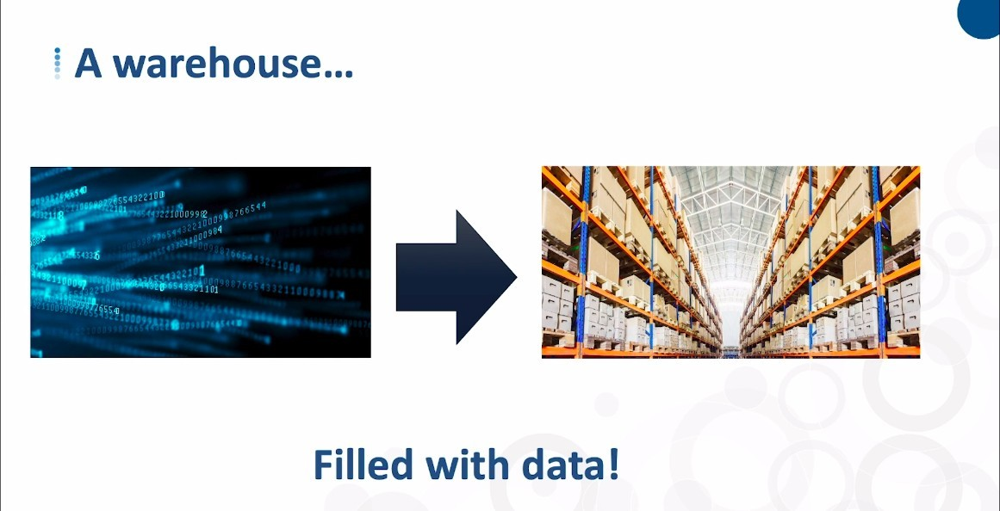

## **Is it Database?**

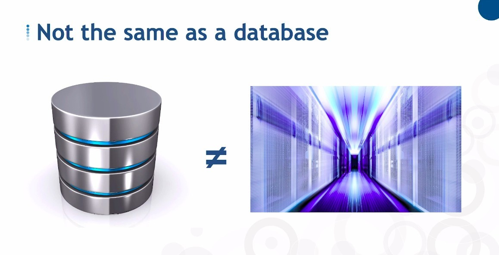

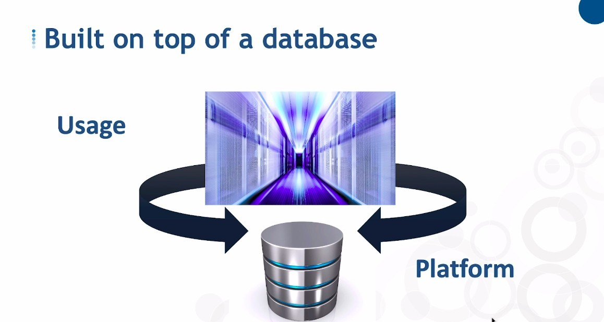

## **How or where does the data in it come from?**

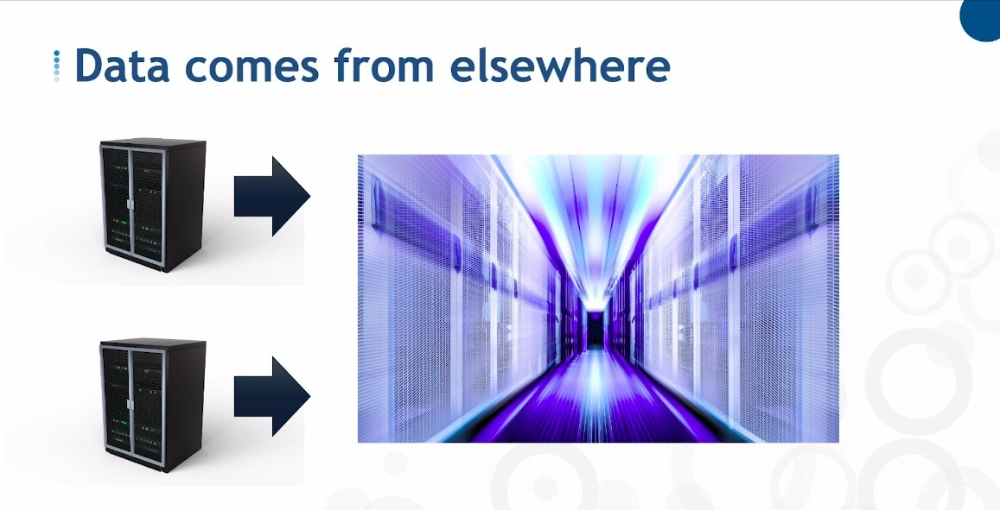

- We don't create data for the first time in a data-warehouse.

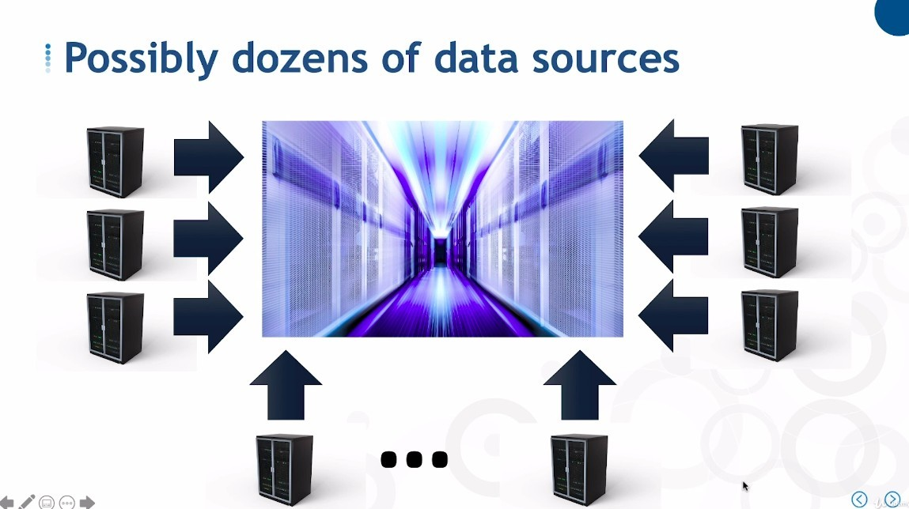

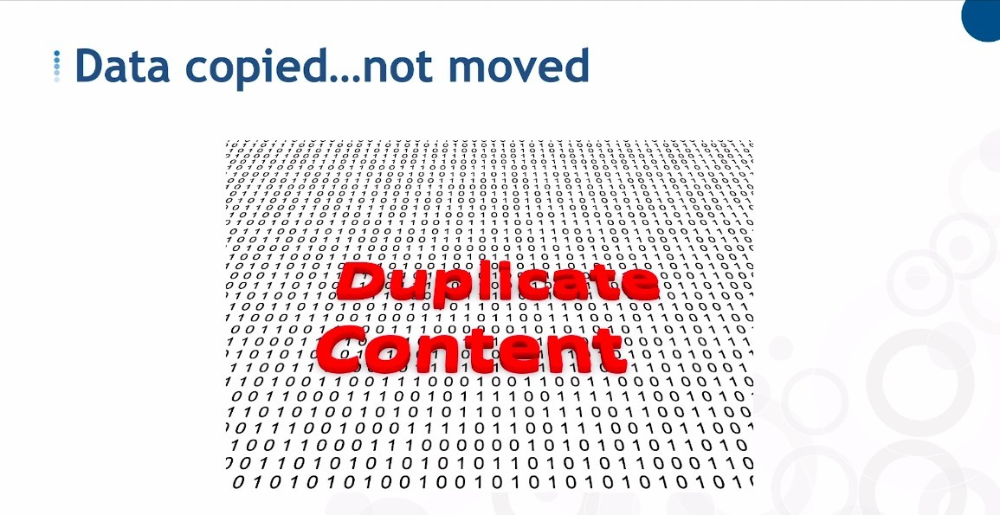

- So the original app system will still keep the data.

# ***Know the RULEs***

## **Who and When build the rules?**

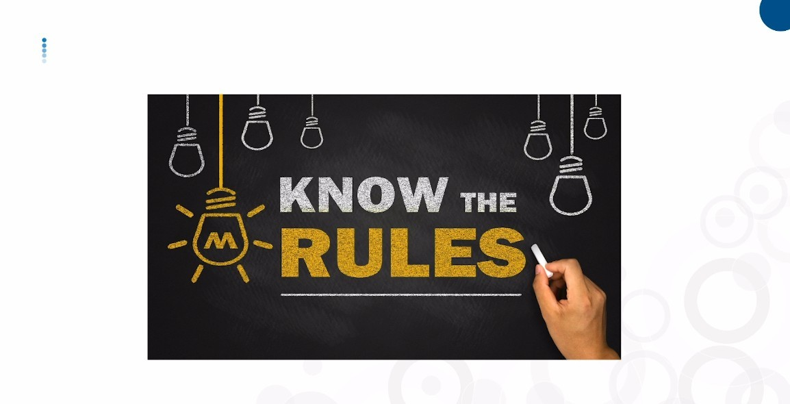

- In 1990 Inmon introduced a set of rules for data-warehouse.

## **Integrated**

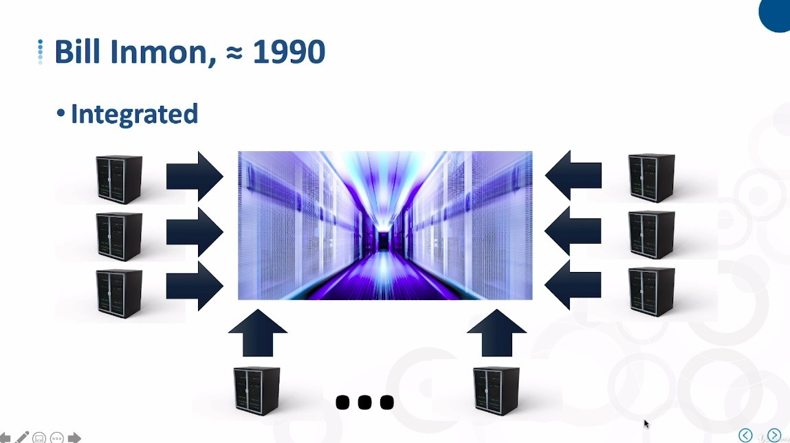

- The data-warehouse data comes from many different source systems.

## **Subject oriented**

- But no matter how many source systems transfer data to the data-warehouse, the data-warehouse must be subject-oriented.

## **Time variant**

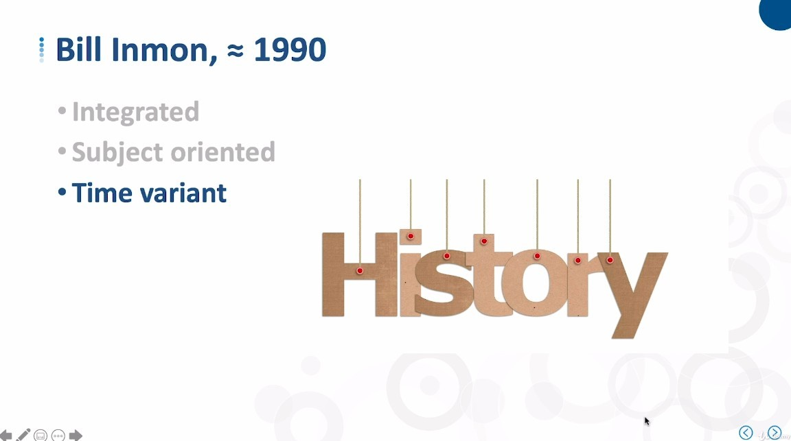

- data-warehouse saves historical data.

## **Non-volatile**

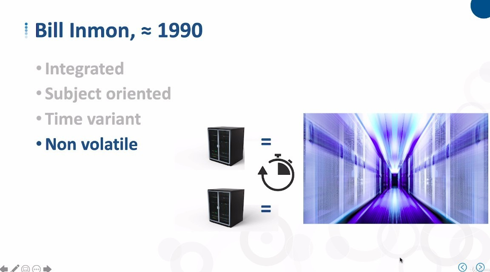

- The data-warehouse data will only change when refreshing, the data will be stable and unchanged between the last refresh and the next refresh, so that we can do analysis and strategy on the data.

## **Improvement**

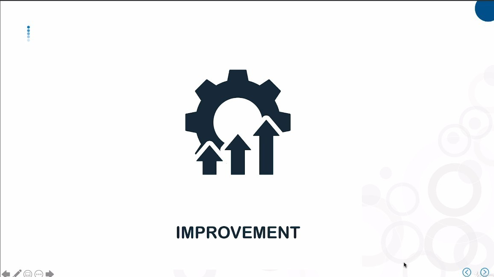

- It means that when data is put into the data-warehouse, we usually reorganize it to make it more useful for analysis.

## **Final rule: make decisions**

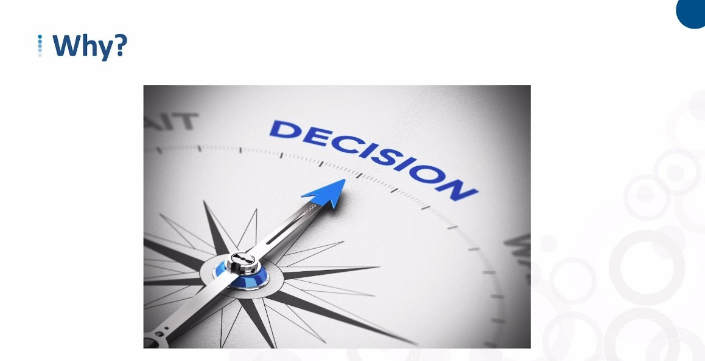
