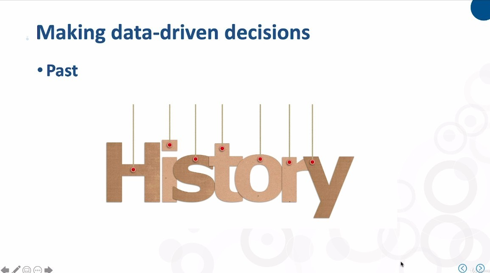
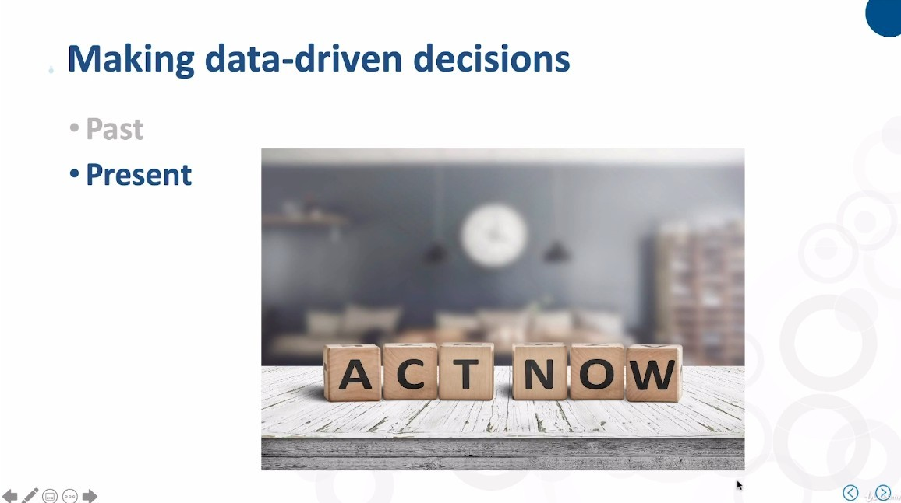
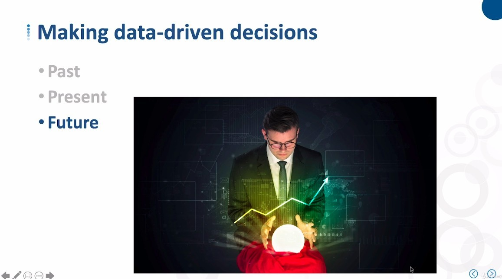
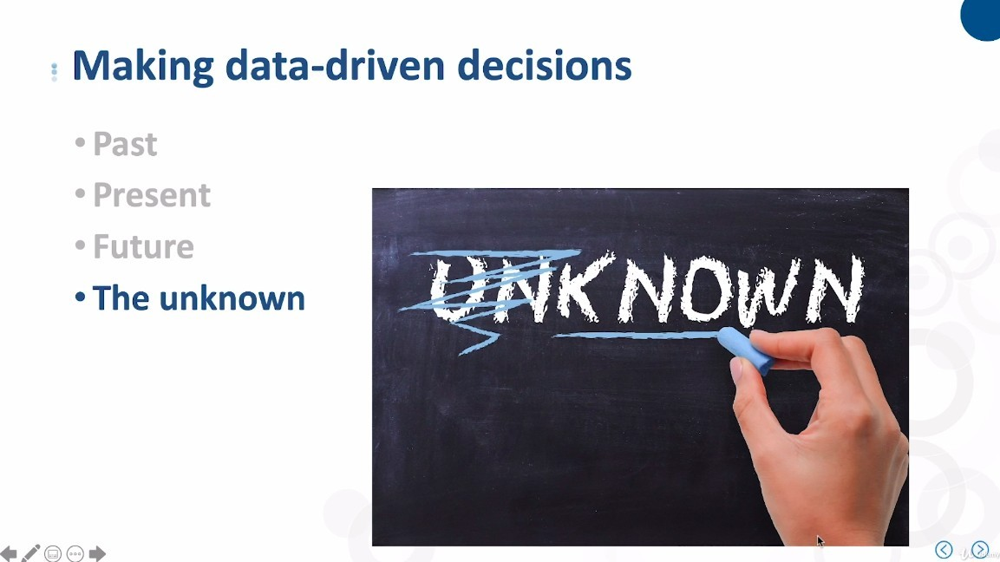
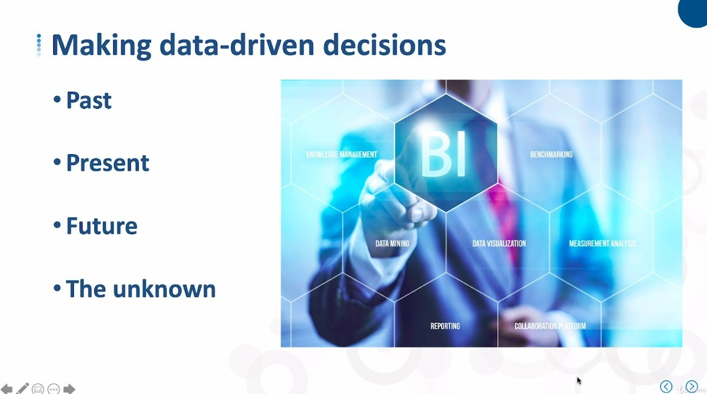
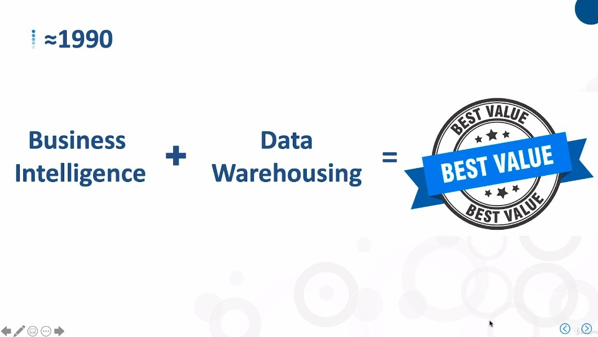
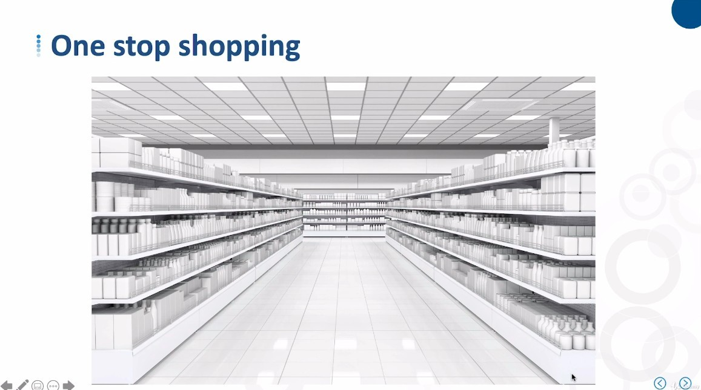
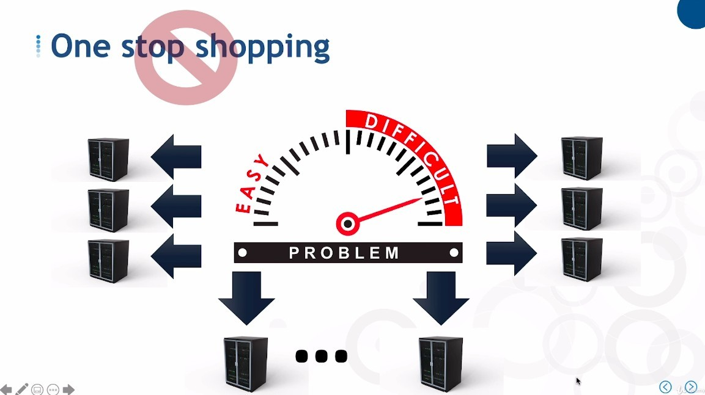
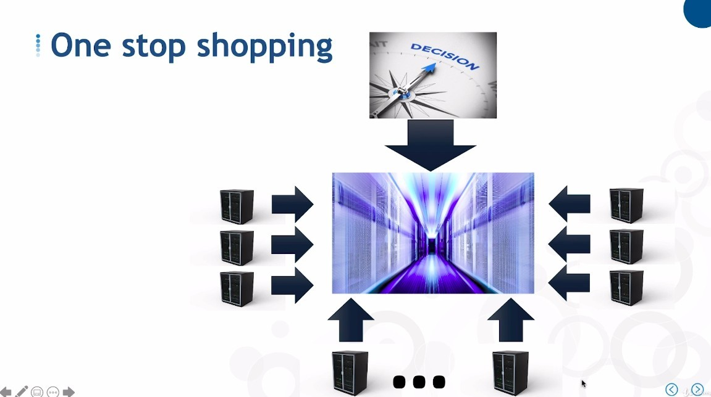

# ***Two Primary Reasons to Build Data Warehouse***

## **Making Data-Driven Decisions**

> Data Warehouse allows us to make decisions in a data-driven way, rather than relying entirely on experience, intuition or even premonition.

- If the various business views generated by our data are considered as a whole, they are related to BI.

- Around 1990, Warehouse and BI emerged at the same time, and together they produced tremendous value for the business.

## **One Stop Shopping**

> The data we need is in one place, not scattered among all the various transactions.

**Not one stop shopping age**

> Before the appearance of Data Warehouse, any data-driven decision first had to trace data, and this process was tedious and difficult.

- With Data Warehouse, you can focus on analyzing data, rather than repeatedly collecting and integrating data over and over.

