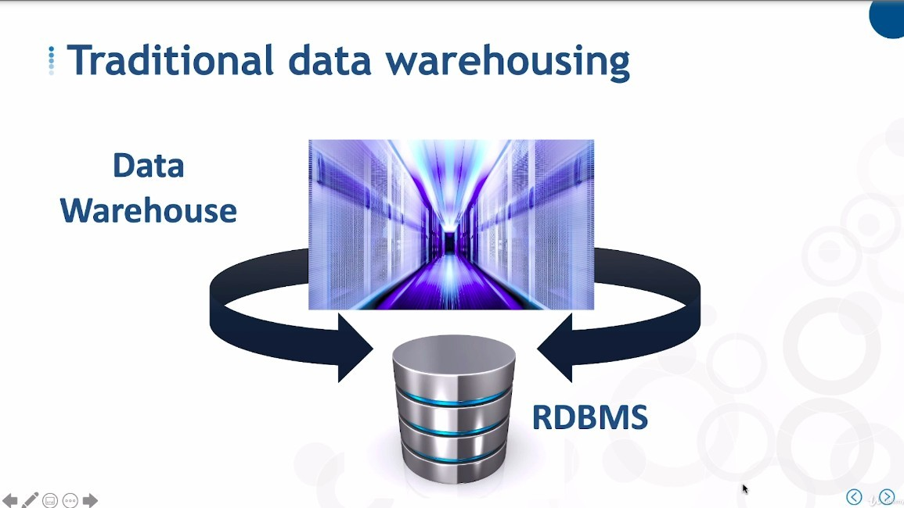
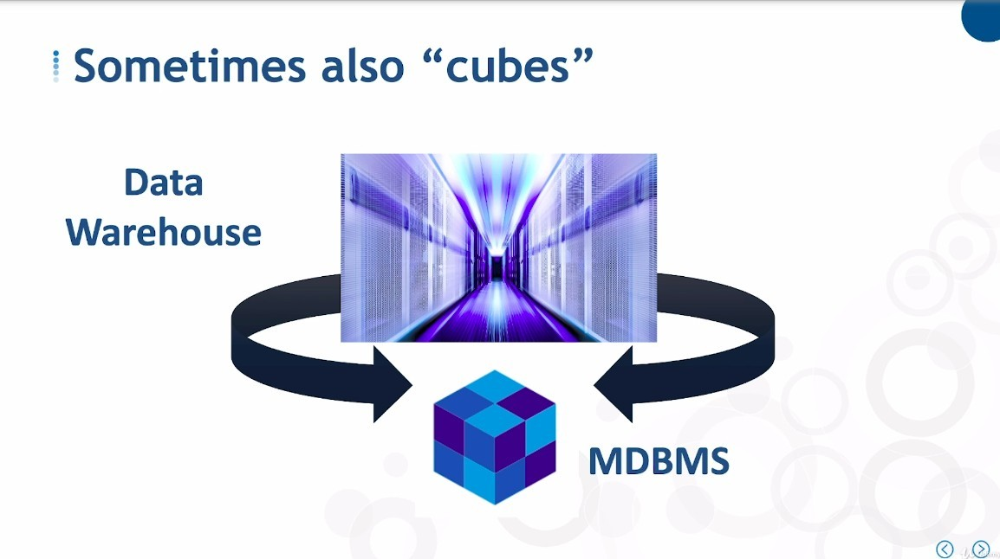
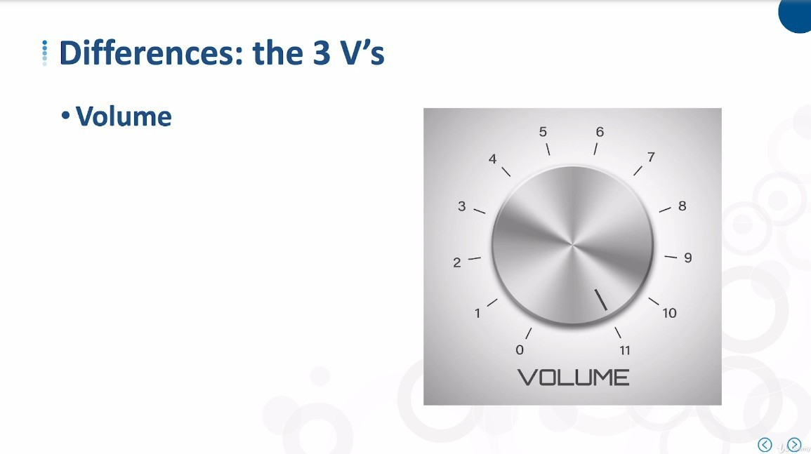
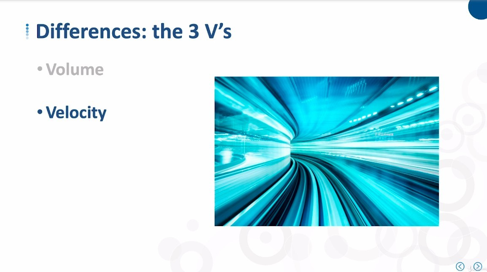
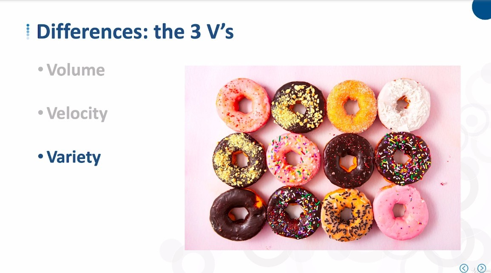
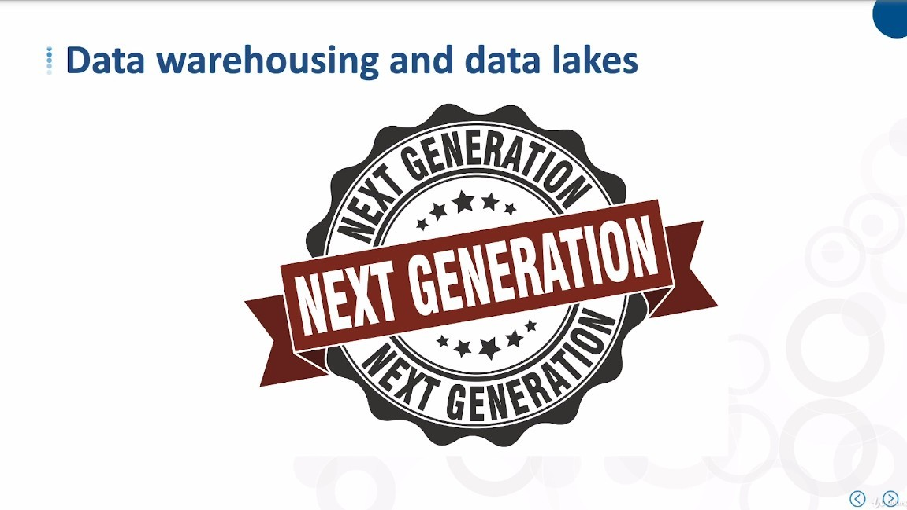
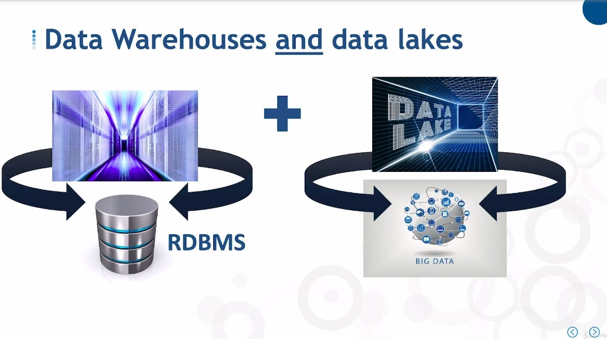
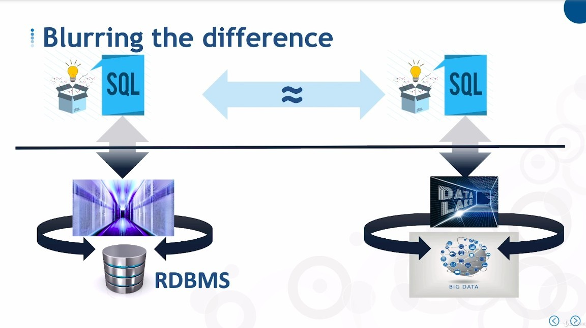
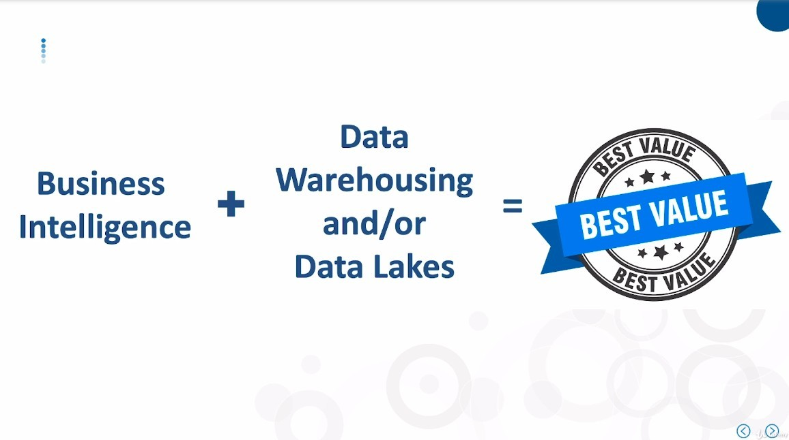

## **Base Database Differences**

### _Data warehouse_

- RDBMS can also be used in business systems or applications, you can think of it as a Swiss knife, very versatile.

- Sometimes we also build a data warehouse on top of a multimensional database that's typically known as a cube.

  - think of a cube as sort of a special purpoase database.

### _Data lake_

- There are three features of big data that are different from normal data. We call them 3V.

**Volume**

**Velocity**

Big data support to absorb or update data at a very fast rate.

**Variety**

- Traditional data warehouses mainly deal with structured data

- strains and similar data types which big data easily supports along with semi-structured data such as text msg, email, blogs and complex documents.

- big data also support unstructured data such as audio and video.

  - We're sometimes able to handle those other types of data in our data warehouses, but we usually need some special tricks.

## **So that Data lake is Next Generation?**

- Some companies have Data Warehouse even though they have spent a lot of money to build Data Lake.

- BI can also be informed by Data Lake, so now it feels like a combination of all three tools to provide the best value to the business.
