## **History**

### _1980s-era Extract files_

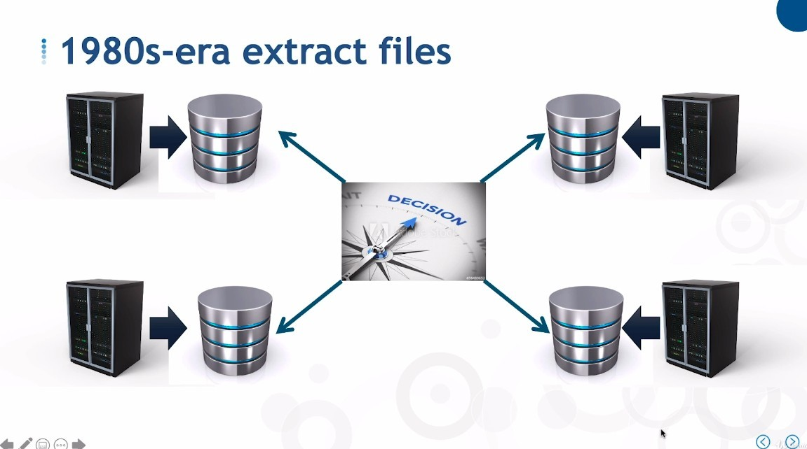

- extract files is like a mini data warehouse that extracts data from one or more applications, but without any coordination and rules of data structure, and almost without any part beyond extraction.
  - As a result, the time spent collecting and reconstructing data over and over again is still much more than the time spent actually analyzing the data.

### _late 1980: Distributed DBMS_

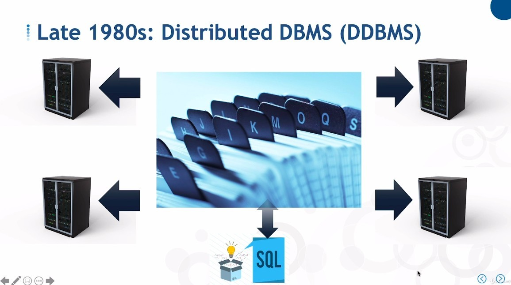

- Distributed data management system regardless of the degree of distribution, index will go to each place to extract the correct data and then organize it.

- The concept was solid, but it failed because of the lack of technology at the time.

### _After DDBMs fail_

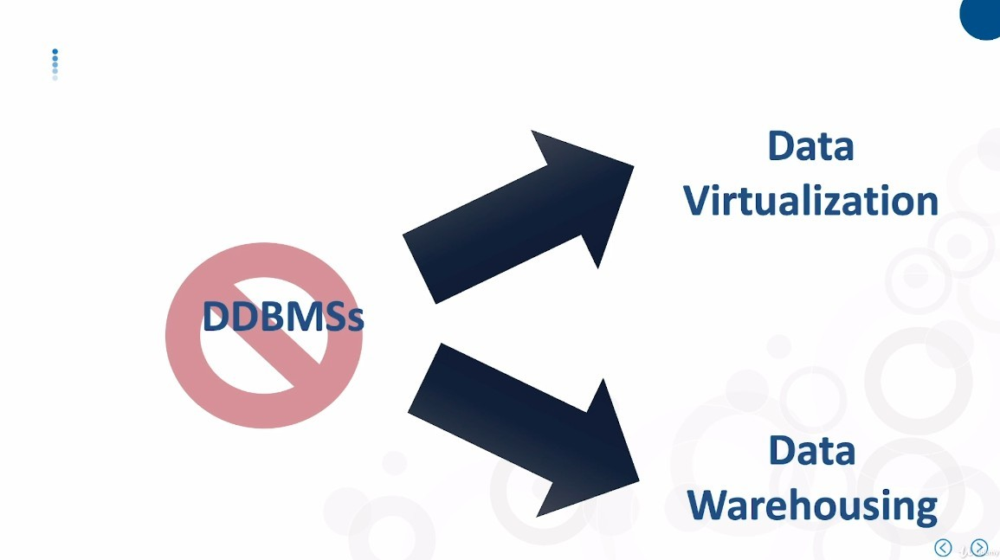

- The failure of DDBMSs led to the creation of Data Warehouse and Data Virtualization.

## **Features fo Data Virtualization**

### _Read only DDBMS_

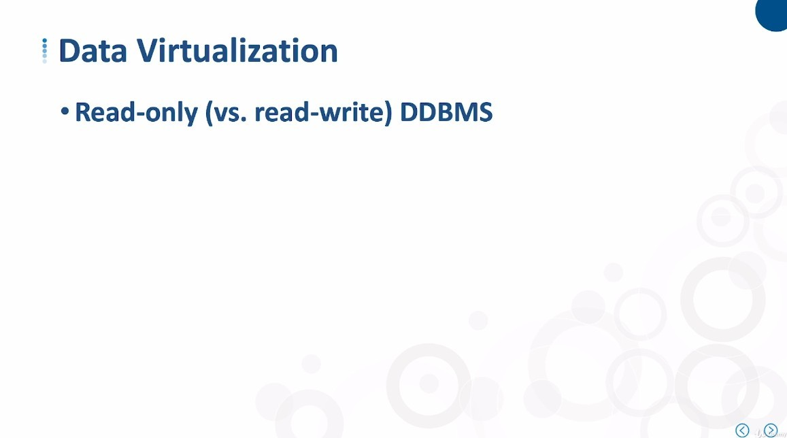

### _In-place data access_

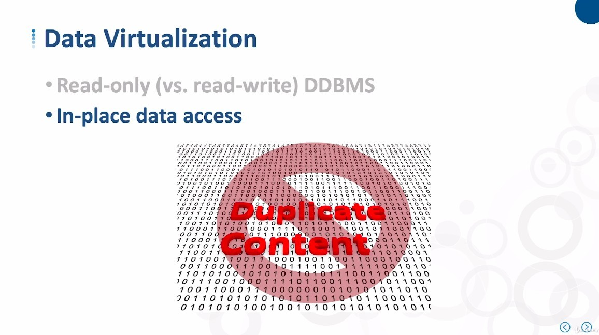

- It means that it does not duplicate data.

### _Many names over the years_

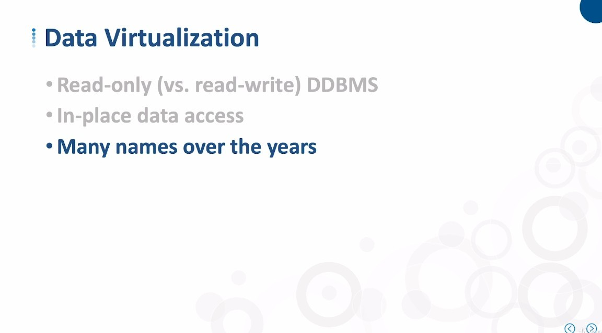

- Such as:

  - Virtual Data Warehouse

  - Enterprise Information Integration (EII)

  - Enterprice Data Access (EDA)

## **Significantly Improved from the late 1980s and early 1990**

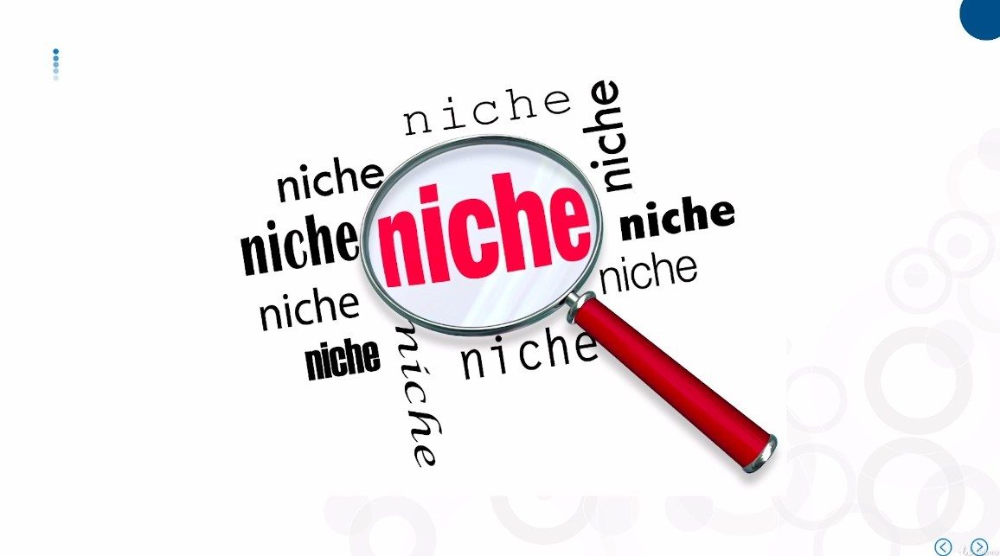

- That said, it is best to use Data Virtualization only in the following use cases:

### _Simple or no transformation_

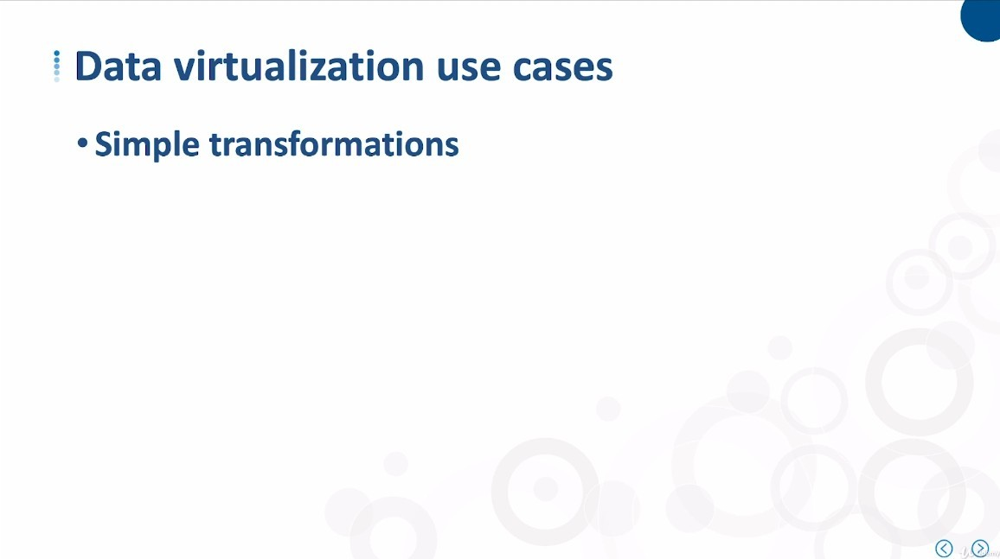

### _Smaller number of data sources_

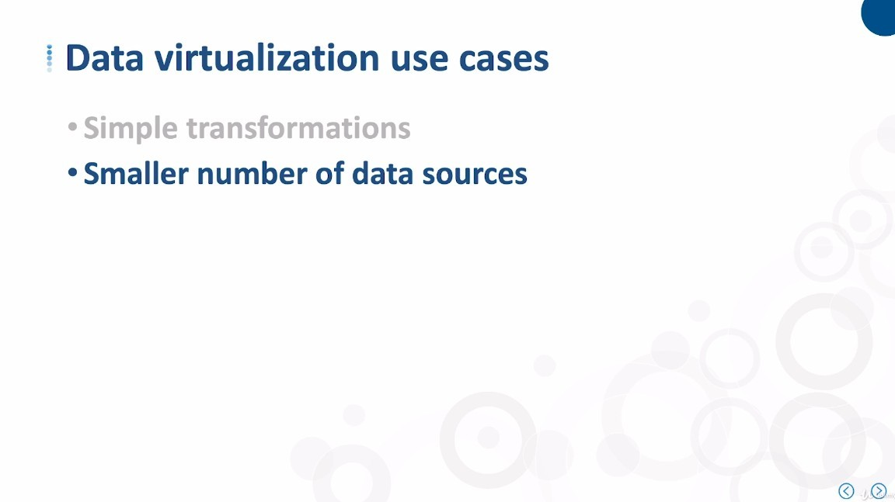

### _Relaxed response time_

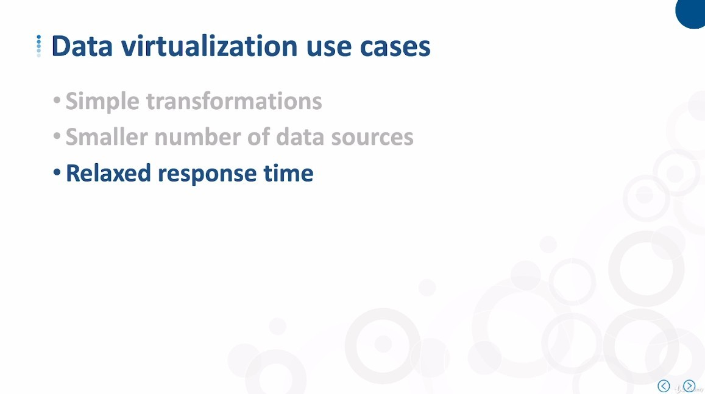

## **Combined All tools to provide BEST VALUE**

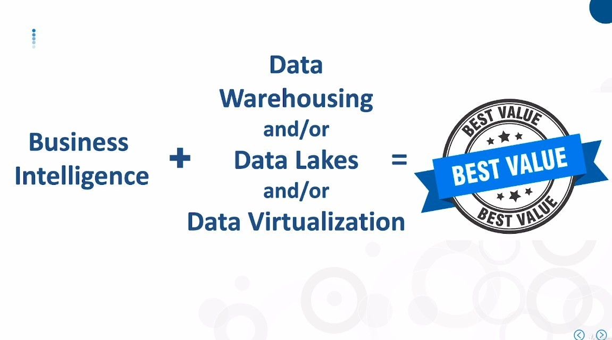
