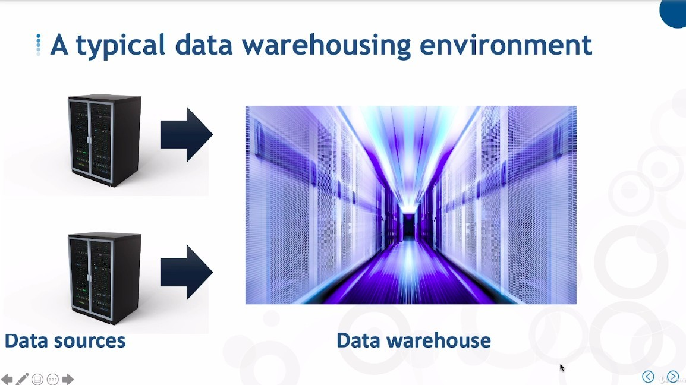
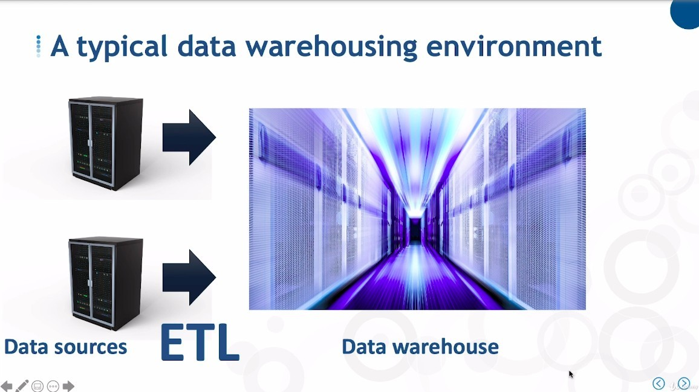
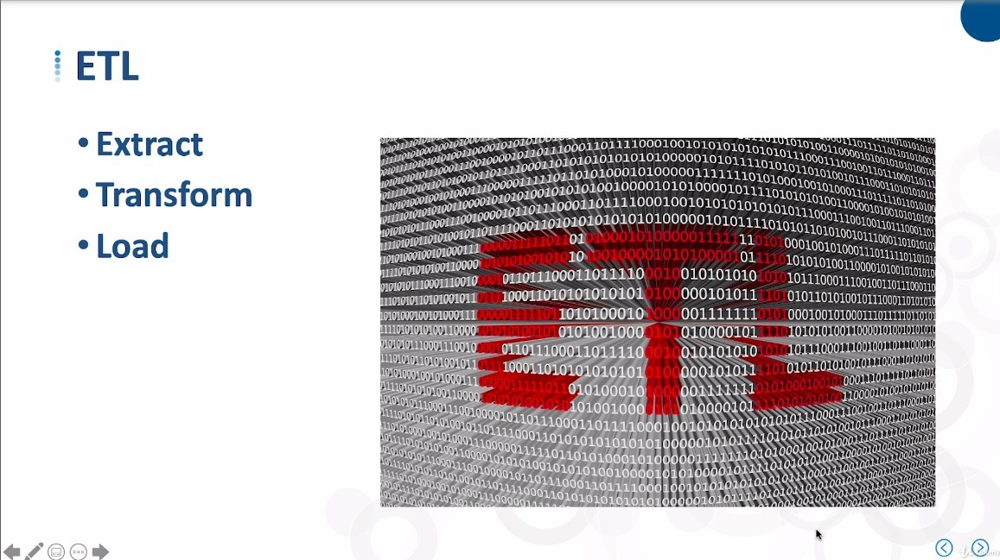
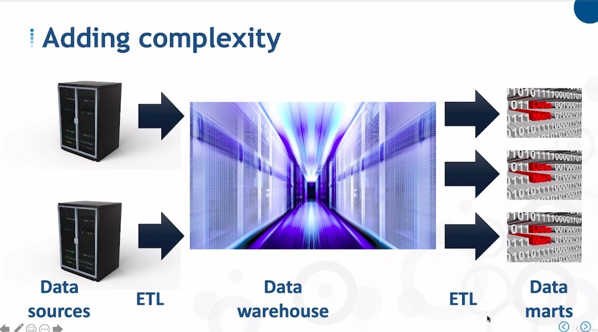
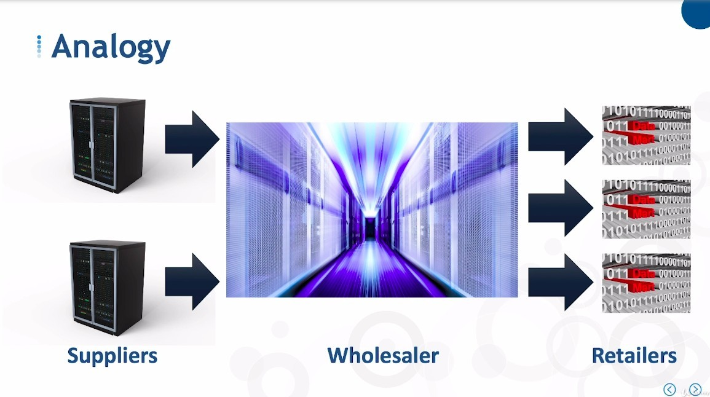

## **Simple End to End**

## **ETL**

## **More Complex End to End (add ETL and Mart)**

- The data does not stop at the Data Warehouse, but continues down to several smaller Data Mart.

  - The intermediate process is also done through ETL.

## **Analogy**

> We can make an analogy between the above process and the process of goods from upstream to downstream.

- Mart is similar to the role of a retailer in that they extract a collection of converted sub-data specifically for presentation to a specific customer's organization or function.

