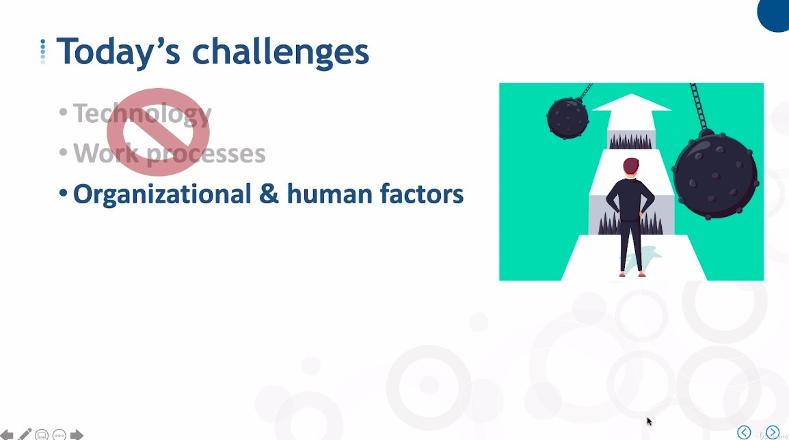

## **Architecture of Centralized Data Warehouse**

- Ideally, this should be your default setting.

- It seemed really easy to do but was anything but easy.

## **Advantage**

- All the data we need for reporting, business, intelligence and analysis in one place, kind of like a data superstore.

  - So obviously, the advantage of this structure is that it is a one-stop shop.

## **Challenges**

### _Historical_

### _Today_

**Still Challenge: organizational & human factor**

- The nature of centralized DW requires a high degree of cooperation between organizations. (It's hard)

  - But the good news is that modern DW technology has matured.

**Think of Data Lake as the successor**

- Also, to some extent, you can think of Data Lake as the successor to this classic centralized DW.

  - Although Data Lake's data is actually highly distributed based on big data technology, from the user's point of view the data still looks single and centralized.
