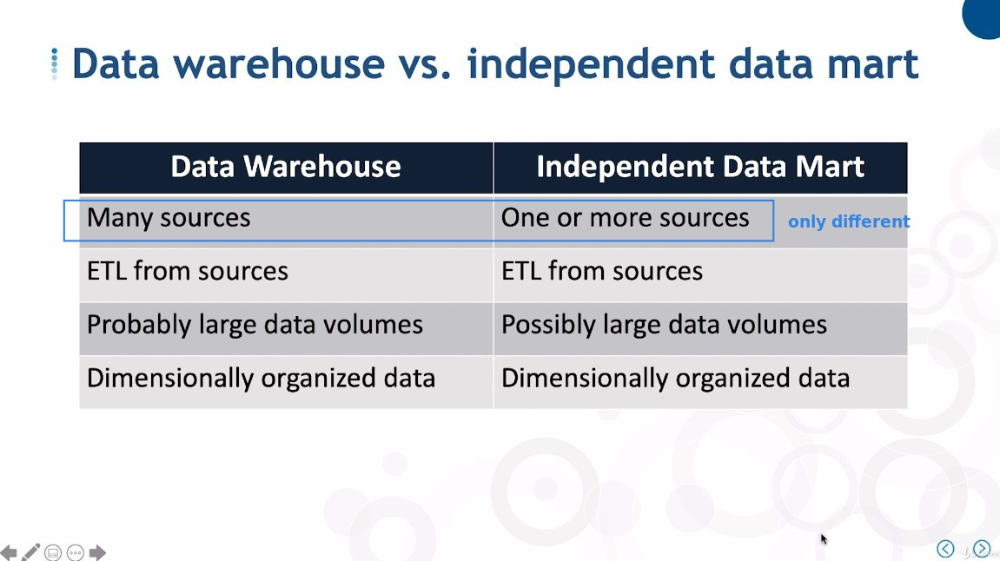

## **There are two types of Data Mart**

> The main distinction is whether the data comes from the Data Warehouse or the data sources.

## **Independent Data Mart & Extract Files**

> Independent data mart are conceptually the same as those old fashioned extract files, with the exception that their data is usually **organized dimensionally** rather than according to reports that need to be produced.

## **Versus**

### **Dependent Data Mart vs Independent Data Mart**

### **Data Warehouse vs Independent Data Mart**

- Basically, there is only a difference in the number of data sources.

  - The definition between the two is blurred.
