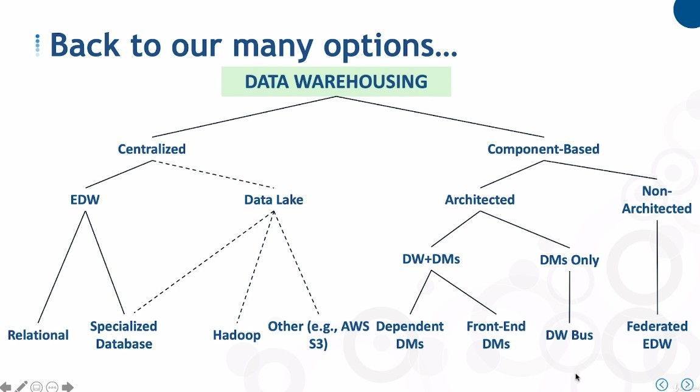

## **Centralized vs Component-Based**

## **Centralized - EDW vs Data Lake**

### _EDW branches_

### _Data Lake branches_

## **Component-Based - Architected vs Non-Architected**

### _Architected - DW+DMs vs DMs Only_

**DW+DMs**

**DMs Only**

### _Non-Architected_

## **Overview**

