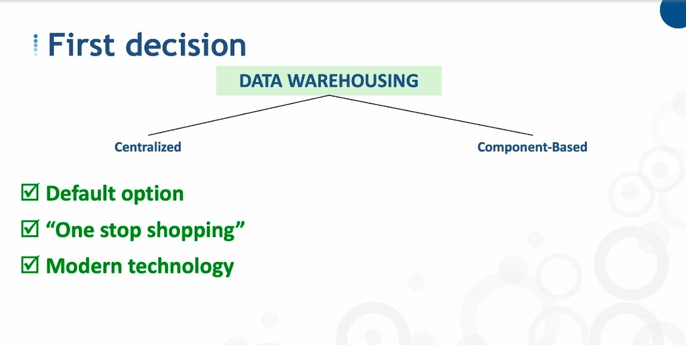

## **Centralized vs Component-Based**

- Although it seems that Component-Based has more advantages and fewer disadvantages, remember that the default option is still 'Centralized'.

## **Centralized - EDW vs Data Lake**

- The 'E' in EDW is Enterprise.

- As mentioned in the previous lecture, we see Data Lake as the successor to the classic Data Warehouse, so it makes sense to put it here.

### _EDW branches_

- Specialized Database is a database designed specifically for EDW.

### _Data Lake branches_

## **Component-Based - Architected vs Non-Architected**

> Whenever Data Marts are used, it is considered Component-Based.

- Specialized Database can also be used as a platform for Data Lake.

### _Architected - DW+DMs vs DMs Only_

- Basically, this section is for solving cross-departmental communication problems within the organization.

**DW+DMs**

- Already explained with the analogy with retailers in previous lectures.

- There is a variation of the dependent data mart, it is called the Corporate Information Factory, or CIF.

  - CIF is proposed by Inmon, in fact, it is Data mart with a series of specifications.

  - If you use CIF, it is easy to find the information and data you need.

  - Nowadays, less people use it.

- For example, if the same SAP company has both foreign and domestic companies, you can use two Data Mart to integrate the foreign data with the domestic data.
  
  - Most of the analysis and reporting will be done directly in the Data Mart section.

  - But in the end, all the data will be aggregated in the Data Warehouse.

**DMs Only**

- It's called the data warehouse dimensional bus that was defined by Ralph Kimball.

- The idea behind the data warehouse bus is that all of the data marts follow a principle that known as **confirmed dimensions**.

  - means that we have an **apples to apples view** about our key subject areas.

    - key subject areas such as customers, products, employees ...

### _Non-Architected_

- Each department uses its own data mart to make its own suggestion for decisions.

  - Each suggestion does not need to be the same.

## **Overview**

