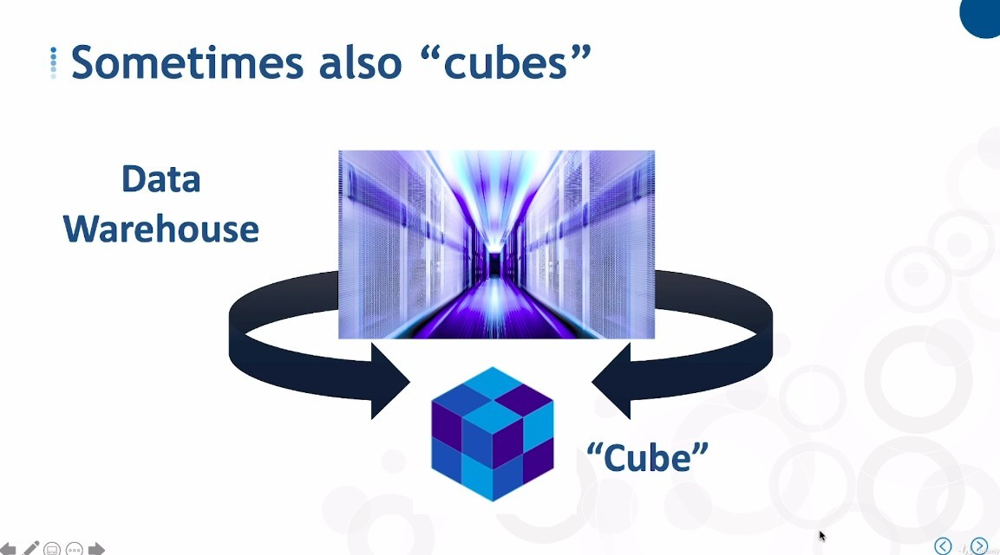

## **Alternative platform to RDMS**

## **What is Cube?**

## **Advantages of Cube**

- The disadvantage is that the data organization structure of Cube is very strict and rigid, because it is built for fast performance of query.

## **Best practice of Cube**

- In the retailer's structure, we can use Cubes as platforms for Data Marts, or we can use a mix of it with RDMS.

## **How to proved best value to user?**

- Nowadays, users are using BI tools to extract data from the database, instead of using native SQL script.

  - So whether RDMS or MDMS is used as the platform, it is almost the same for the user.

