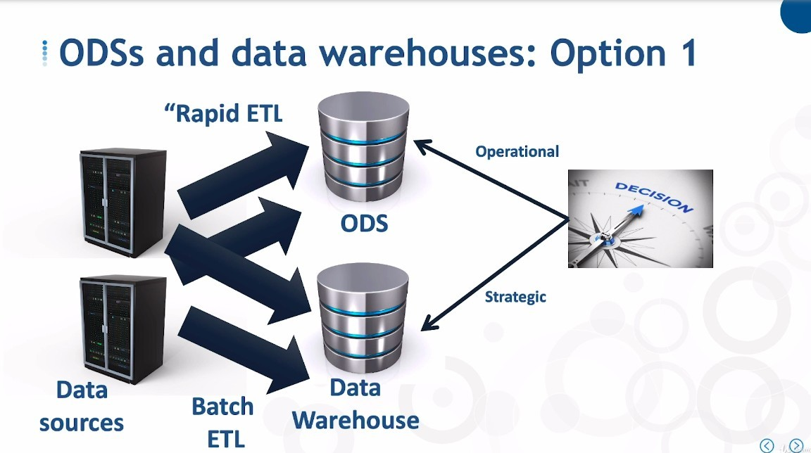
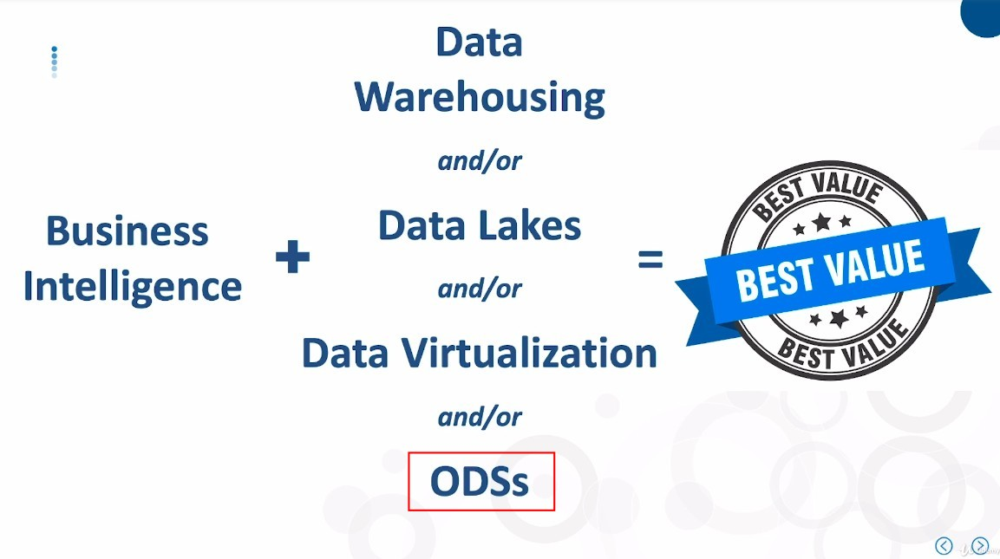

## **What is Operational Data Store**

- Like Data Warehouse, it collects data from multiple sources

  - but in real time rather than in batches

  - and stores only current data and no historical data.

## **Features**

- From a BI perspective, ODSs provide the strategic meaning of "telling me what's going on right now"

## **ODSs and Data Warehouse**

> ODSs can be used in conjunction with DWs to provide users with more comprehensive analysis data.

### _option 1_

### _option 2_

- This approach treats ODSs as a staging area for further downstream in to DW.

- Users can still access data directly from both.

  - There is no difference between option 1 and 2 from the user's perspective.

## **ODSs Tdday**

- Big data can present data in almost real time.

## **Provide BEST VALUE**

