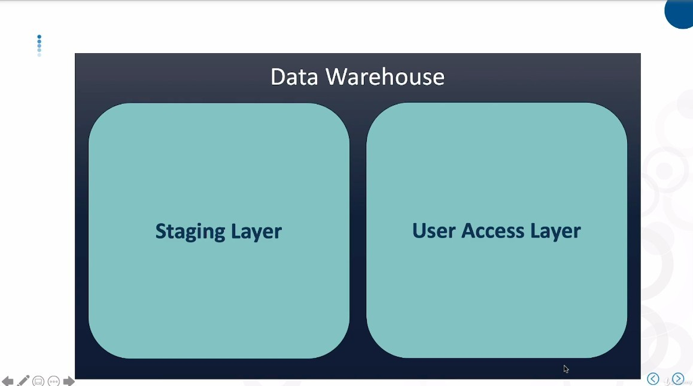
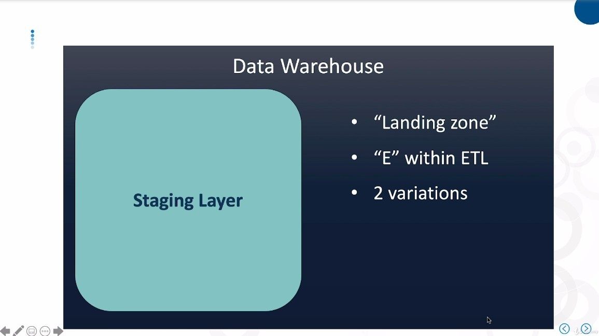
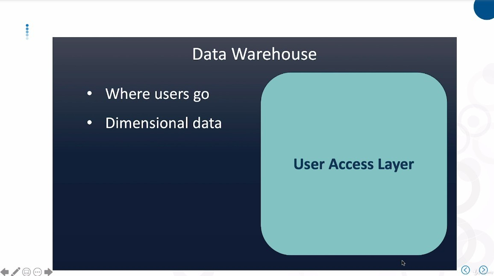
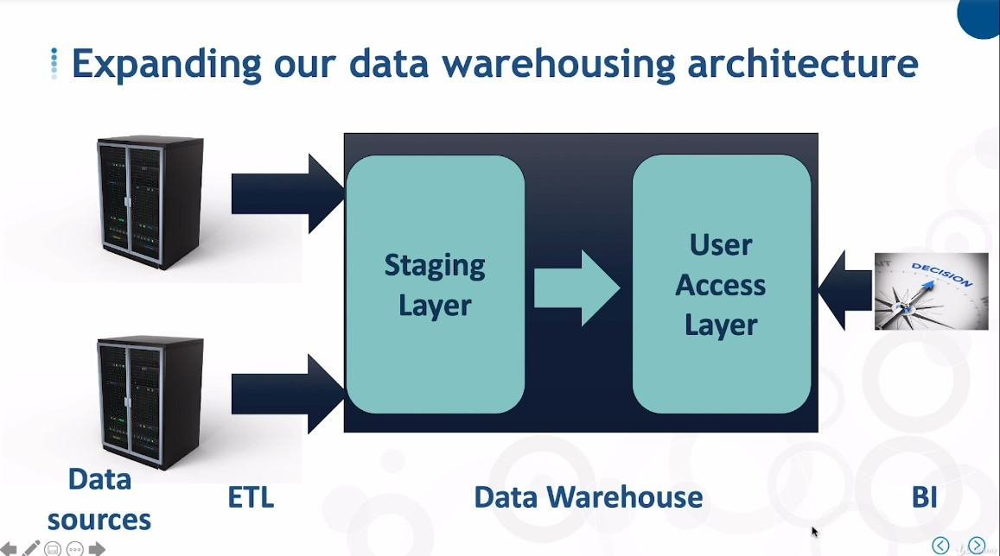
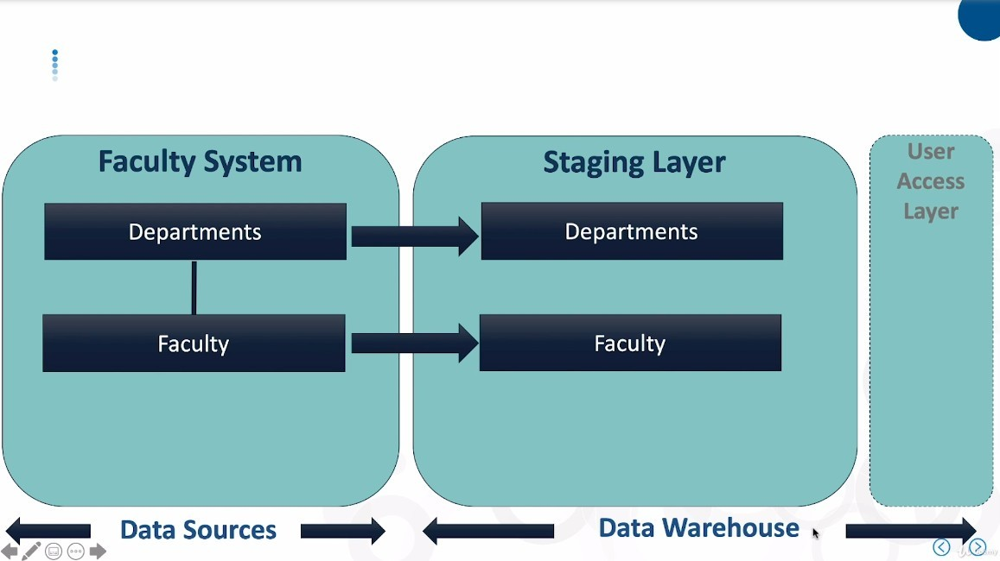
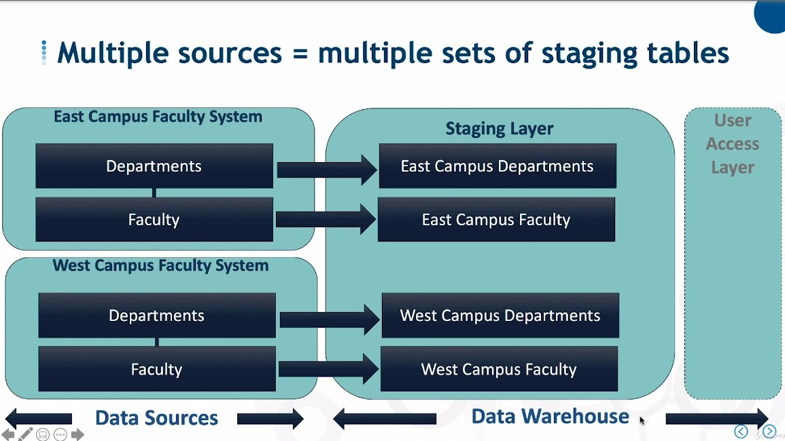
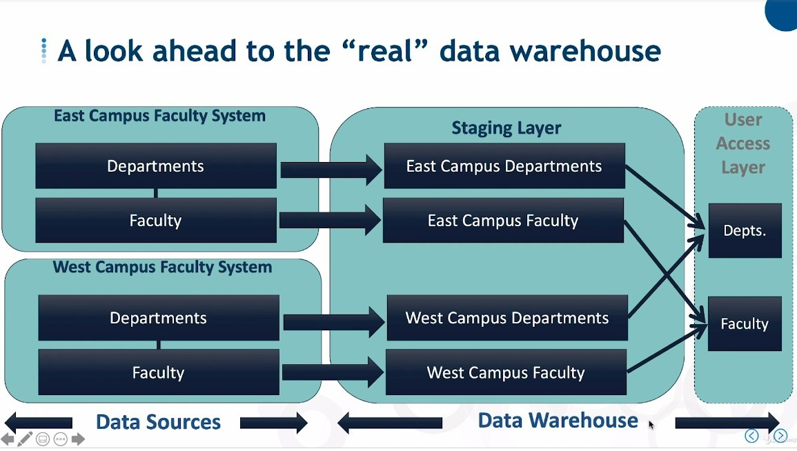
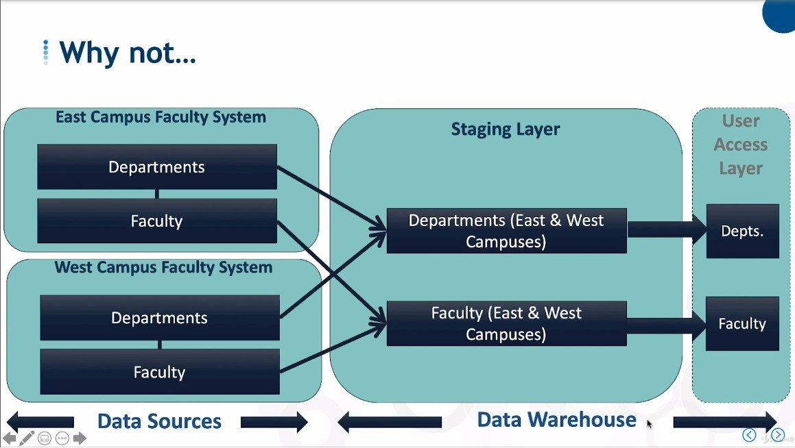
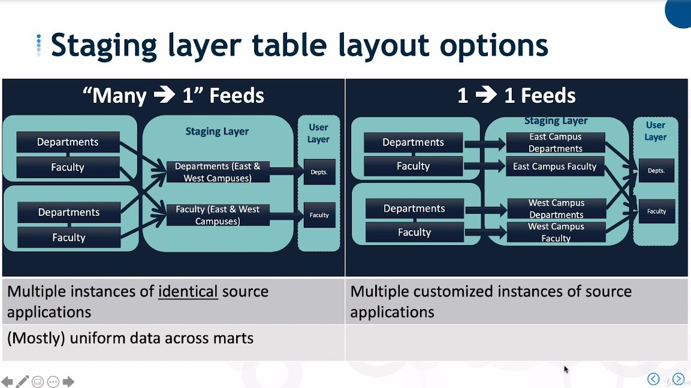
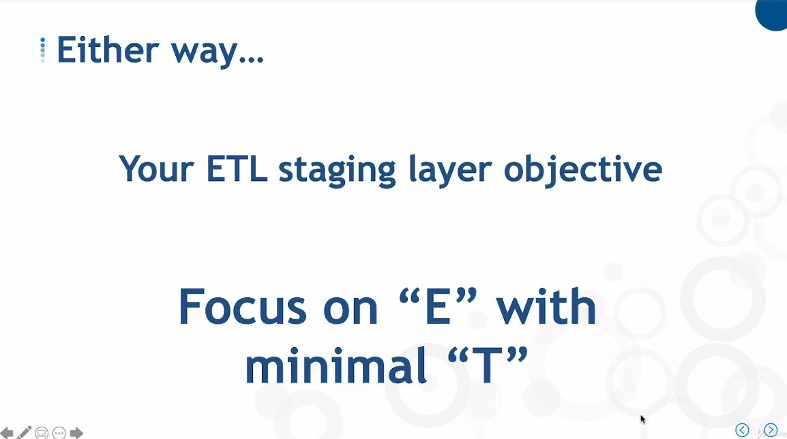

## **Two Layers inside Data Warehouse**

### _Staging Layer_

### _User Access Layer_

- We have often heard of snowflake patterns, dimension tables, fact tables, etc. being constructed in this layer.

## **What kind of tables in Staging Layer**

- In order to copy the data to the staging area as quickly as possible, we create tables with similar structure to the data source.

- Even though different data sources have similar structures, we still prefer to use a one-to-one mapping method and merge only at the user access layer.

- It is not impossible to implement many-to-one method, but need to ensure that the data is uniform, but in reality, the format of different data sources is usually not uniform.

## **ETL from Data source to staging layer**

