## **Step-by-step procedure for Non-Persistent Staging Layer**

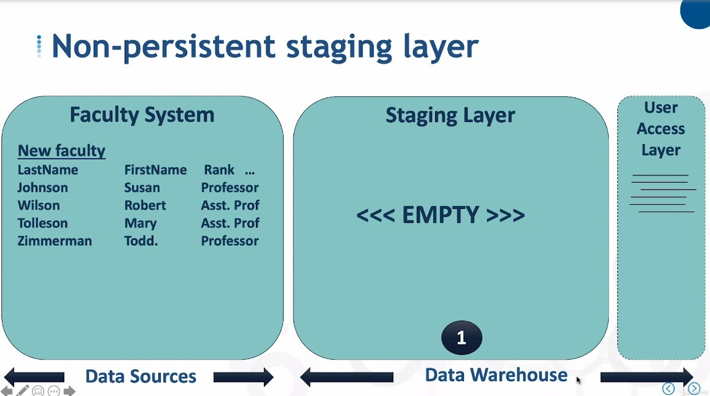

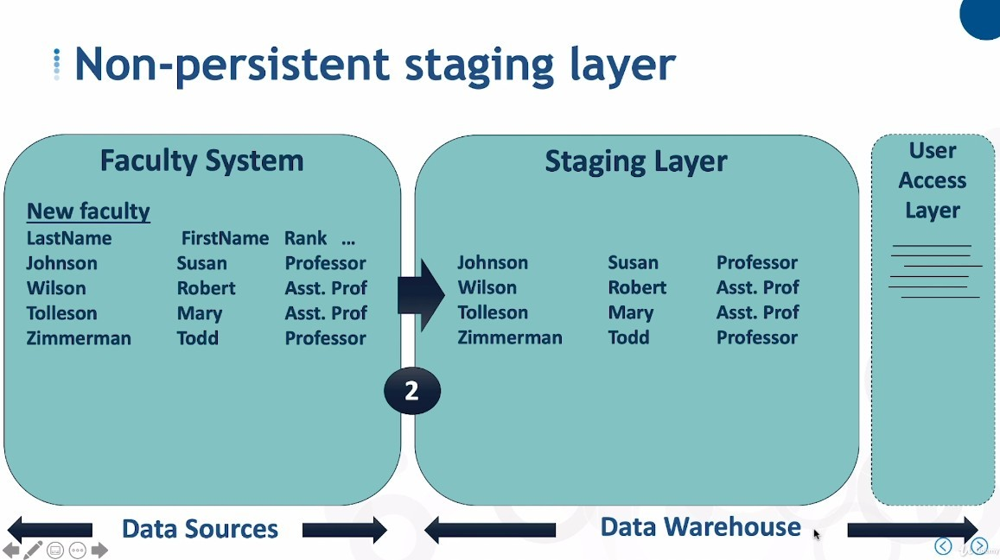

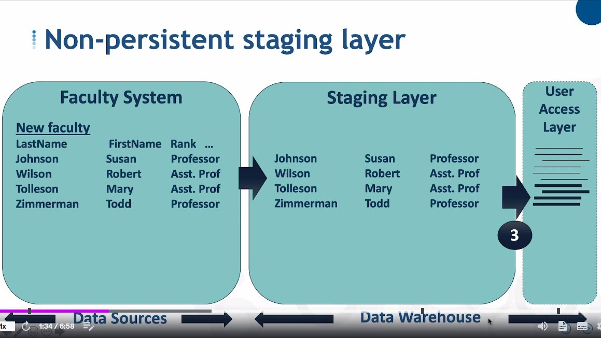

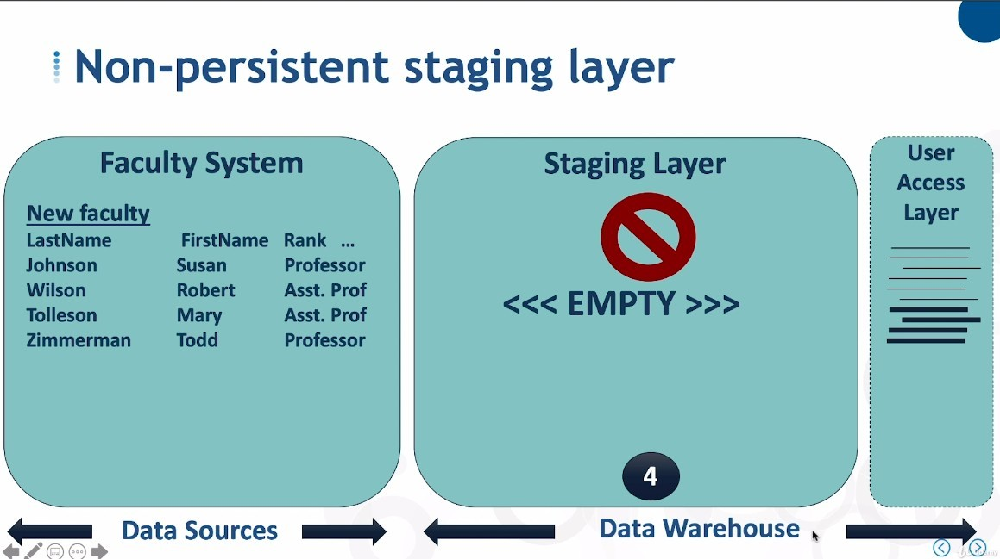

- Because the user does not access any data from the staging layer, emptying this layer will not have any effect.

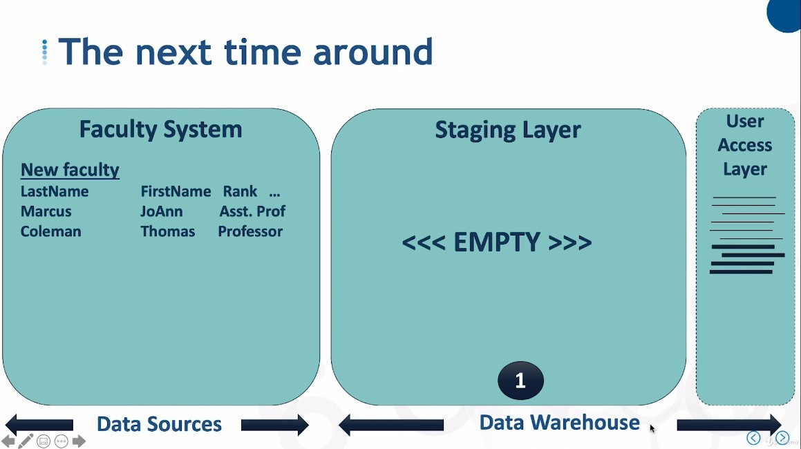

- The staging layer remains empty the next time new data comes in.

## **Step-by-step procedure for Persistent Staging Layer**

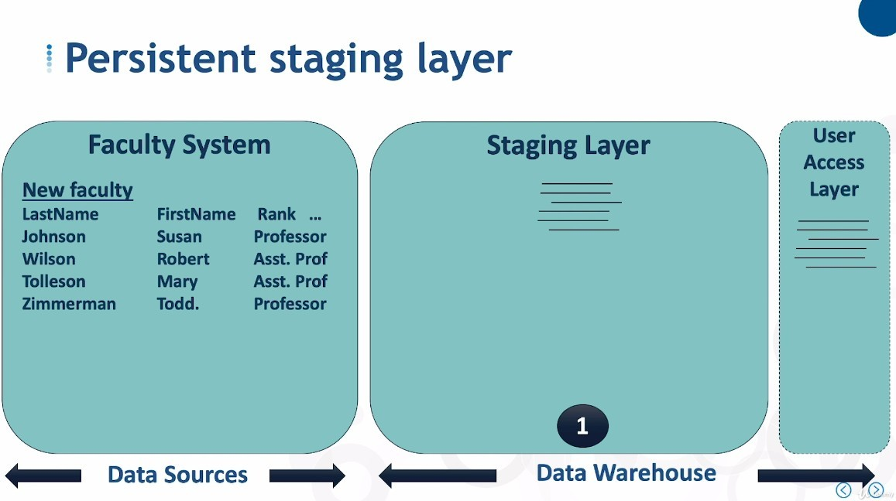

- There is already data in it before it is even used.

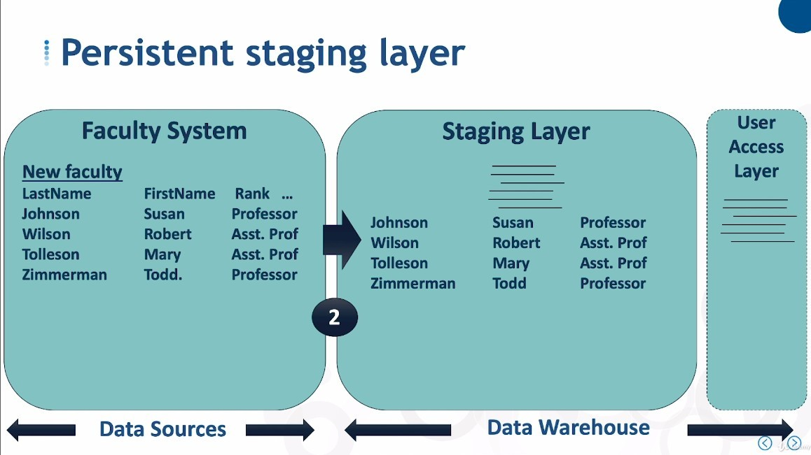

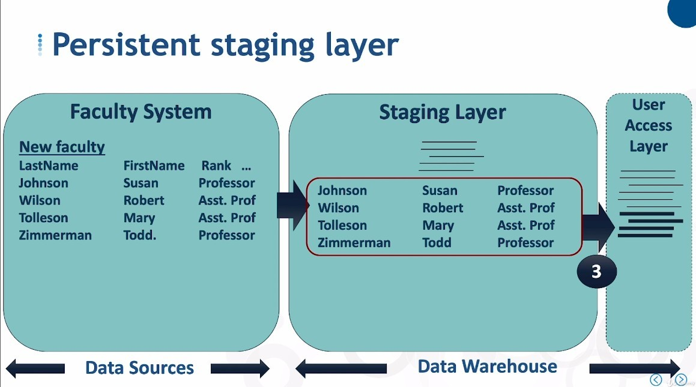

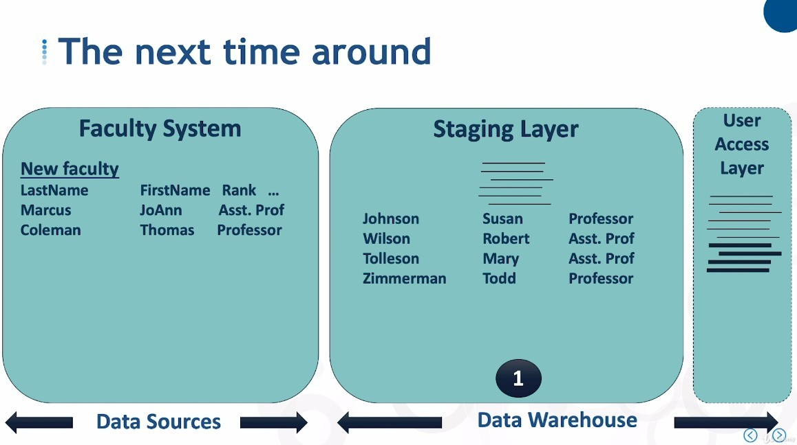

## **Advantages and Disadvantages**

### _Non-persistent_

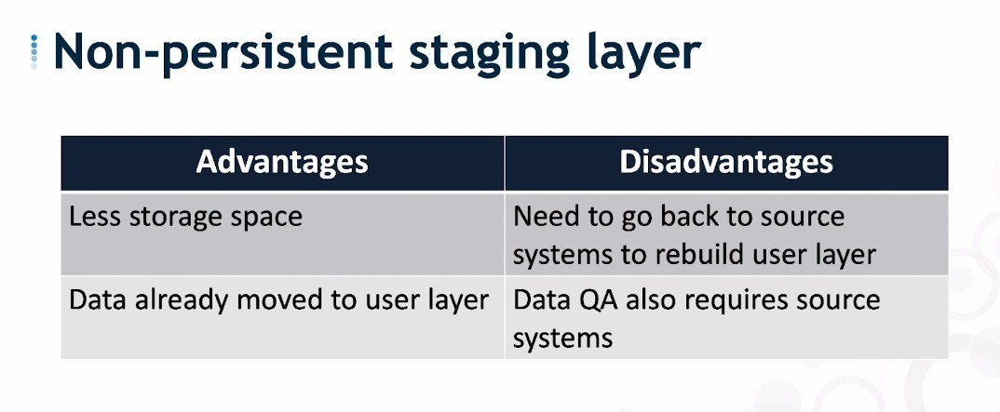

- Once the user access layer is destroyed and needs to be reorganized, the data must be collected from the data source again.

- QA means data quality assurance, when they have a need to compare data, they must also go to the data source for.

### _Persistent_

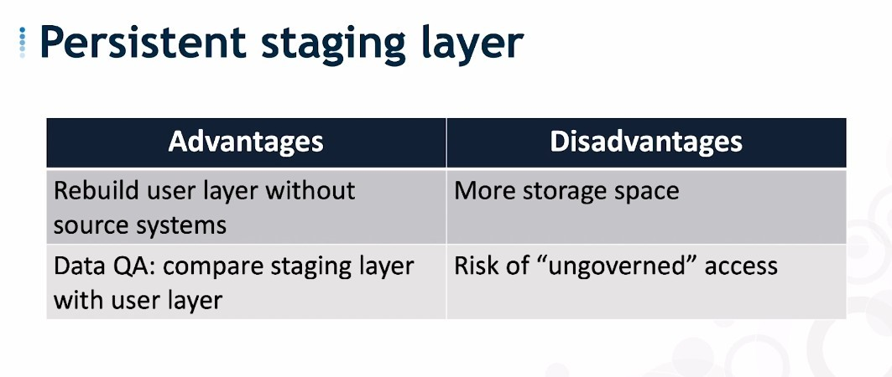

- Rebuilding the user access layer is easy, because the staging layer has all the data, same as QA problem.

- Of course, it goes without saying that a lot of storage space is obviously needed.

- Another point is that staging with a lot of data, which is a risk in itself.
