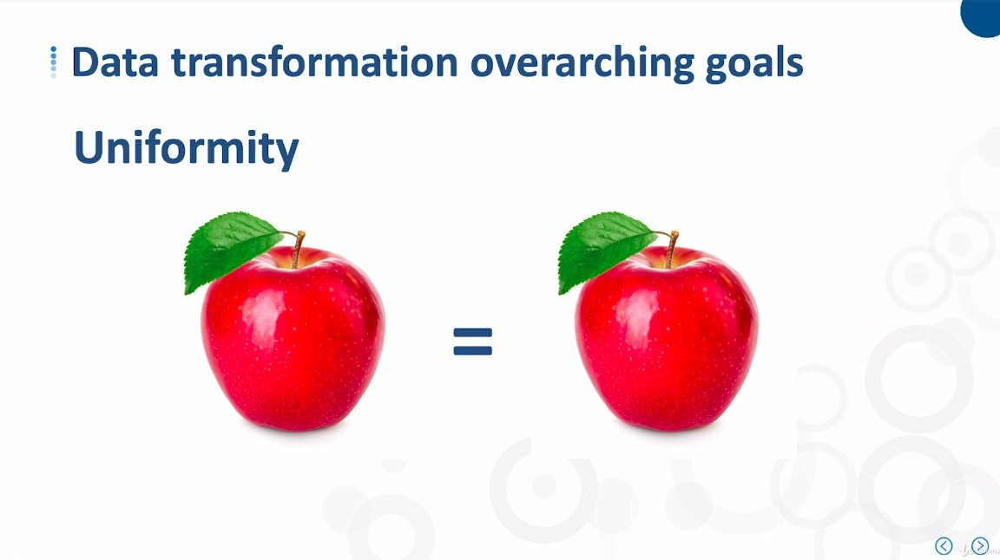
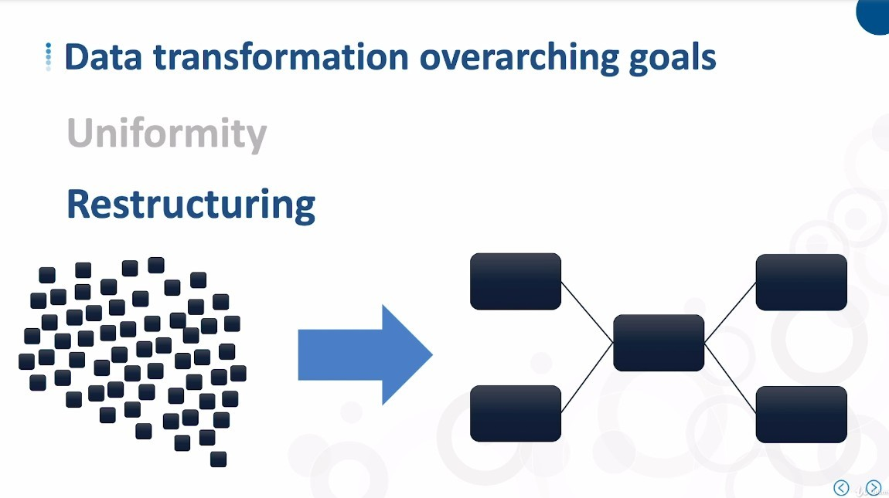
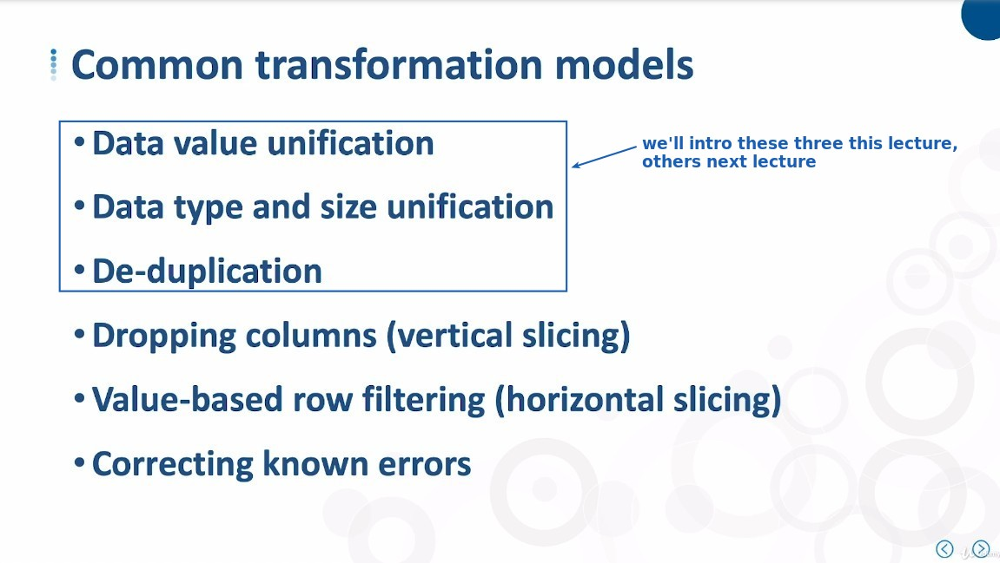
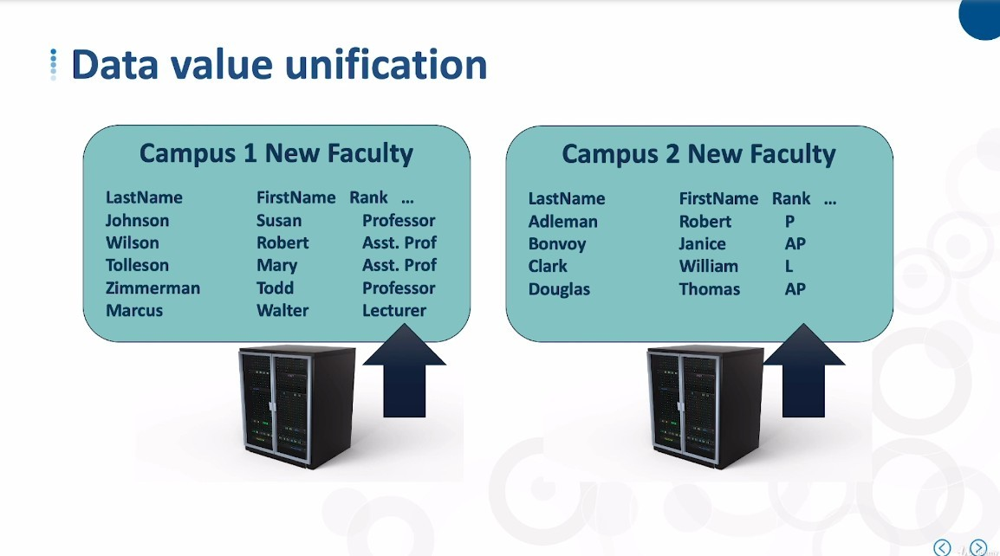
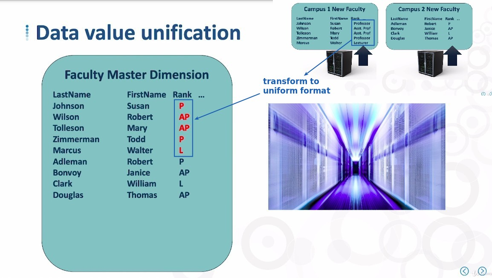
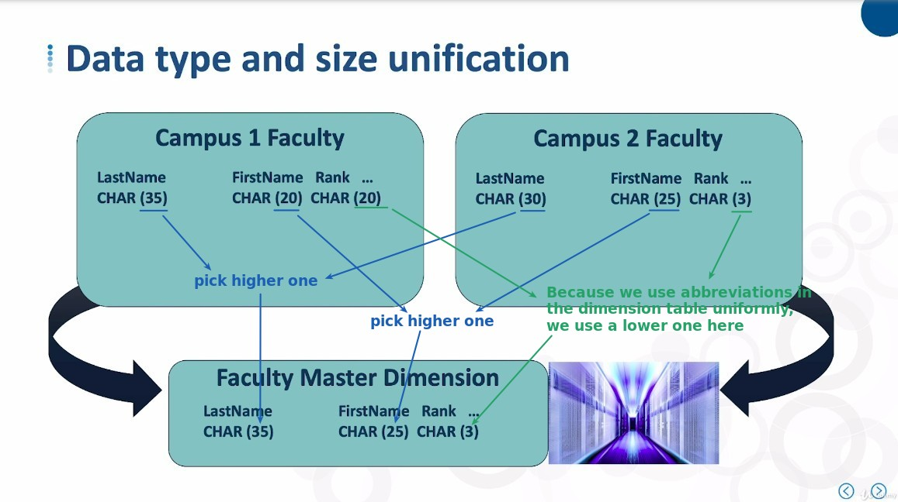
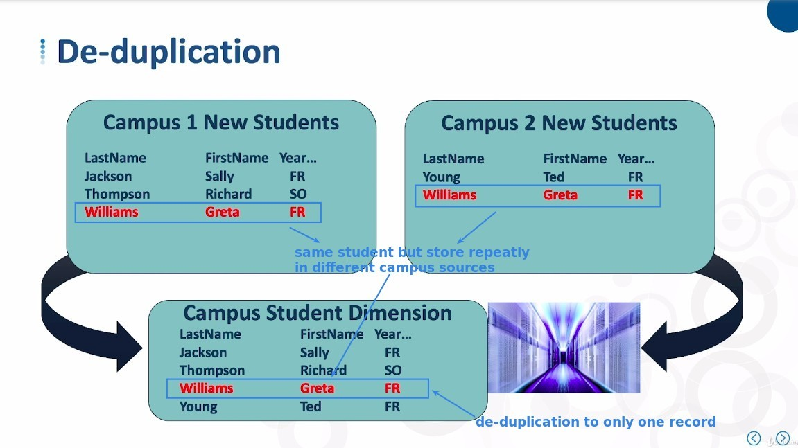

## **Two purposes of data Transformation**

## **Common Transformation models**

> The 'model' here does not mean a type, but something that needs to be done.

### _data value unification_

### _data type and size unification_

- So the data size is not always chosen the higher one.

### _de-duplication_

