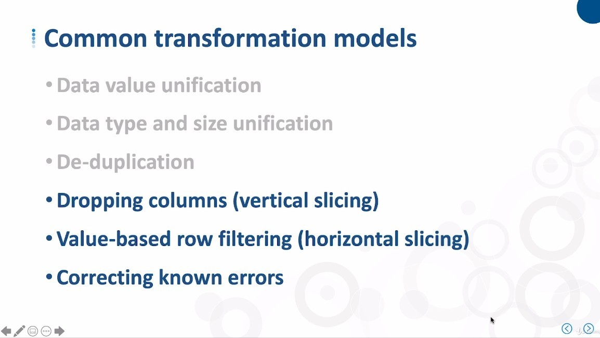
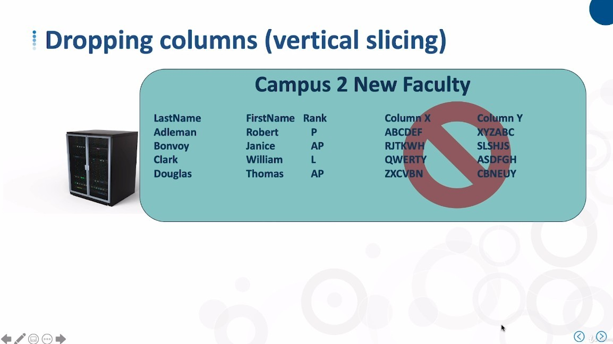
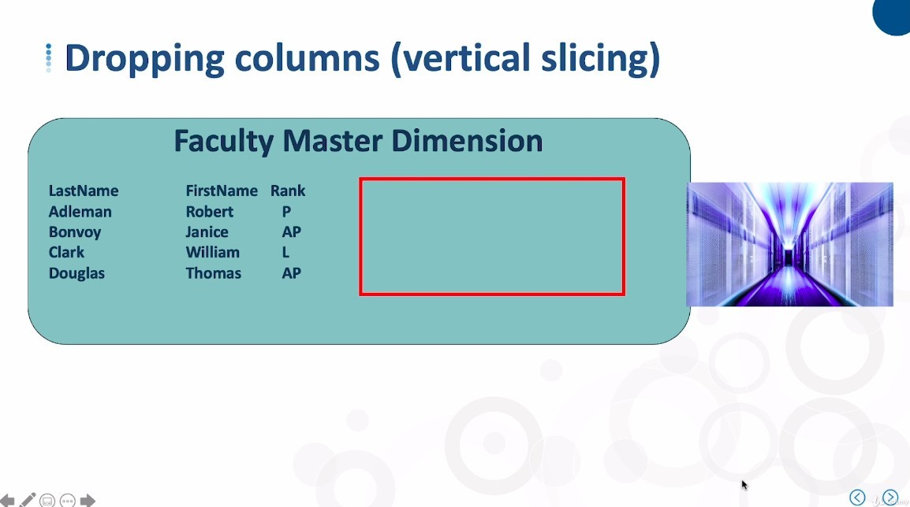
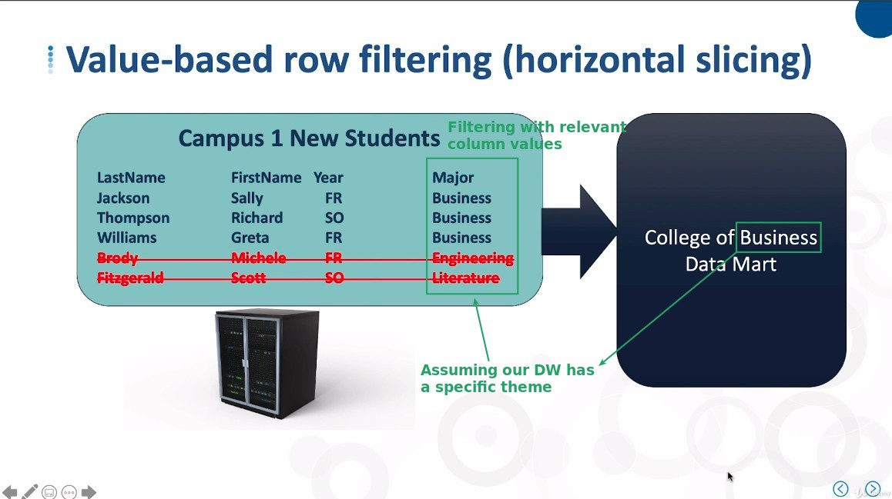
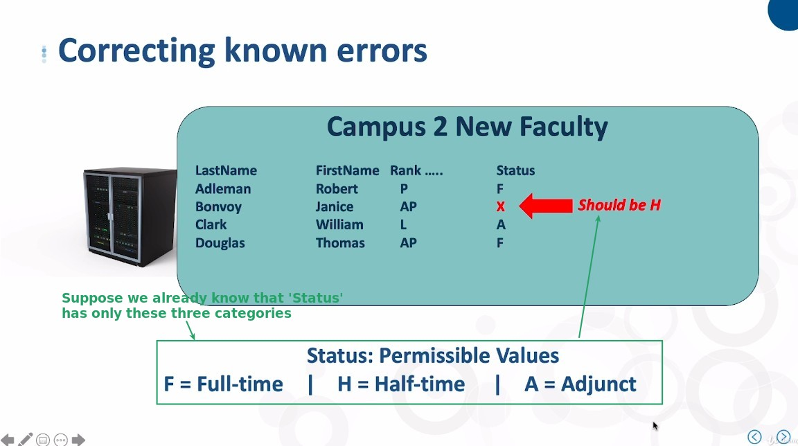
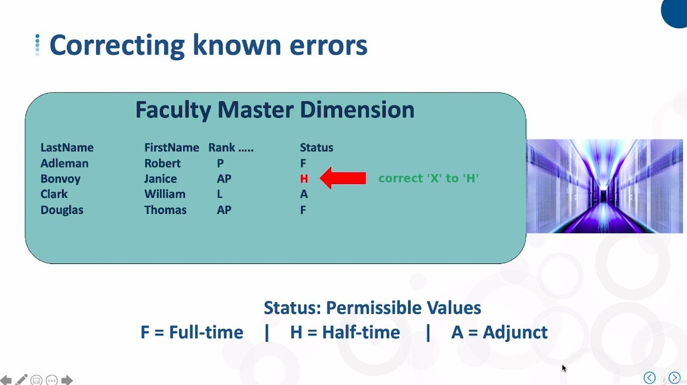

## **Other Three Common Transformation Models**

### _Dropping Columns (Vertical Slicing)_

- Columns that are not meaningful to the user (the person who will actually access the DW for analysis) should not go into the DW, even if they are meaningful to the department that is the source of the data.

### _Value-based Row Filtering (Horizontal Slicing)_

### _Correct Known Errors_

## **Conclusion**

- The models explained in this and the previous lecture are all aimed at achieving the goal of "Uniformity".

- Once the data is fairly unified, we can work on the next goal - "Restructure".
