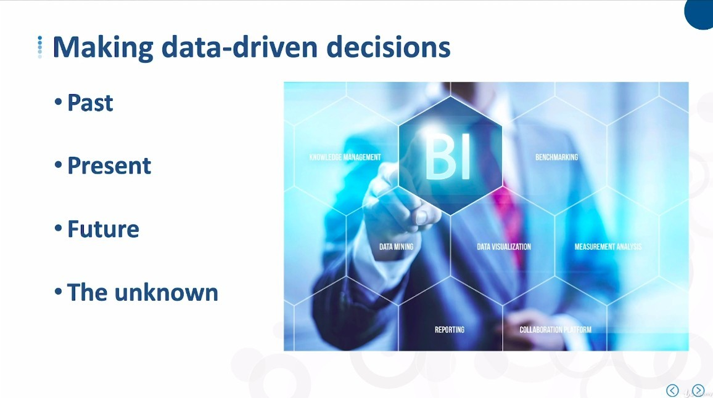
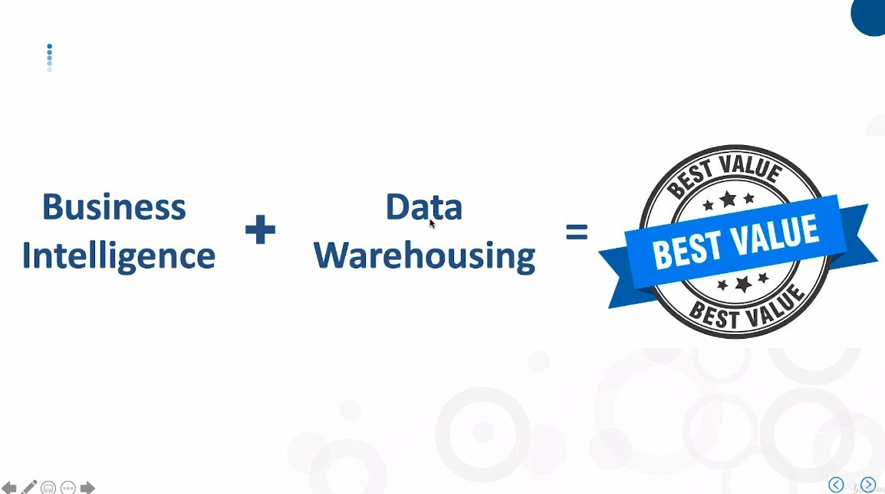
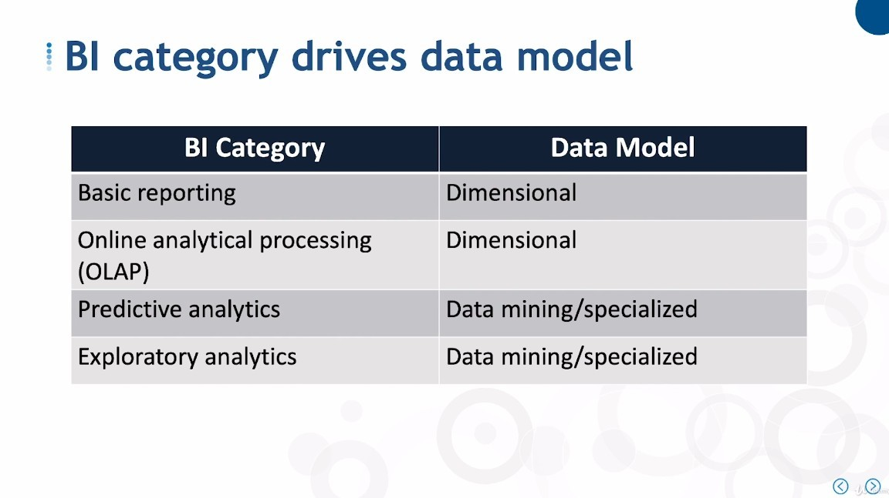

# ***How Will Your Data Warehouse Be Used?***

## **Thinking**

## **BI Category**

> After thinking about the above, the types of Data models are directly determined by the BI Categories.

- The latter two will have data that cannot be structured, so they cannot be placed in the dimensional table.

