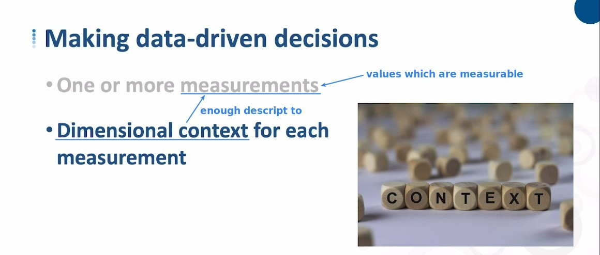
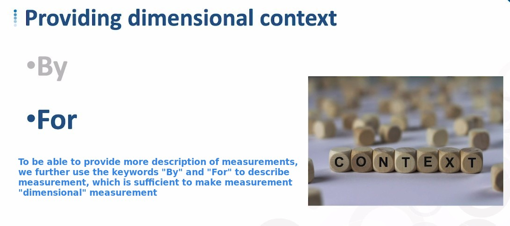
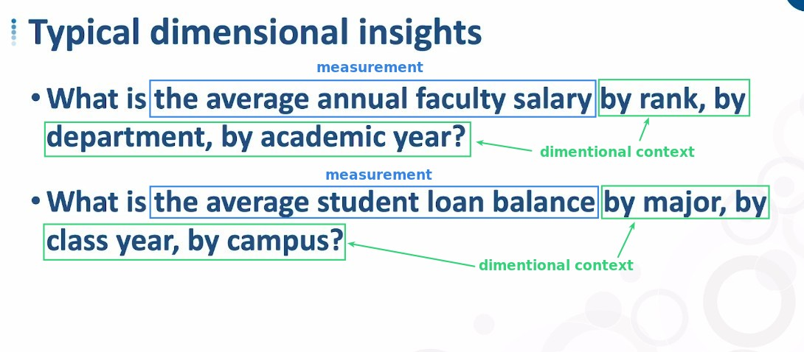
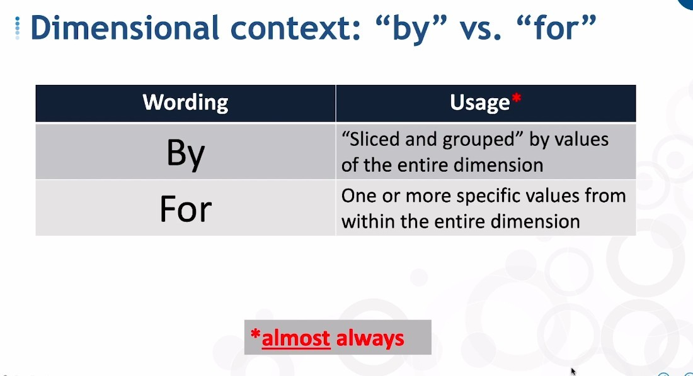
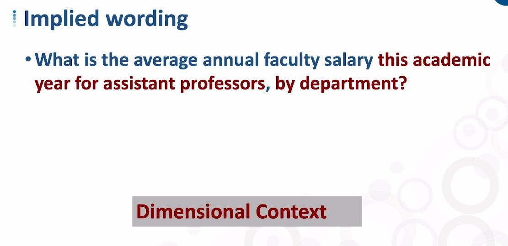
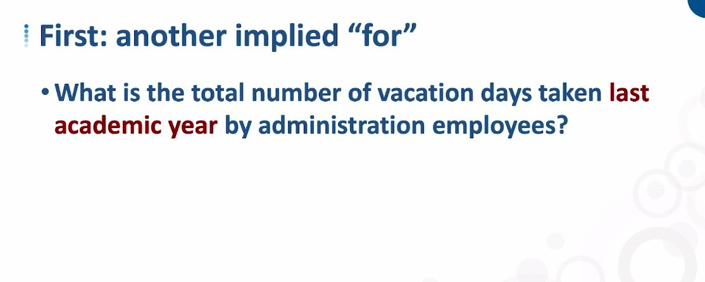

## **How to making data-driven decisions**

> What kind of data will help us get data-driven decisions.

### _Example starting with pure measurement_

## **Bring Dimensional Context to Our Measurement**

## **Conclusion**

- Dimensional modeling is the fundamental point, and if we do a good job of filtering and grouping our measurements, we can easily derive insights that drive decisions.
