# ***Facts and Dimensions in Data Warehousing***

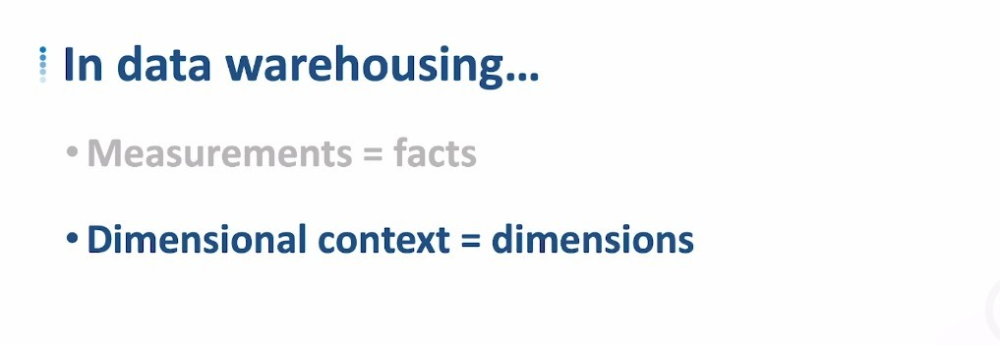

## **Facts and Fact table**

### _Facts_

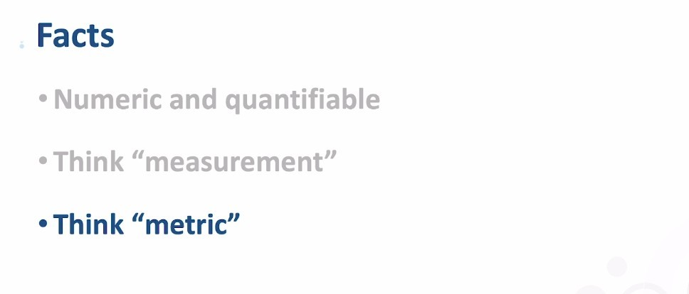

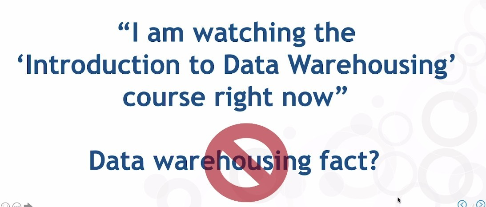

### _Fact table_

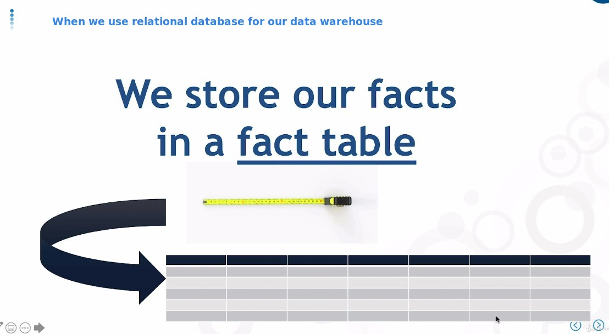

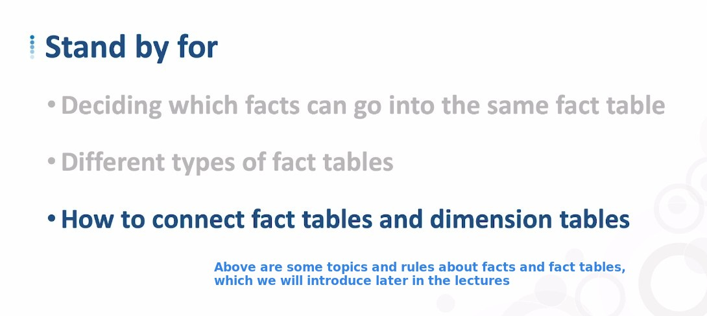

## **Dimensions and Dimension table**

### _Dimensions_

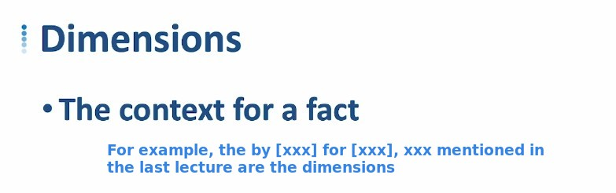

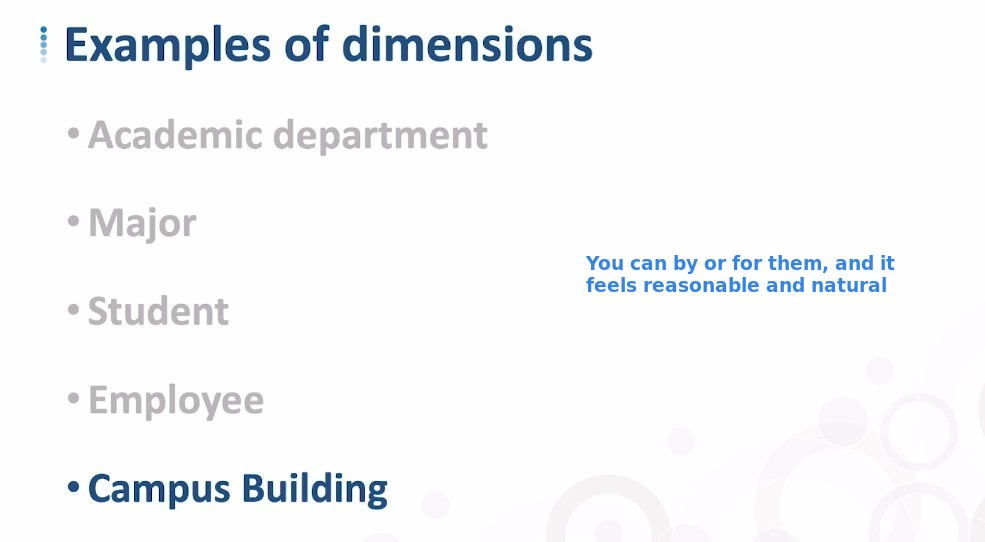

### _Dimension table_

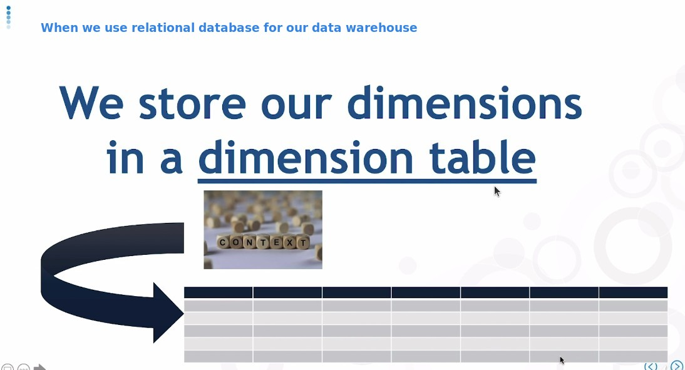

**Imprecise verbiage**

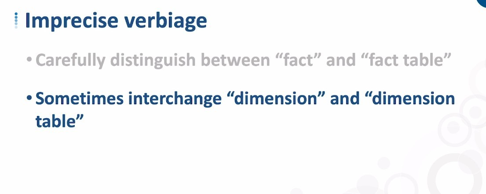

- We usually have a clear distinction between facts and fact tables, but the distinction between dimensions and dimension tables may not be very strict.

**1 or 3 dimension tables(hierarchy)?**

> Even for the same dimentions, the number of dimension tables or hierarchy may be different because of the different Schema patterns used.

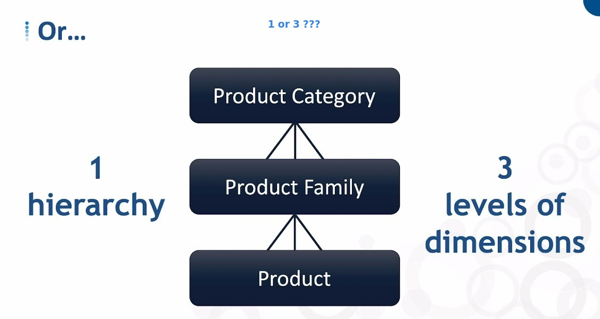

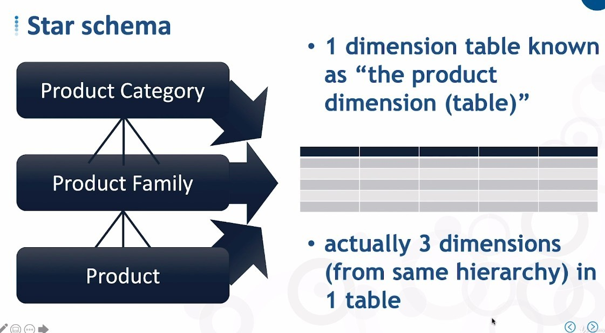

