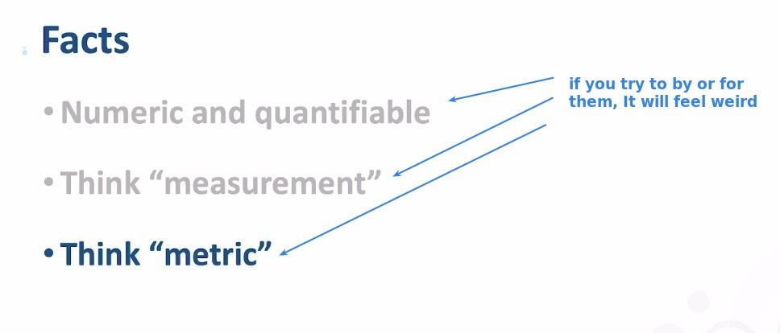
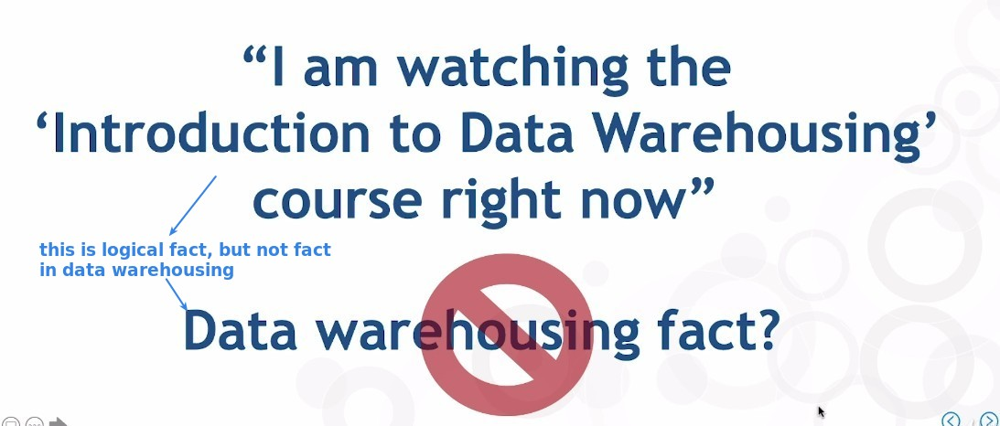
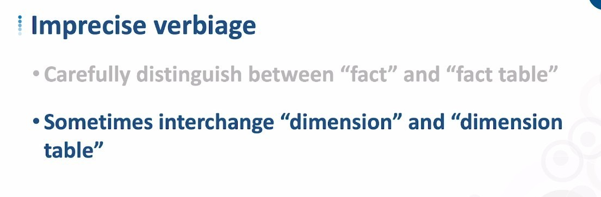
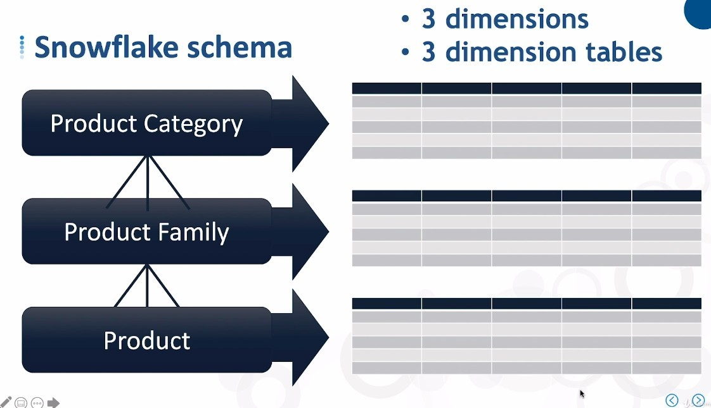

# ***Facts and Dimensions in Data Warehousing***

## **Facts and Fact table**

### _Facts_

### _Fact table_

## **Dimensions and Dimension table**

### _Dimensions_

### _Dimension table_

**Imprecise verbiage**

- We usually have a clear distinction between facts and fact tables, but the distinction between dimensions and dimension tables may not be very strict.

**1 or 3 dimension tables(hierarchy)?**

> Even for the same dimentions, the number of dimension tables or hierarchy may be different because of the different Schema patterns used.

