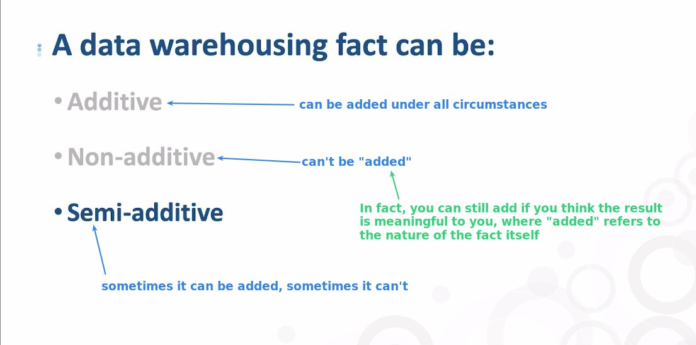
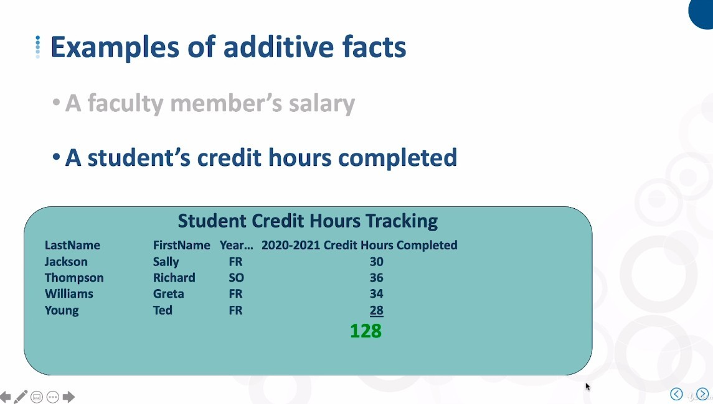
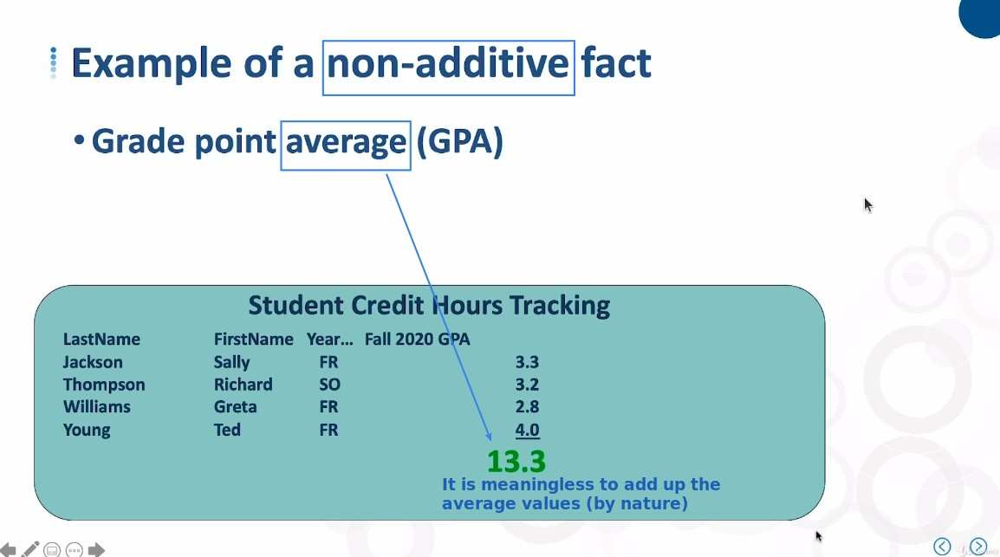
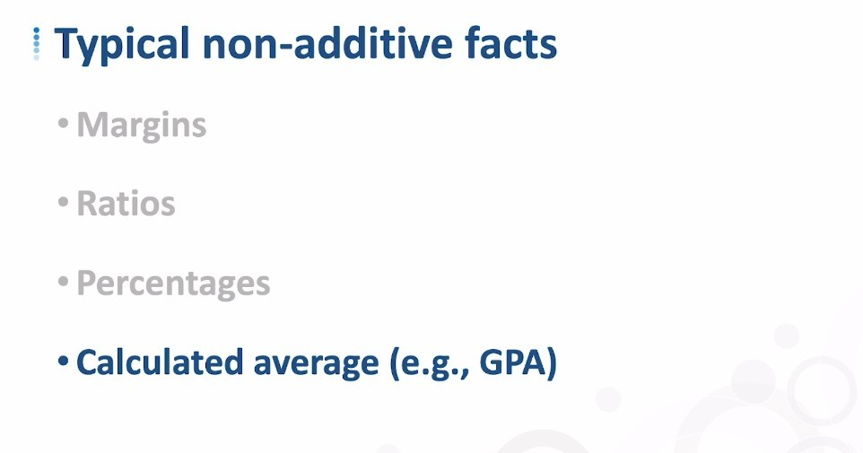
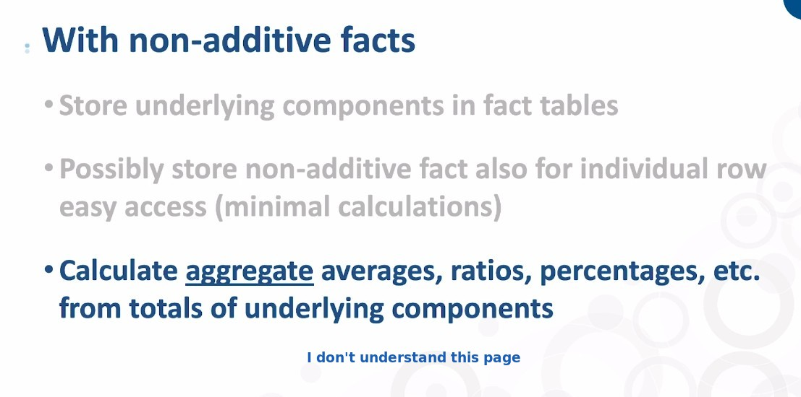
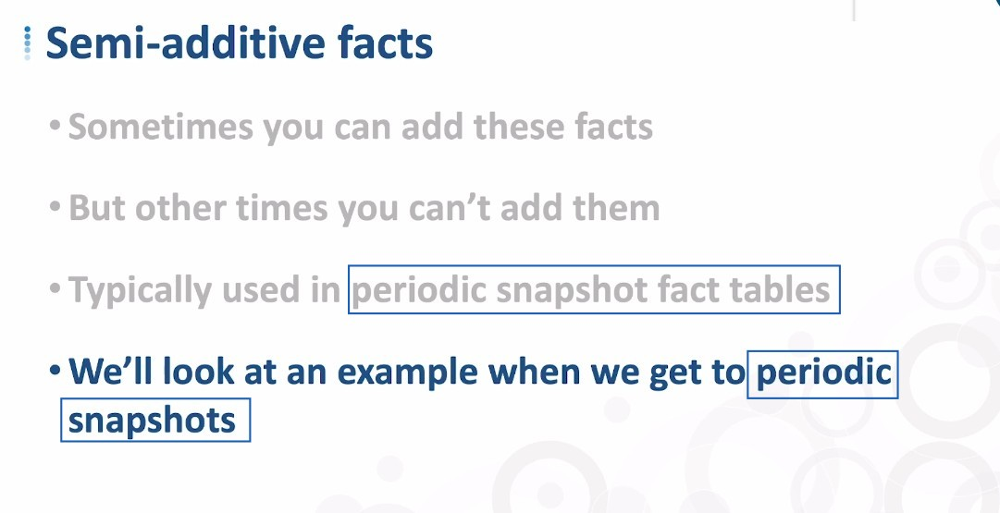

## **The ways to store facts into fact table**

## **Examples**

### _Additive facts_

**Faculty**

**Student**

### _Non-additive facts_

## **Non-additive facts**

## **Semi-additive facts**

