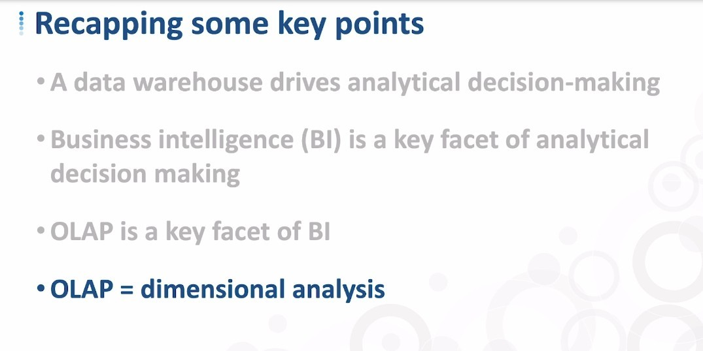
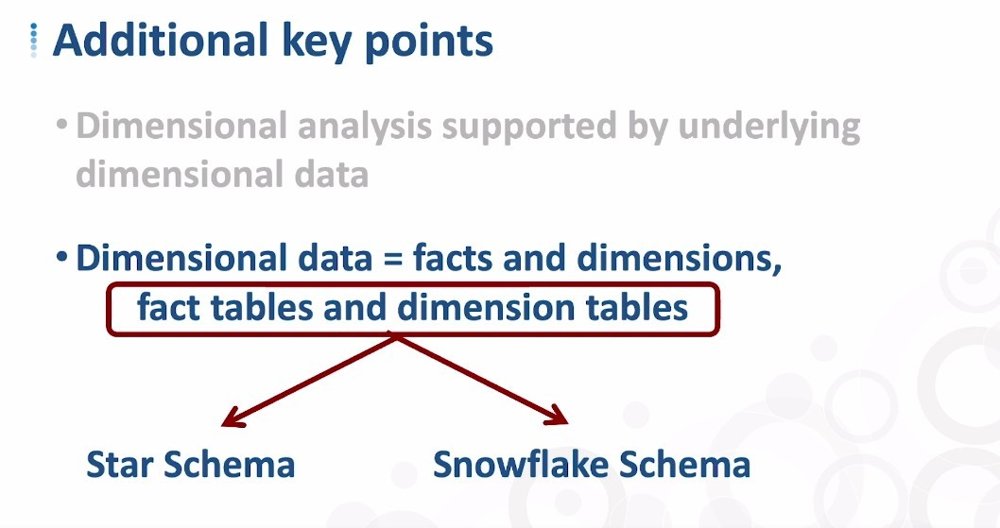
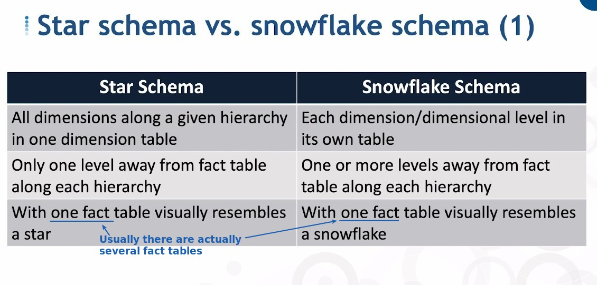
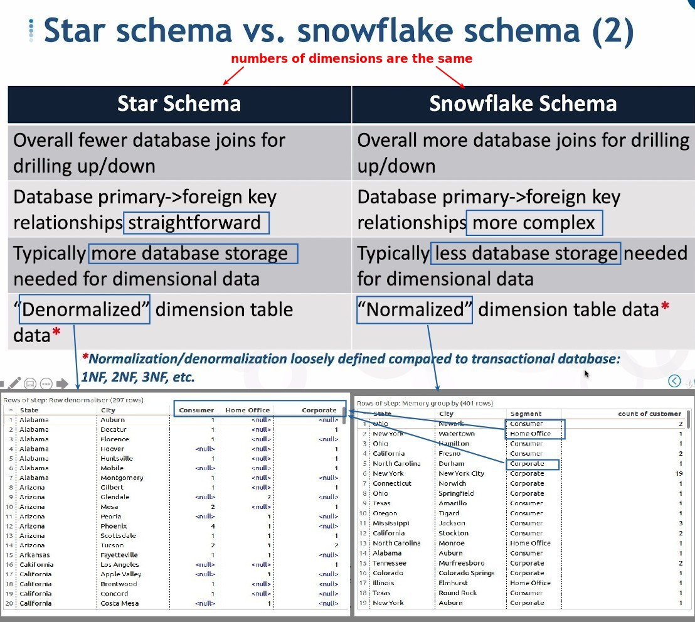
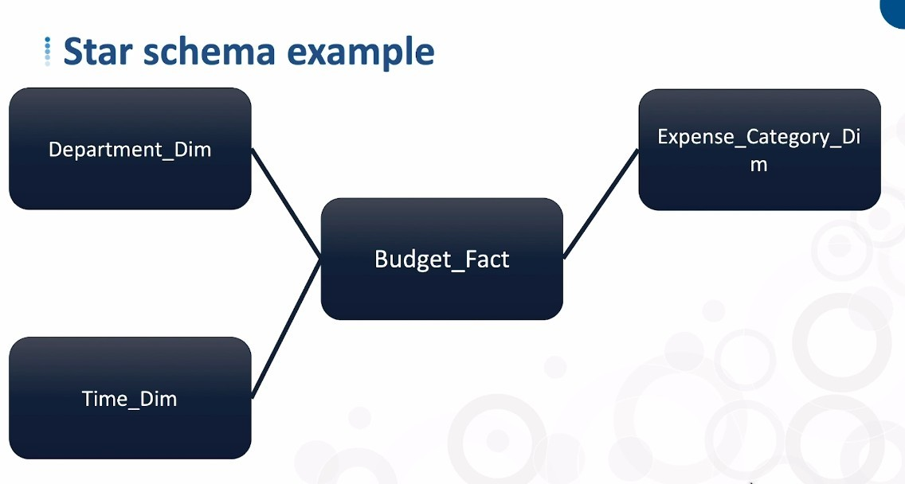
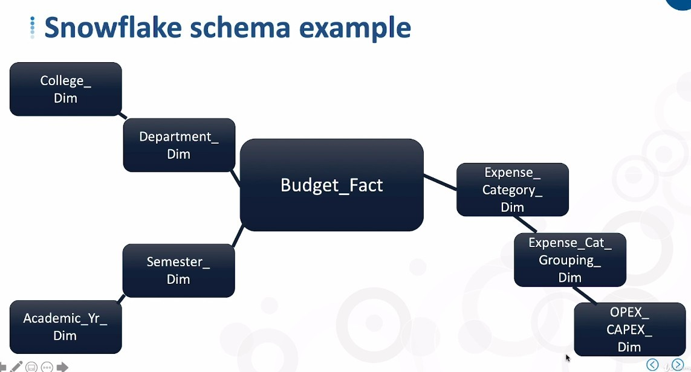
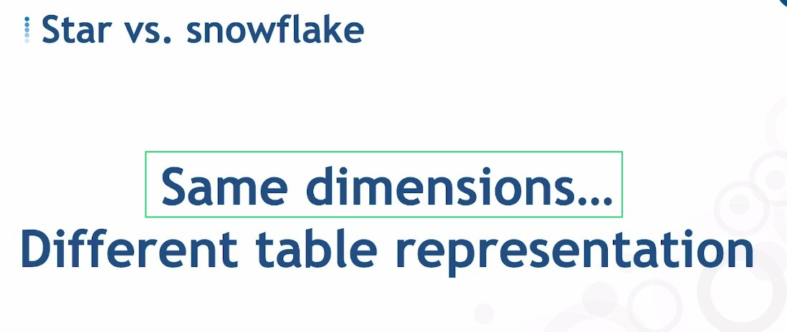

## **Recap key points**

- when we talk about overlap, we essentially mean dimensional analysis of our data.

## **Star Schema vs Snowflake Schema**

- We usually use "_Dim" and "_Fact" for table types.

- There is only one level of dimensional tabls, and even if there is a hierarchical relationship between them, they are still compressed in one level.

## **Examples**

### _Star_

### _Snowflake_

## **Common misunderstand**

