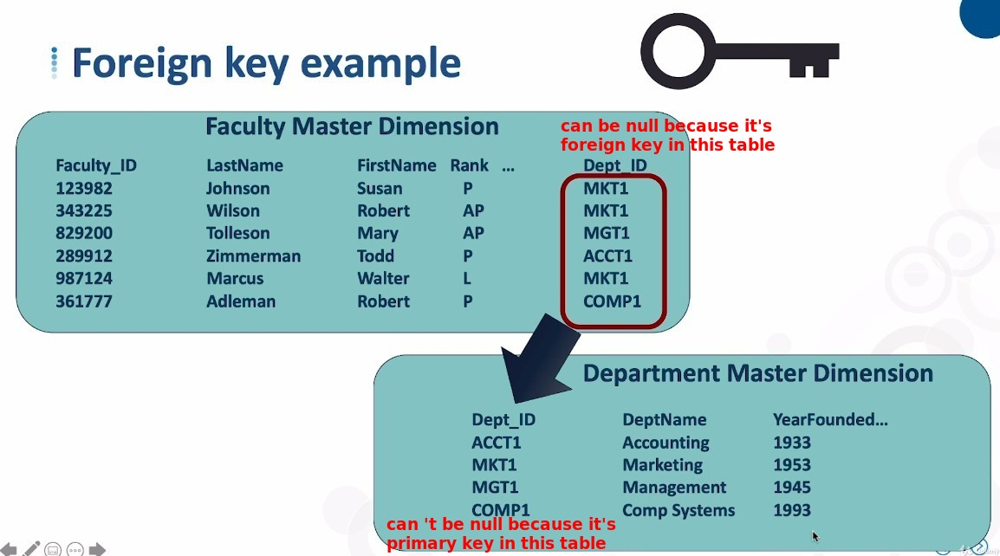

## **How to relate between tables**

## **RDBMS Key Types**

### _Primary key_

### _Foreign key_

## **Data Warehousing Key Types**

### _Natural key_

### _Surrogate key_

## **Whether to discard the natural key**

