## **Fundational Concepts(reviews)**

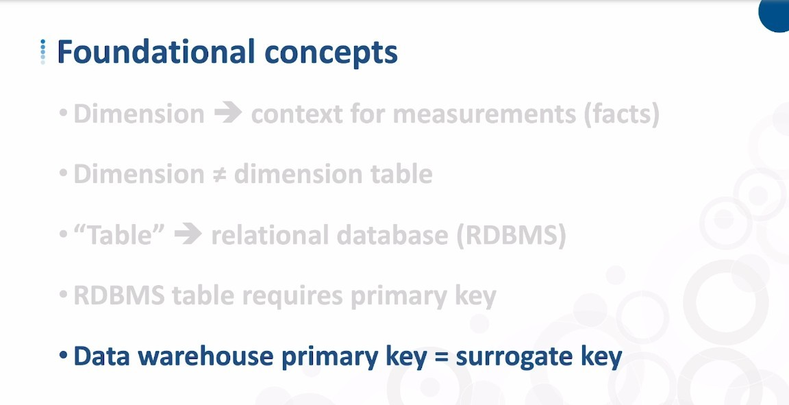

## **Keys of Dimension tables**

- We will then use the two classic dimensions examples above as examples.

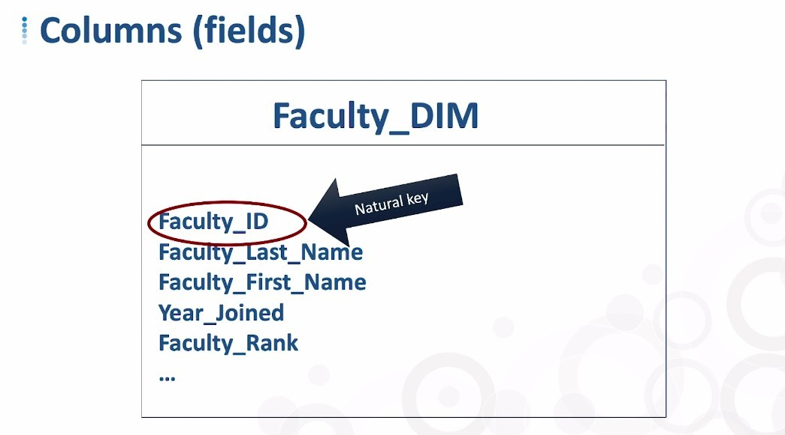

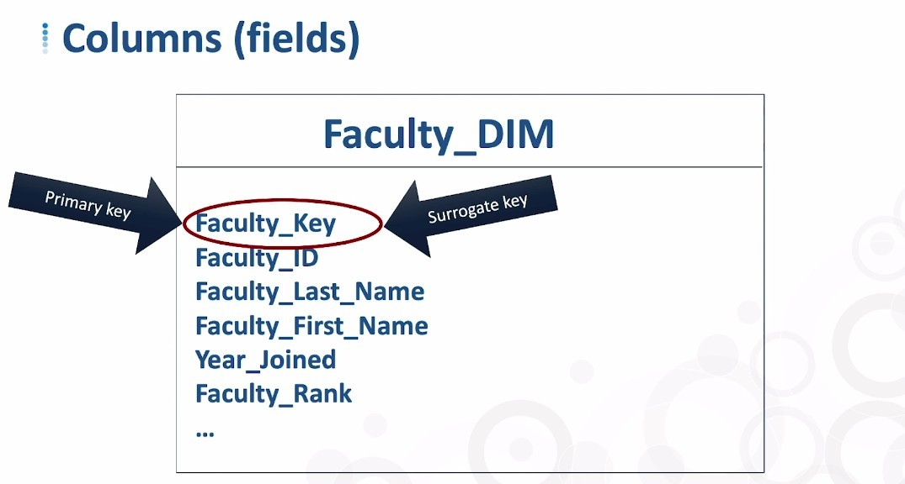

- As mentioned in the previous lecture, the best way is to use surrogate key to relate talbes, so we will add a field "XXX_Key" as surrogate key and also as primary key.

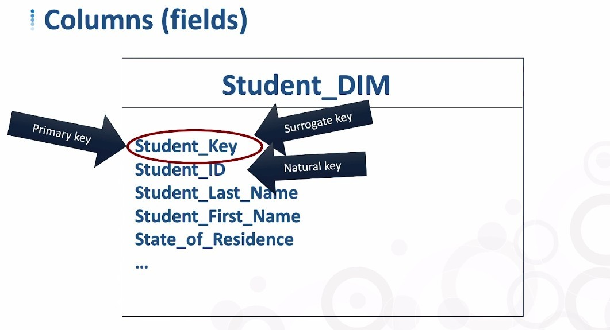

## **Other concepts of Dimension tables**

### _Concept of Dimension talbes_

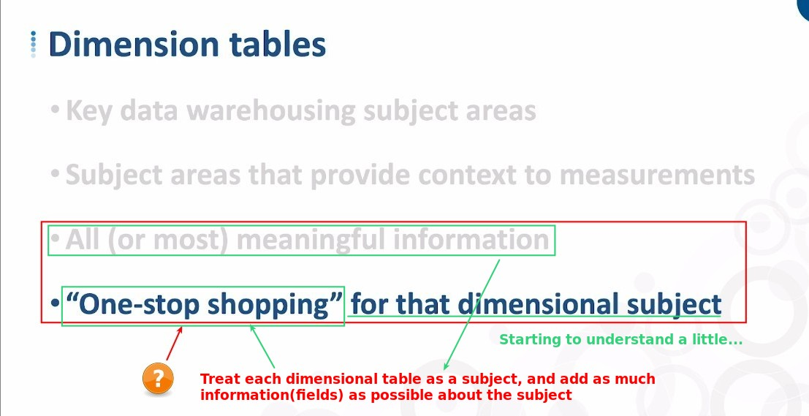

### _Hierarchical vs Flat dimensions_

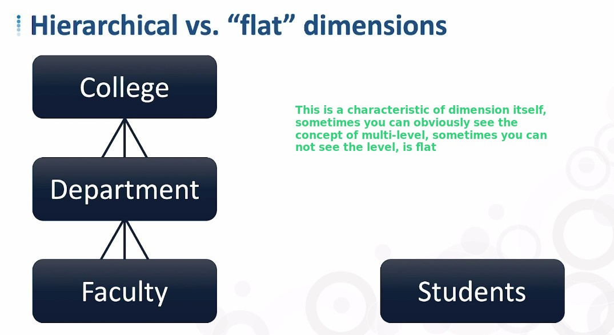

## **Star and Snowflake Schemas**

### _Star Schema_

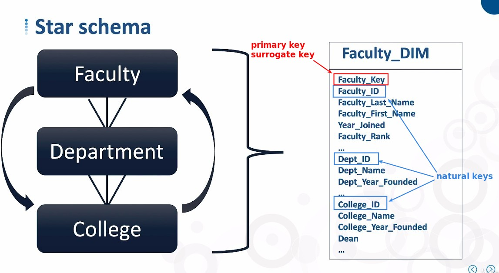

### _Snowflake schema_

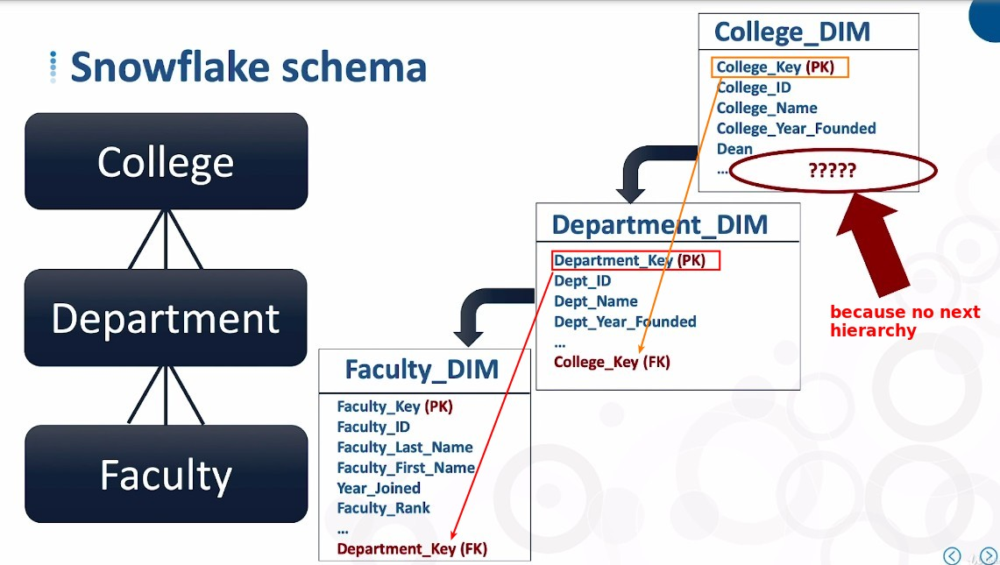

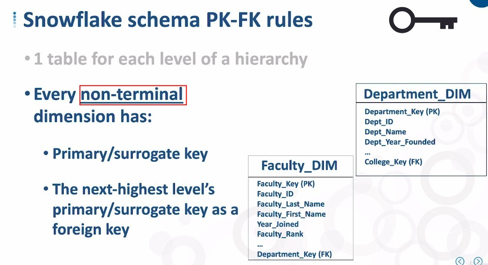

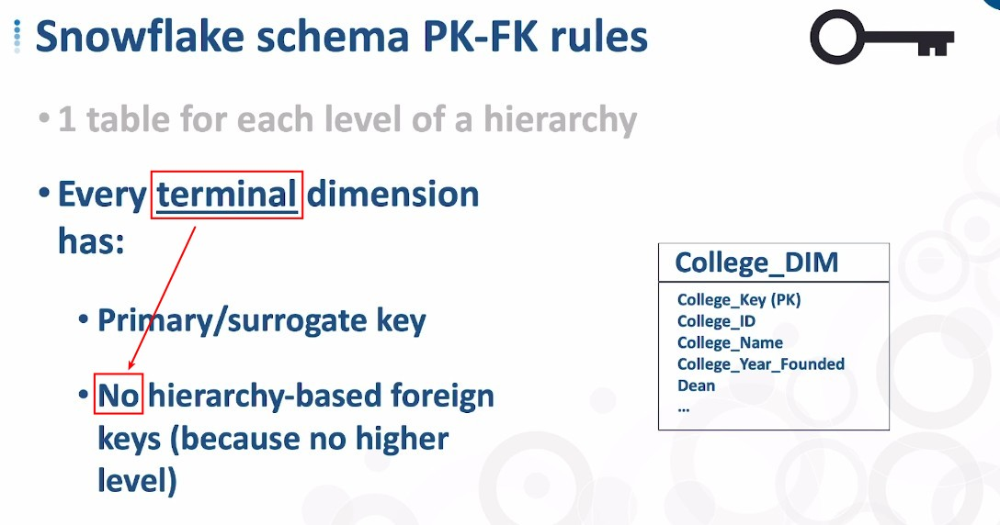

## **Snowflake hierarchy with Branching**

> Sometimes the dimension table itself can be described by more than one dimension, which results in branches as follows.

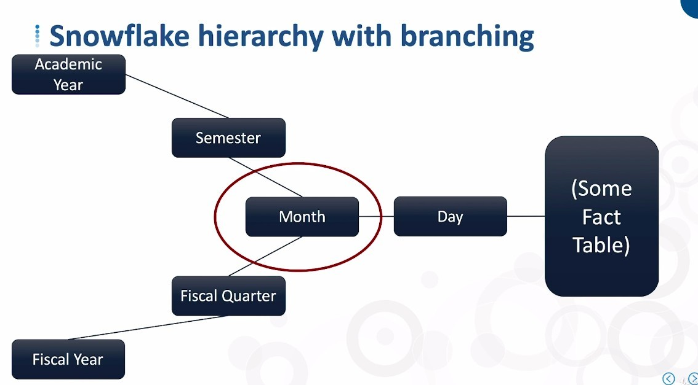

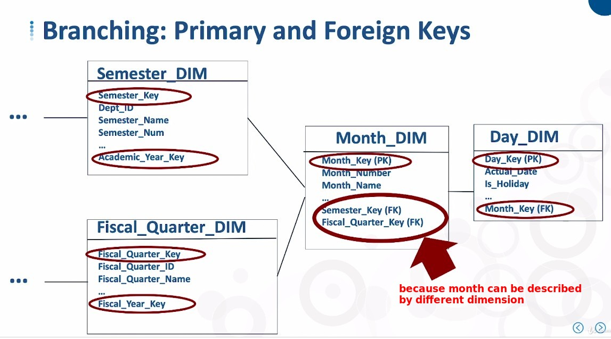
