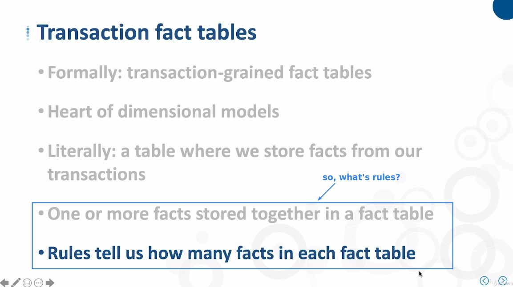
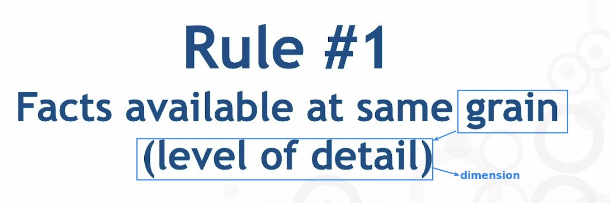
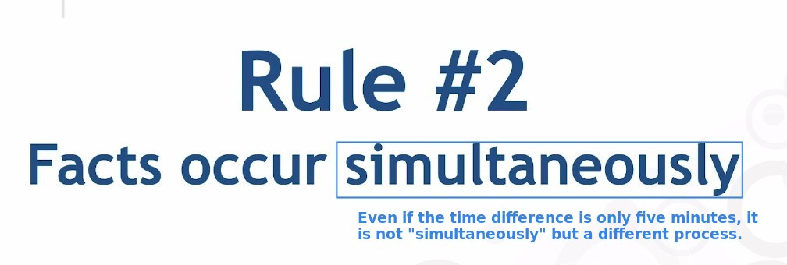
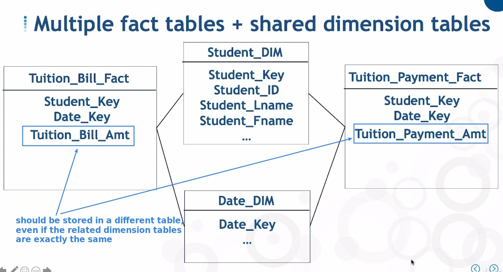
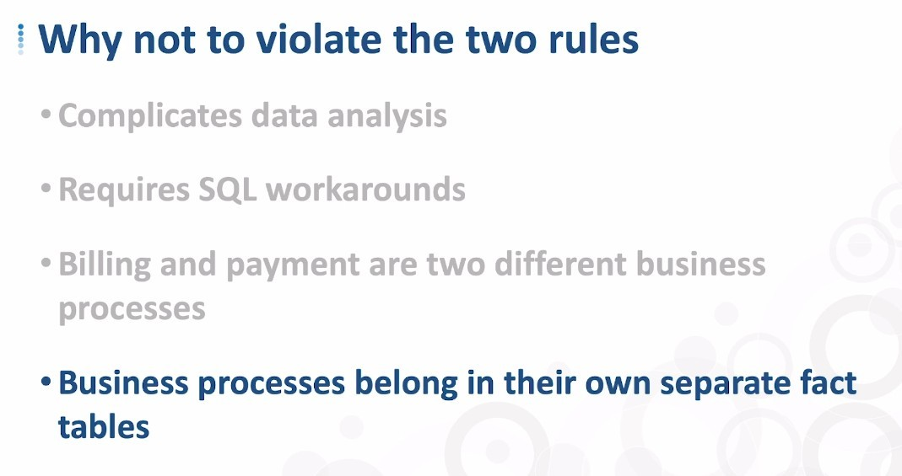
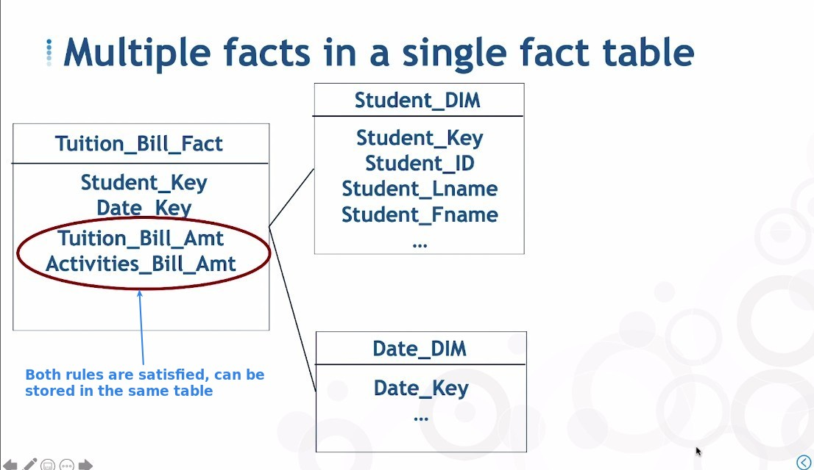

## **What's the Rules?**

> Continuing from the previous lecture, the rule of putting multiple facts into the same table.

### _Both of the following rules must be met_

## **Example of different process**

## **Example of matching both rules**

## **Example of different Grain**

- The grain size of the two facts must be identical to meet rule #1.
