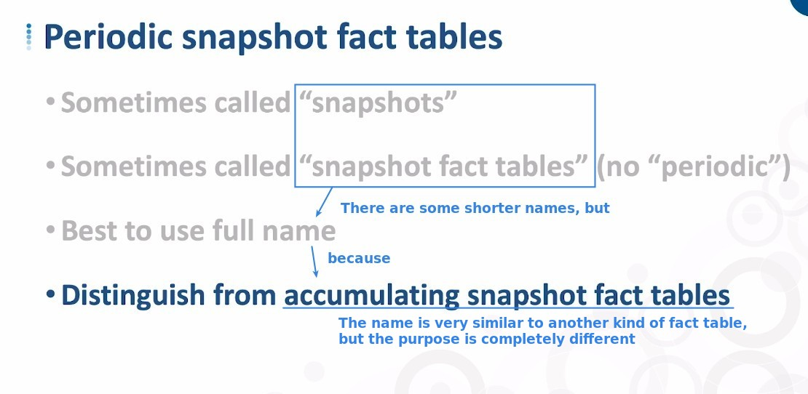

## **Can we just use shorter name of it?**

## **Some points about it**

### _What it does?_

### _What it record?_

### _There are two types of it_

## **If only Transaction fact table**

- It can be difficult to do some analysis which are based on regular periodic level.

  - It can still be done, but in SQL script it becomes very complicated.

## **How about generate a new table for these type of analytics?**

## **2nd type (Not build alongside any transaction fact table)**

