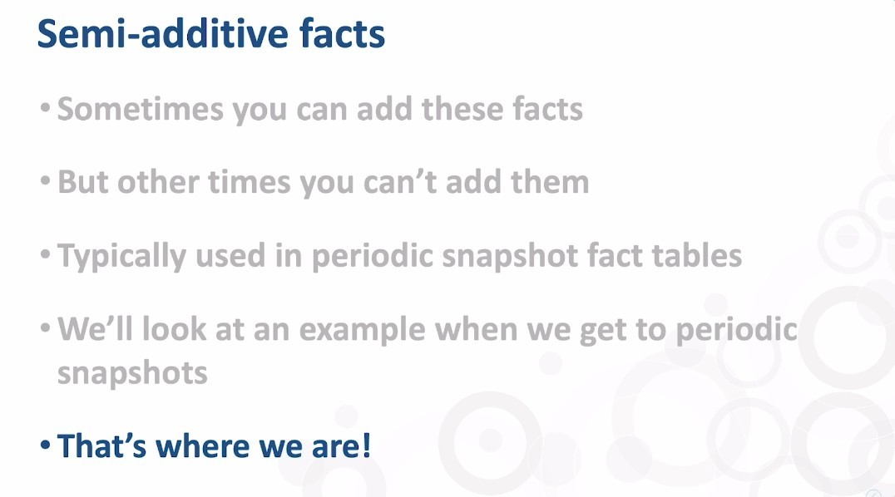
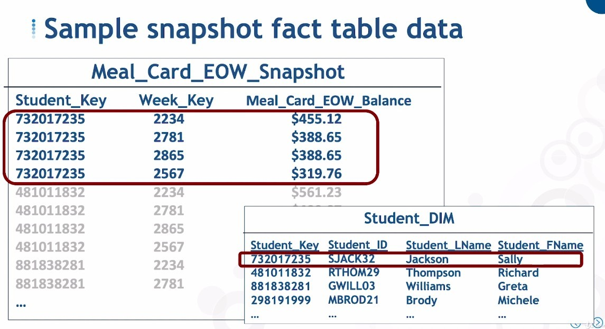
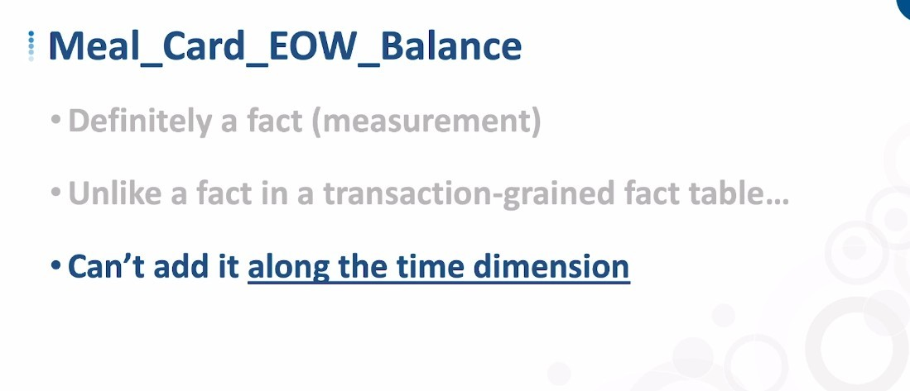
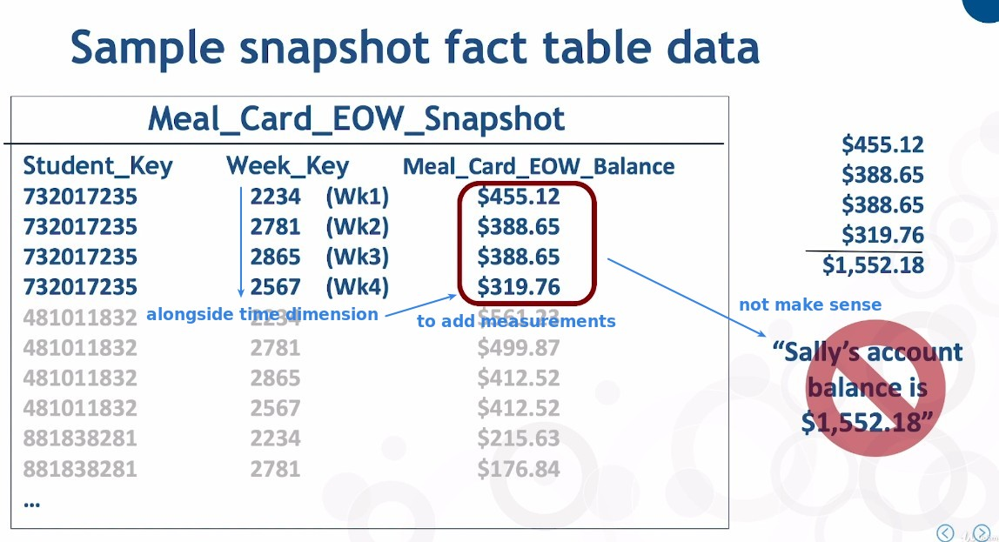
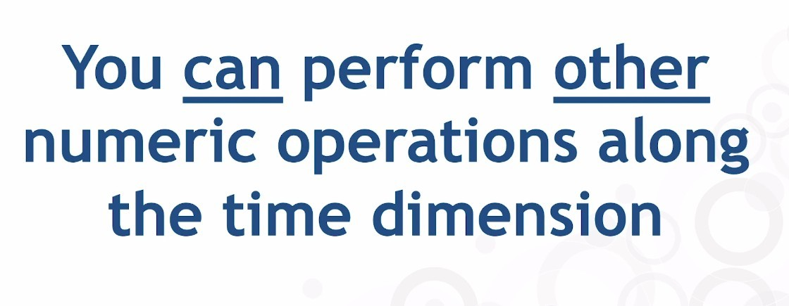
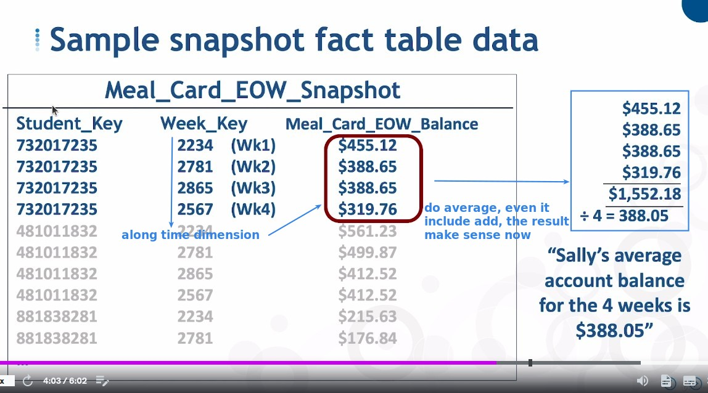
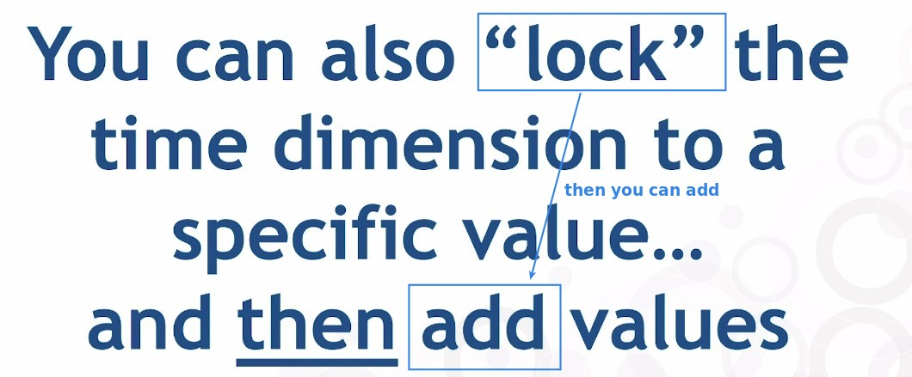
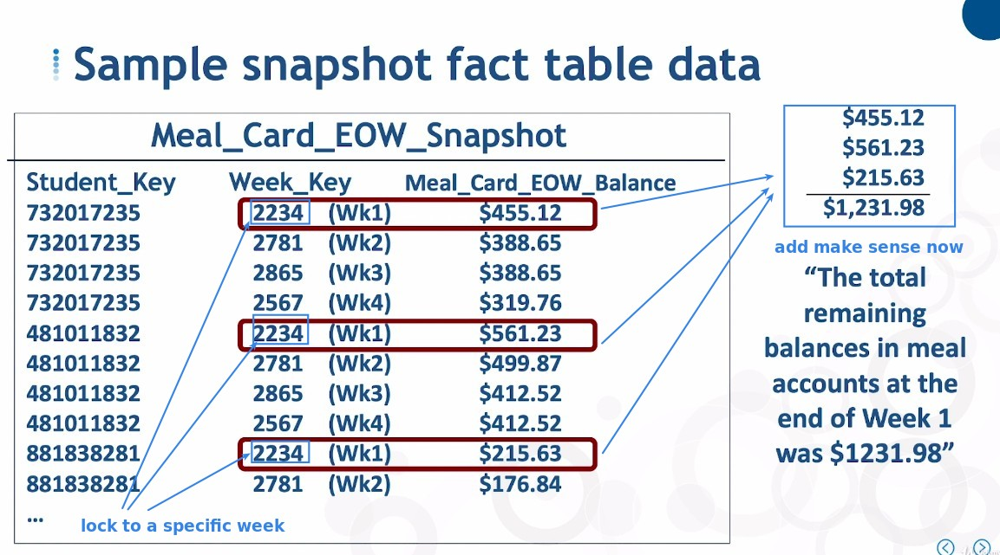
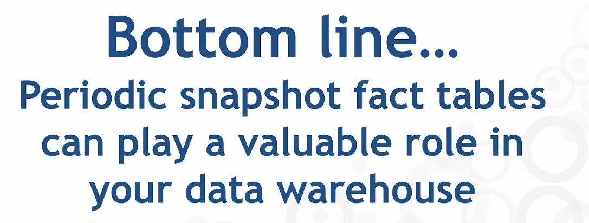

## **Review about Semi-additive facts**

## **Start from a business question based on periodic measurements**

## **Operation with semi-additive facts**

### _Can't add them along time_

### _Can perform other numeric operation along time_

### _Can add along time after locking to specific time_

## **Bottom Line**

- Combining transaction grain fact tables can bring a lot of value to your data warehouse.
