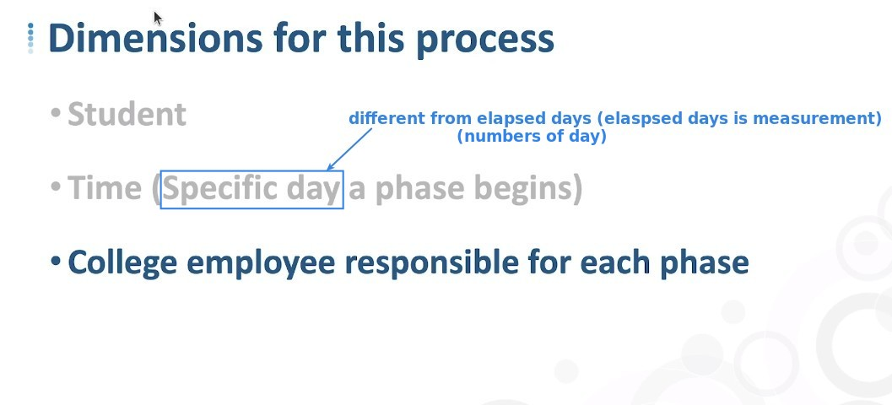

## **Fundamental Knowledge of Accumulating Snapshot Fact table**

## **Example: The Financial Aid Application Process**

### _Introduce all process stages_

### _Dimensions_

### _Measurements_

### _Relationships_

**One to One**

**One to Many**

> means relate to the same dimension table multiple times.

### _Primary key_

