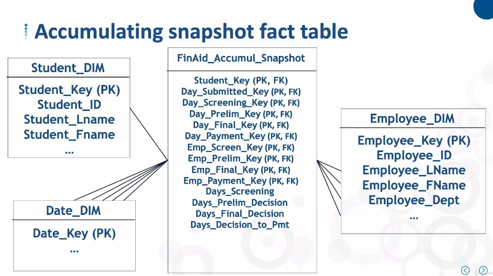
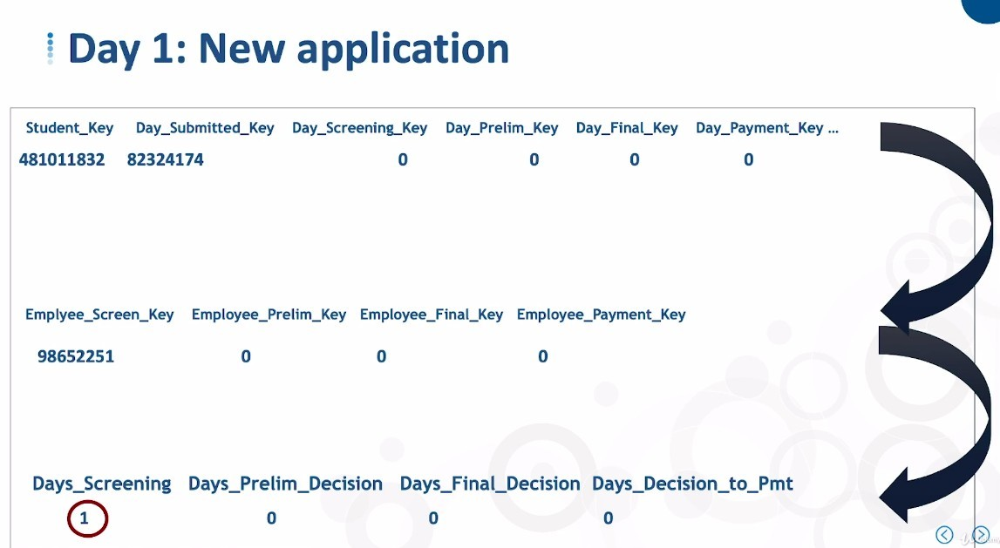
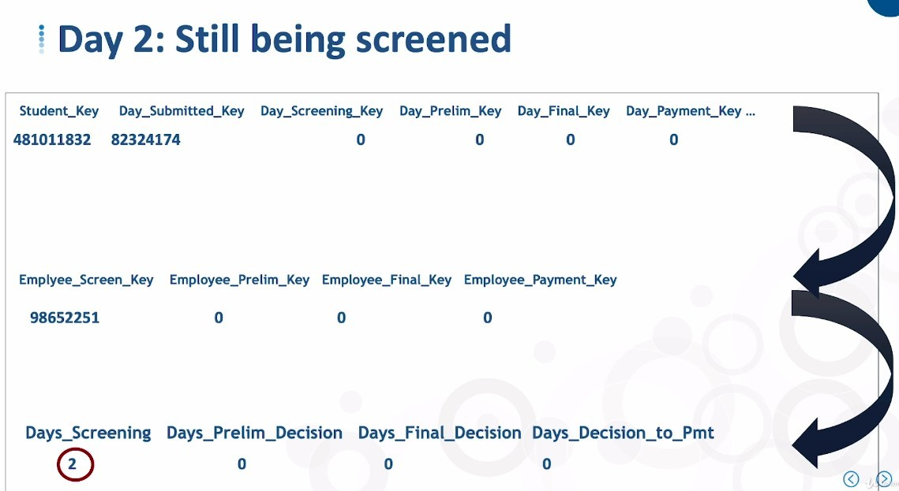
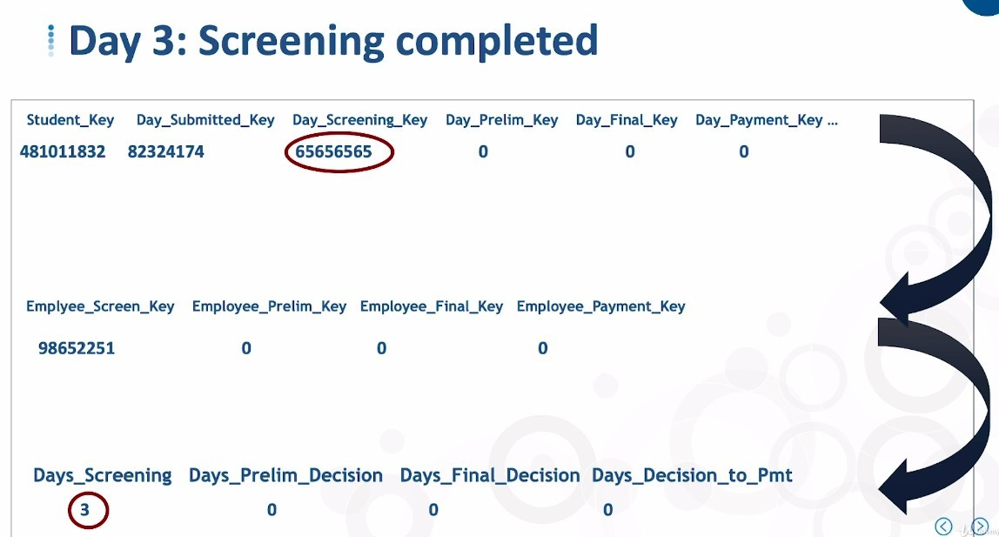
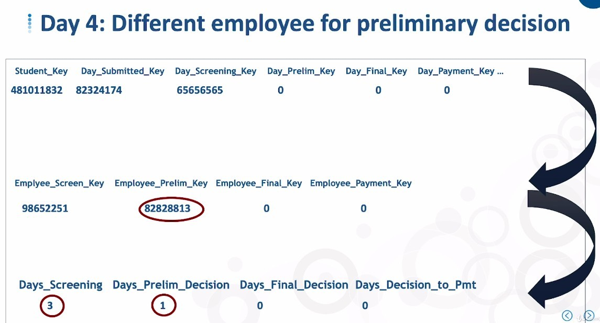
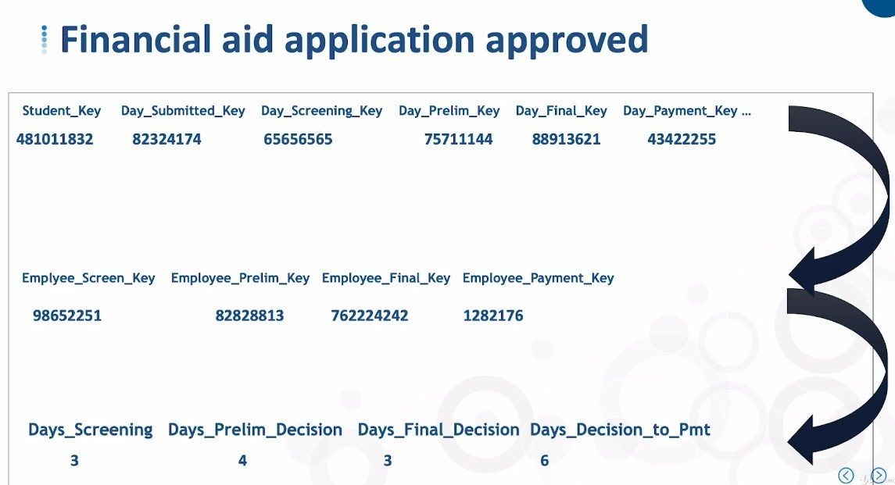
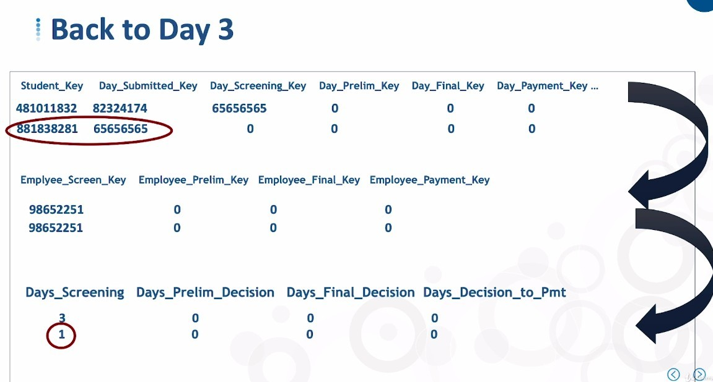
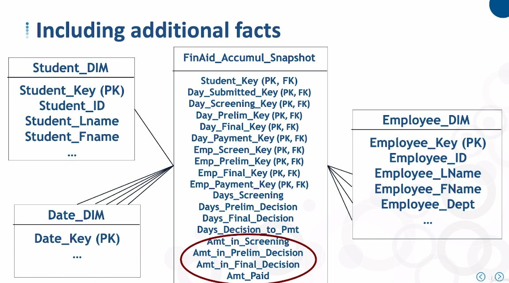
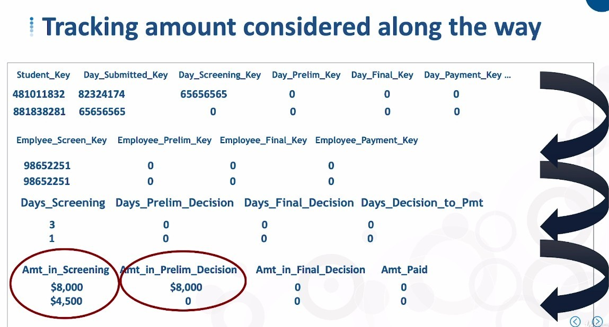

## **Continuation of the table example from the previous lecture**

- In this lecture, we observe the table contents day by day with the following case.

## **Observation Day by Day**

- Particular attention should be paid to the end of one stage and the beginning of another.

  - The most important rule is that days are increased by one every day, no more and no less.

  - In this case, when the start date of the next phase appears, the number of days of the previous phase is still added, and the responsible person fills next day.

    - Maybe it can be changed according to the demand?

## **Track multiple students**

> Assuming another student applies on the third day of the first student's application.

- Naturally, with this form structure, it is possible to track the application process for multiple students at the same time.

## **Track more facts**

> Not only the number of days in each stage, but also other facts can be tracked.

