## **Intro of Factless Fact Table**

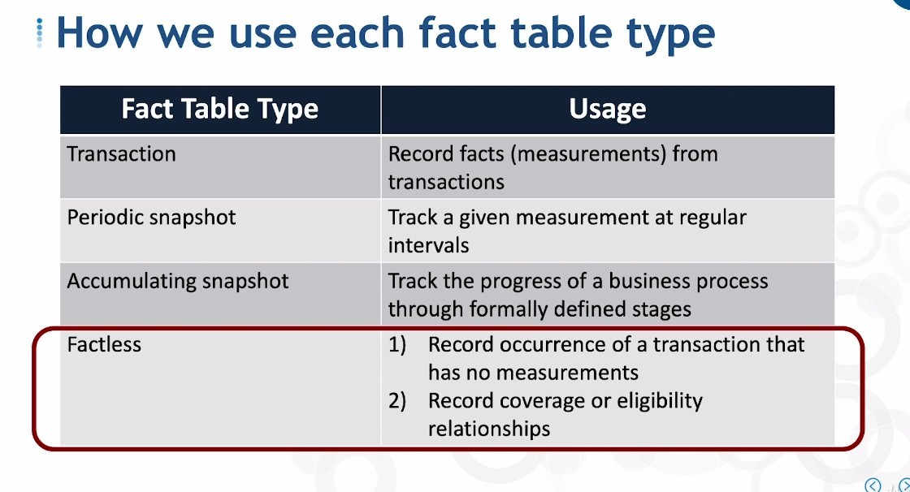

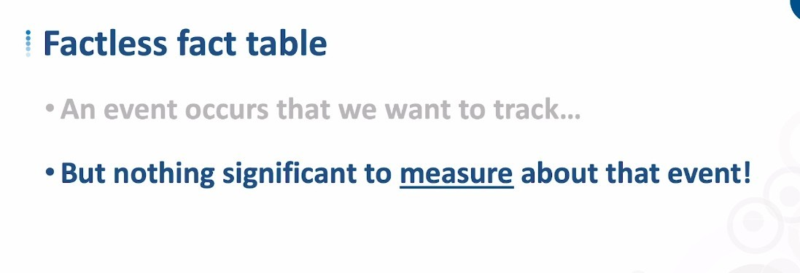

## **Business Question: Student assign webinar**

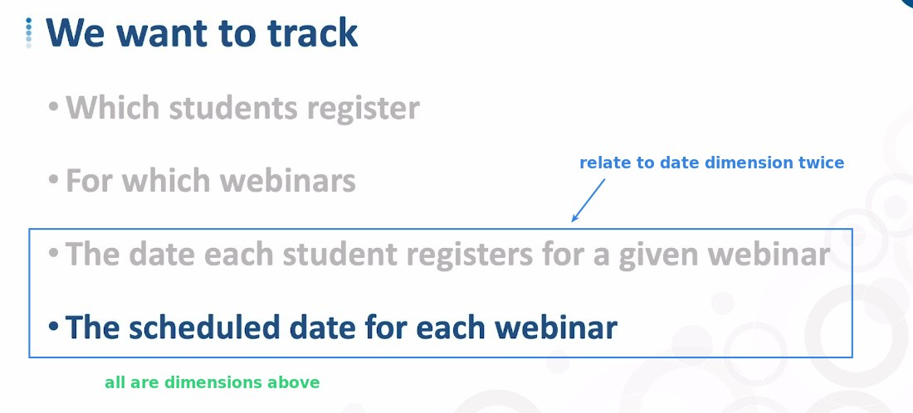

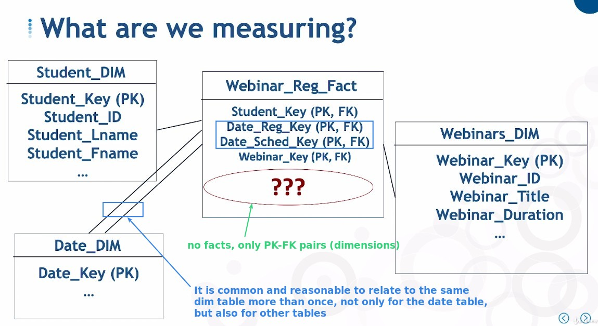

- So it's not just one to many in accumulating snapshot fact tables, other kinds of tables may also have to use this relationship, and it will happen naturally depending on demand.

### _measurement is row itself_

> The fact table itself must be able to do analysis to be meaningful, but the factless fact table does not have any measurement, so what analysis can be done with it?.

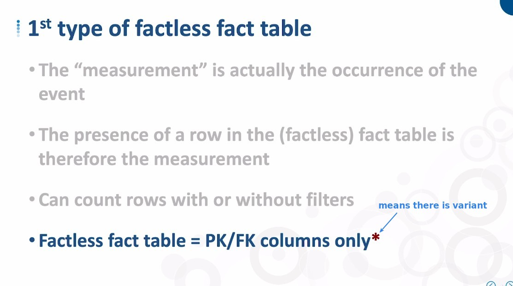

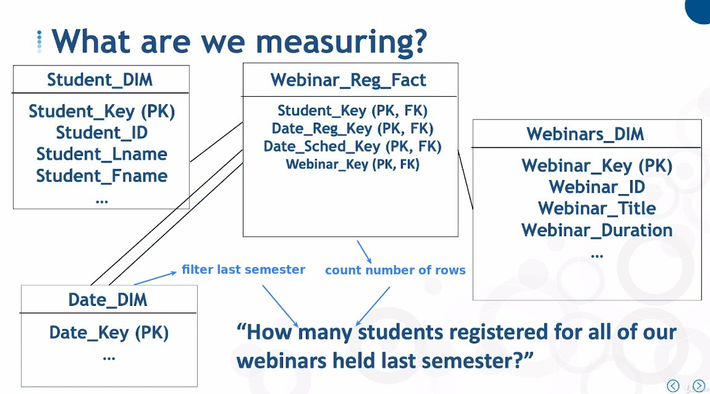

## **Multiple tables to track process of same thing**

### _multiple factless fact tables_

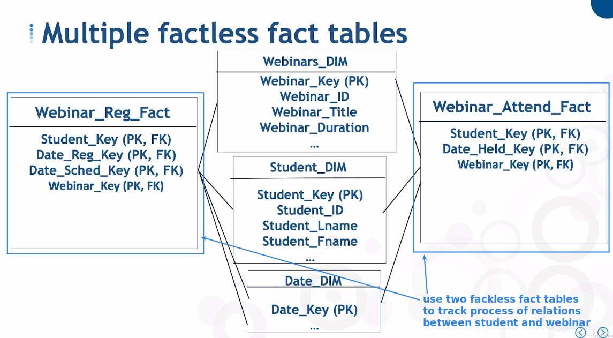

### _combined with transaction table_

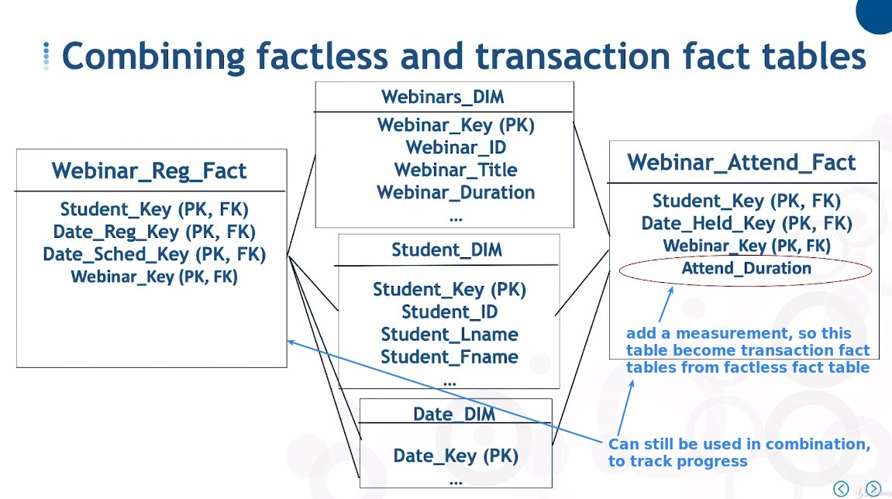

## **Adding Tracking Fact**

> Some people are uncomfortable with all fields being PK-FK pairs, so a field called "tracking fact" has been added to the factless fact table.

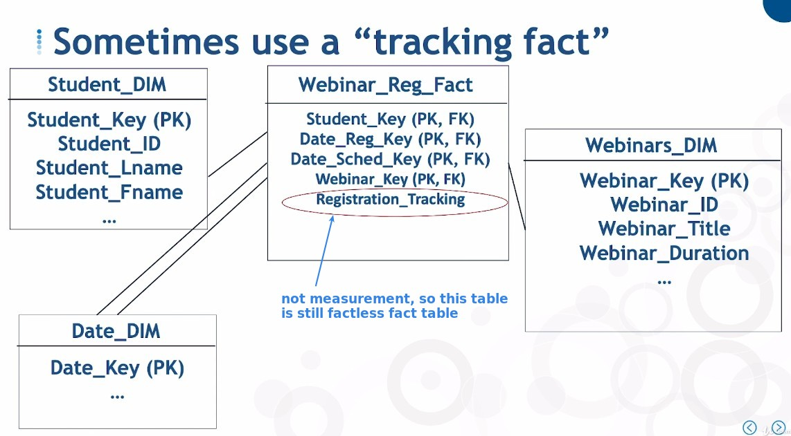

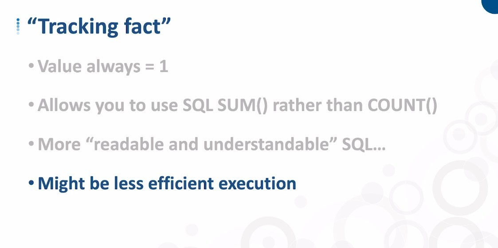

- So using tracking facts is not necessarily a good thing, but at least it is an option.

## **2nd type of Factless Fact table**

> Used to record the fact that there is a association between different departments or people, usually with a start and end date (not mandatory).

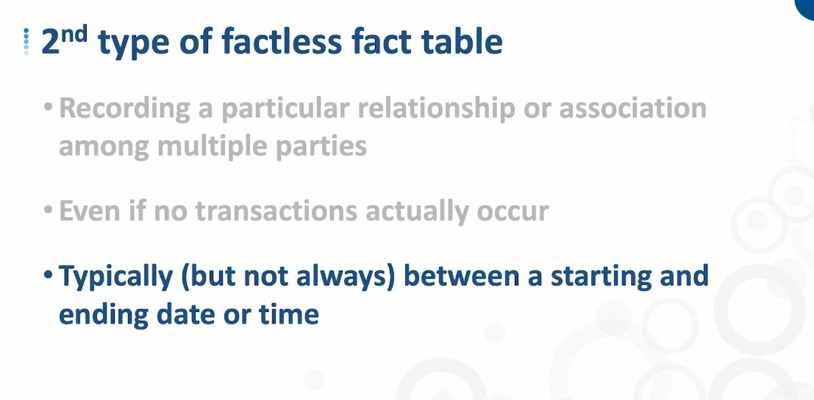

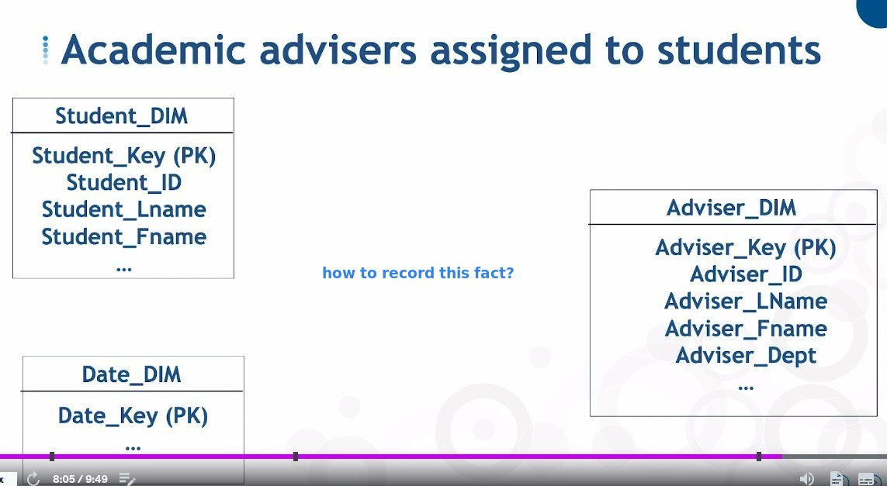

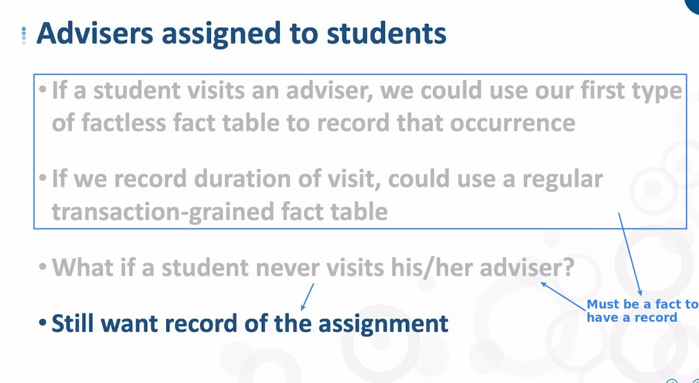

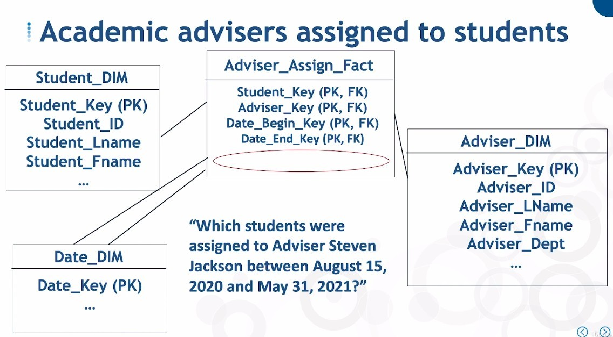
