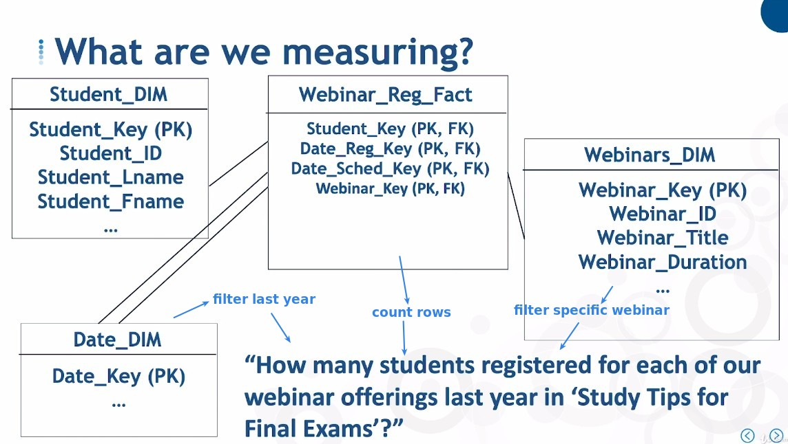

## **Intro of Factless Fact Table**

## **Business Question: Student assign webinar**

### _measurement is row itself_

## **Multiple tables to track process of same thing**

### _multiple factless fact tables_

### _combined with transaction table_

## **Adding Tracking Fact**

## **2nd type of Factless Fact table**

