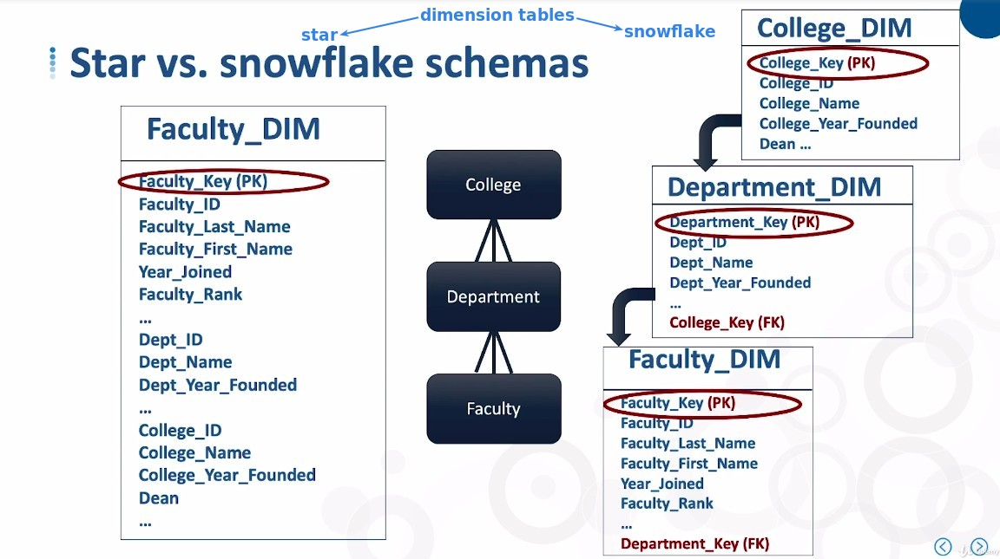
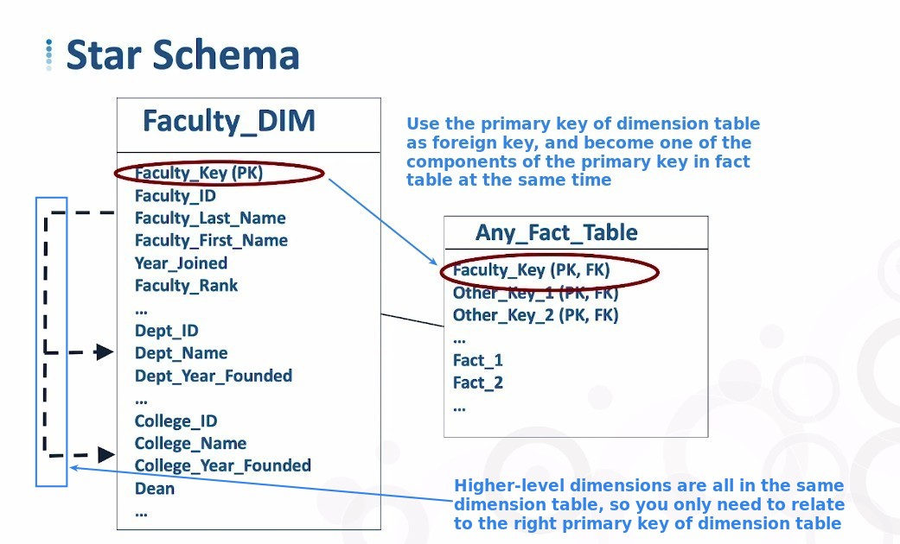
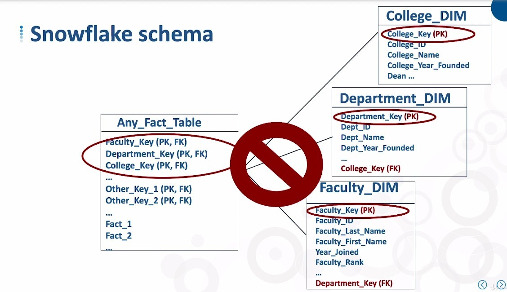
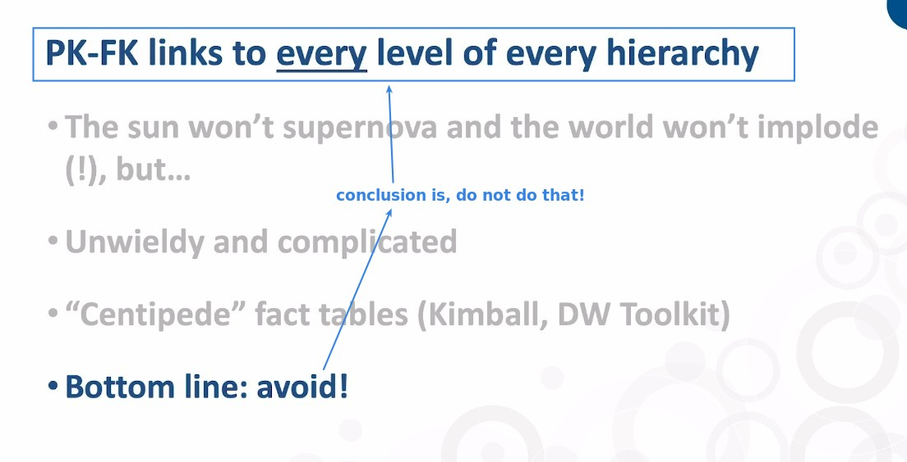
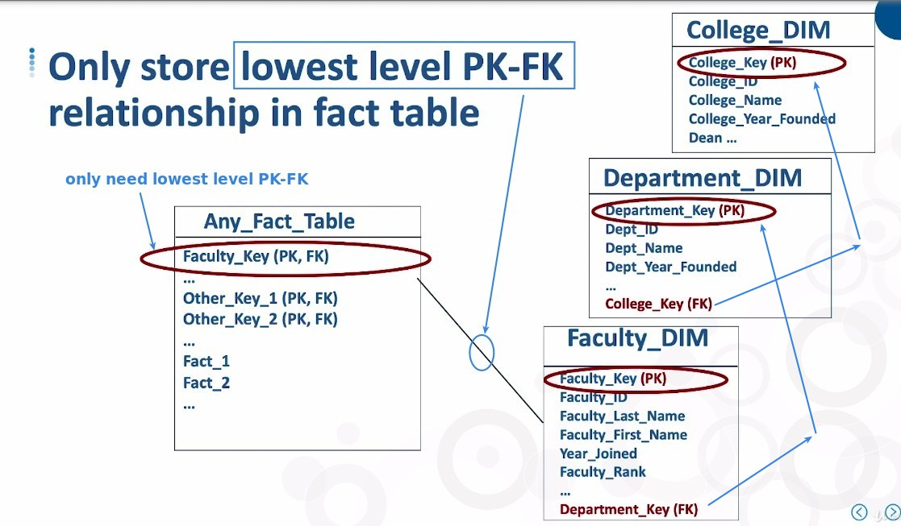

## **Review Star vs Snowflake Schemas**

## **How does Fact table relate to Dimension tables in different Schemas**

### _Star Schemas_

### _Snowflake Schemas_

- The BI tool will automatically help us to relate to higher-level dimension tables for analysis.

- If you are writing your own SQL script to do analysis, you may have to use more complex multi-layer syntax.
