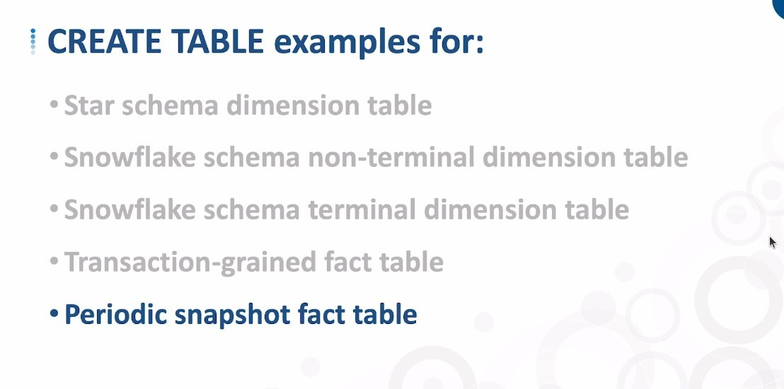
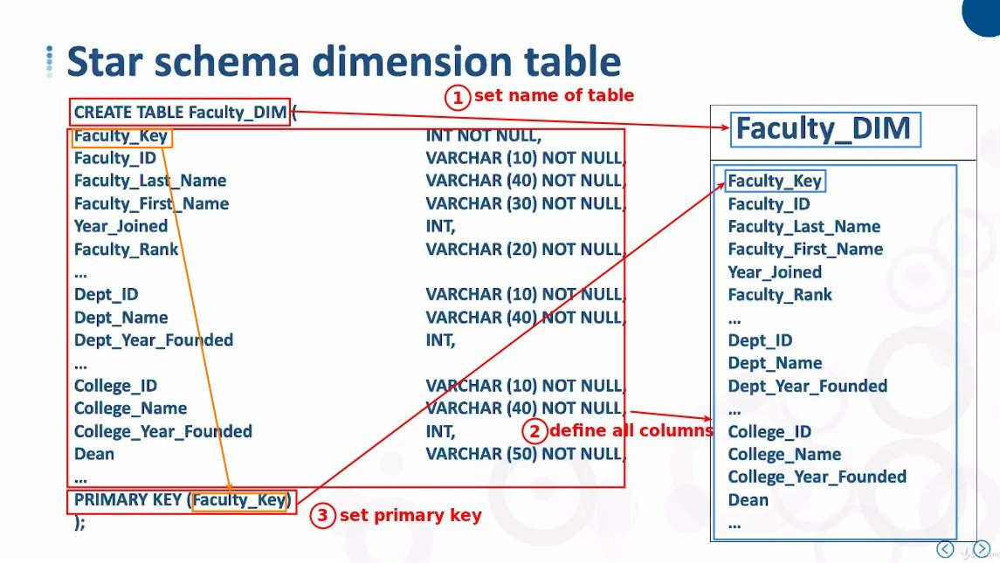
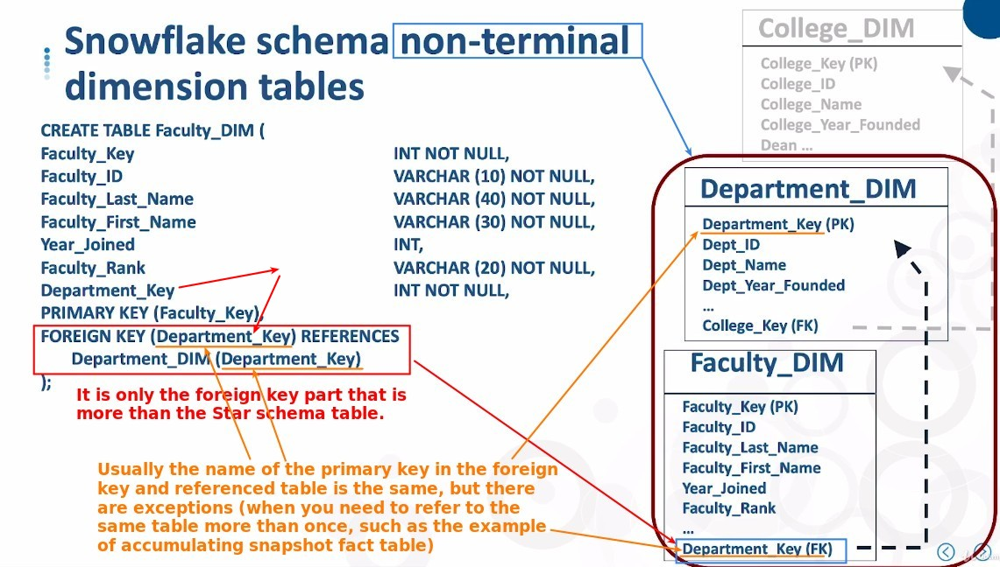
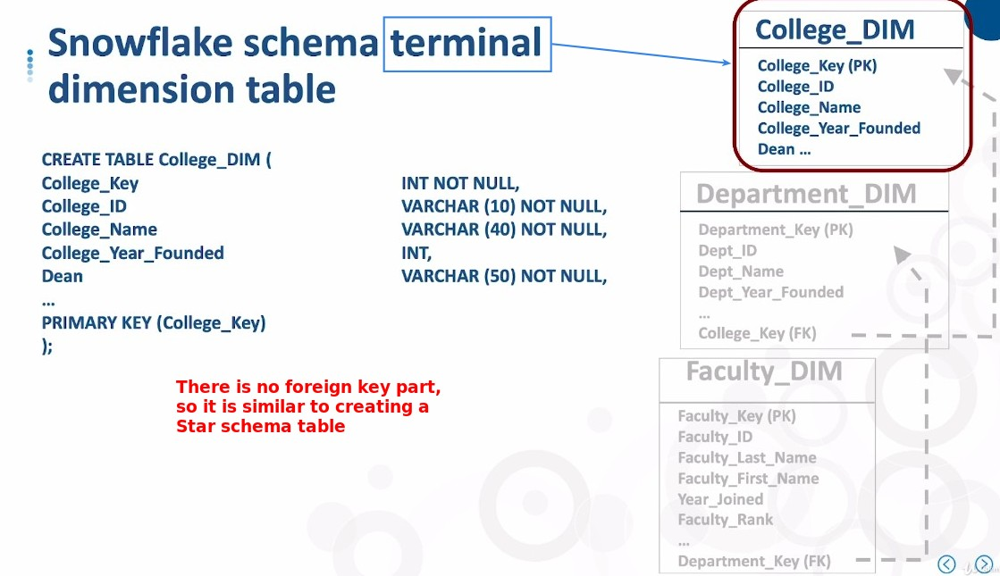
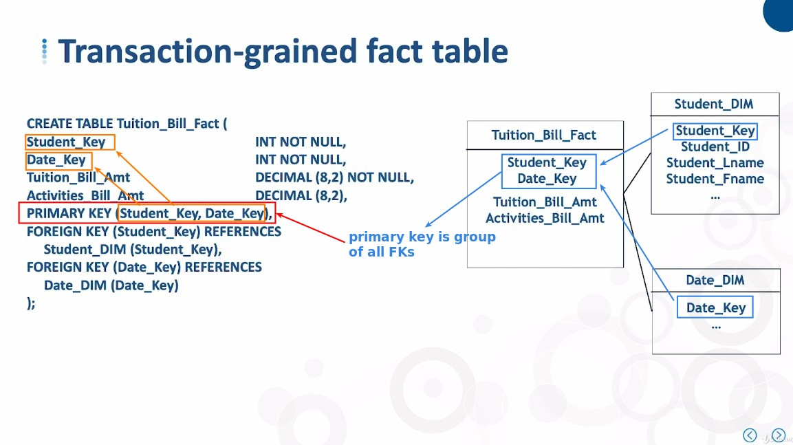
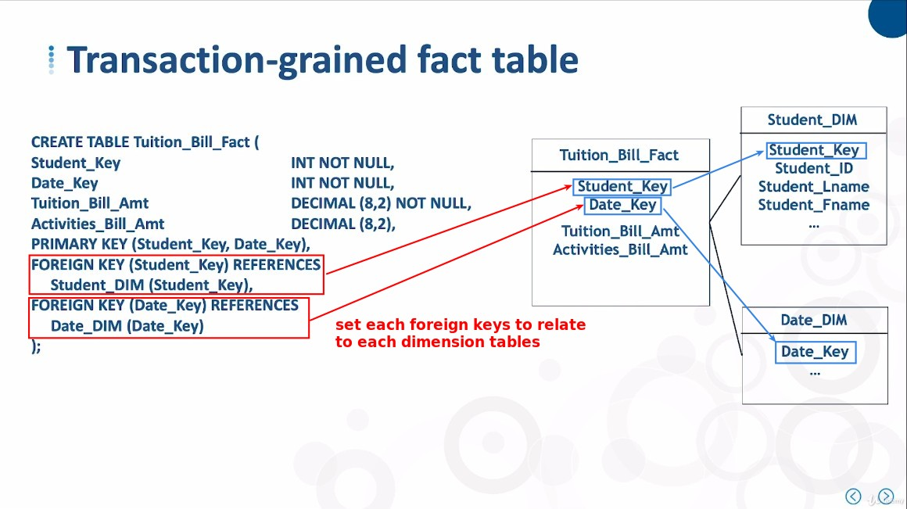
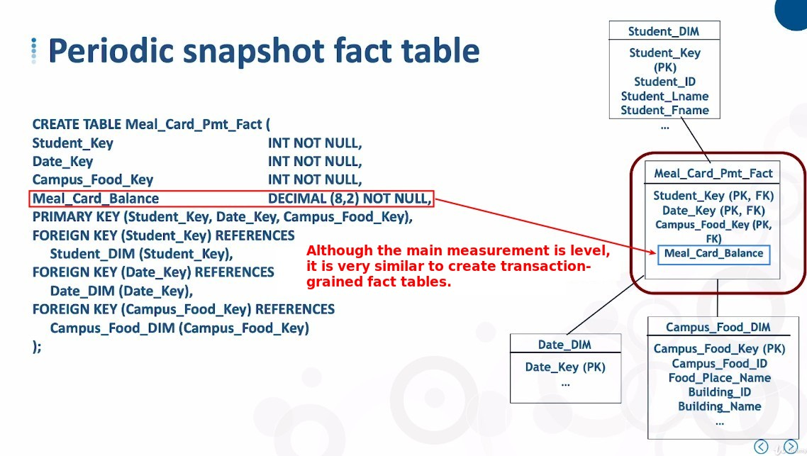

# ***CREATE TABLE Examples***

> Next, we will write SQL script using various types of table concept diagrams, so that we can have some understanding in the practical part.

## **Dimension table**

### _Star Schema_

### _Snowflake Schema_

**Non-terminal table**

**Terminal table**

## **Fact table**

### _Transaction-Grained Fact table_

**Primary key**

**Foreign key**

### _Periodic Snapshot Fact table_

### _Others_

- Should have accumulating snapshot fact table and factless fact table, but the course does not include this part of the example.

- The accumulating table will have to relate to the same dimension table, so the foreign key name will not be the same as the primary key name of the dimension table.

- The factless fact table part will have no measurement column, or only tracking fact, which should be using the boolean type.
