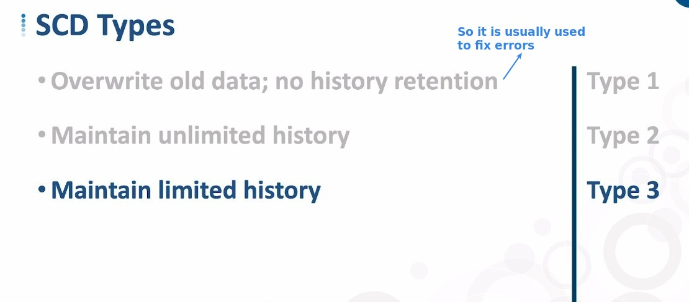

## **What is Slowly Changing Dimension table**

## **There are Three main types of SCD table**

## **Our Focus**

> In fact, there are other types of SCD tables, but since they are less used, we will focus on type 1, 2, and 3 in the next lecture.

