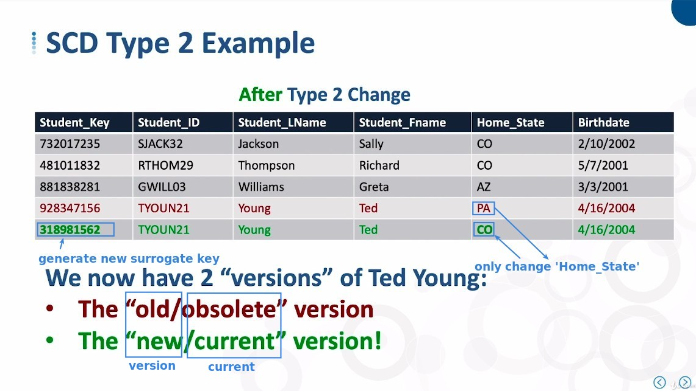
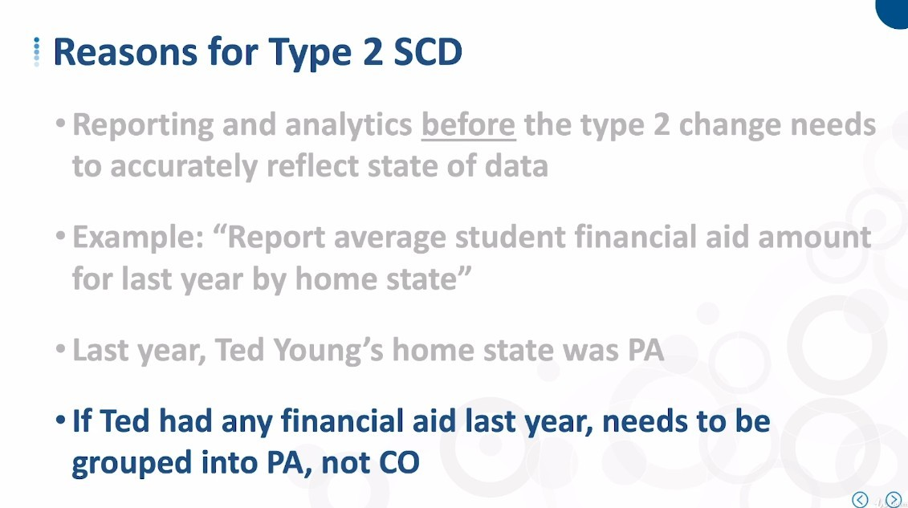
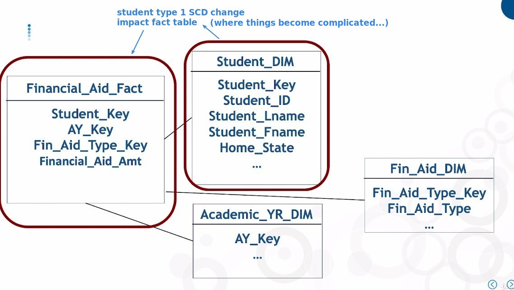
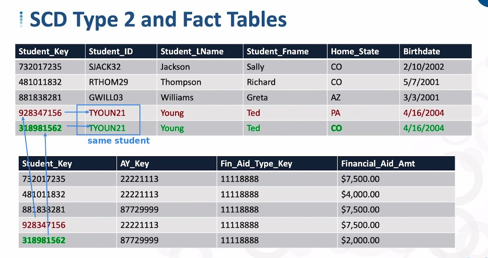
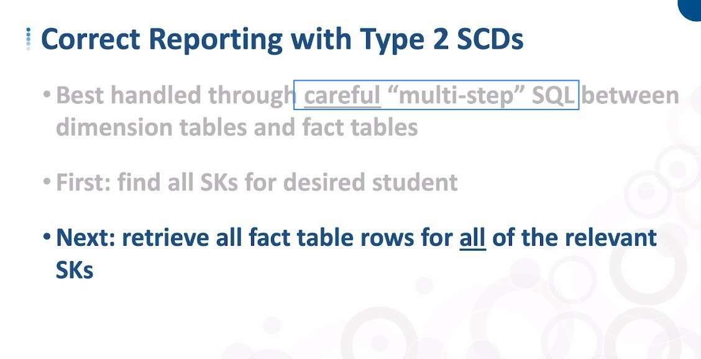
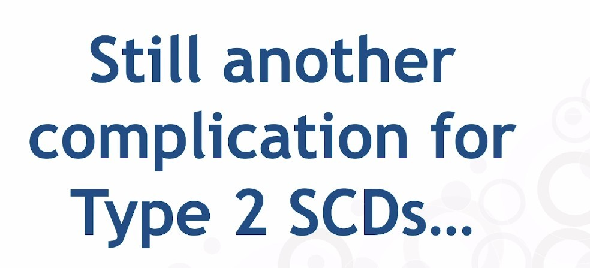

## **What is Type 2 Slowly Changing Dimension table**

## **The Reasons we use Type 2 Slowly Changing Dimension table**

## **Impact to related Fact table**

- As shown above, when type 2 SCD generates multiple versions, it also affects the related fact table which also generates multiple rows.

  - This may affect the correctness of our reporting based on these tables.

## **Correct reporting**

### _Bad practice: using natural keys**

### _Better practice: **careful** 'multi-step' SQL_

