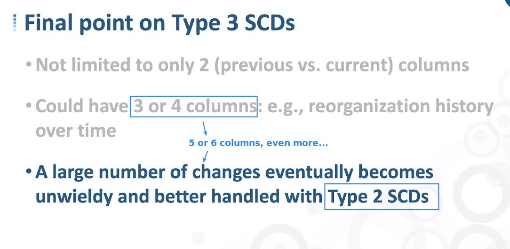

## **Type 3 SCD**

### _Why_

- Although type 2 SCD can be very complete in preserving historical data, but the query is more complicated, in some cases we can use the much simpler type 3 SCD.

### _What_

## **Classic Example of Type 3 SCD - Reorganization**

### _What we want to report_

- If you use Type 2 SCD, the data required to query for the above reports will be very complicated.

### _Previous and current columns_

### _Columns we use for report_

## **Limitations of Type 3 SCD**

## **Final Points of Type 3 SCD**

