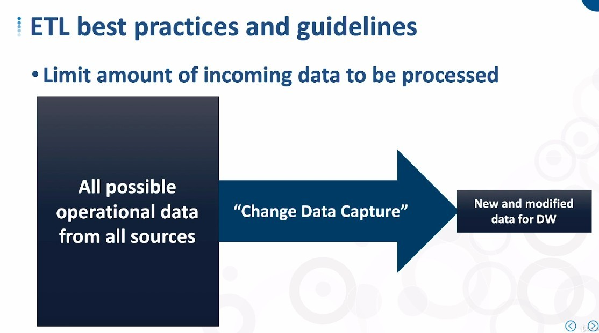

## **Reviews**

## **Main Factors to ETL design**

## **ETL Best practices and guidelines**

### _Limit amount of incoming data_

- We will explain "Change Data Capture" in other lectures.

- We only need subsets of data from data sources, those that are not in the data warehouse or that need to be updated.

### _Order by dependent relations (dimention tables -> fact tables)_

- Because surrogate key is generated in dimension table, so the order is important (point is surrogate key).

### _Better do parrallel processing_

## **Our Focus**

- In the following lectures, we will focus on the ETL design of the red circles, if you know these parts, you should be able to figure out the other parts by yourself.
