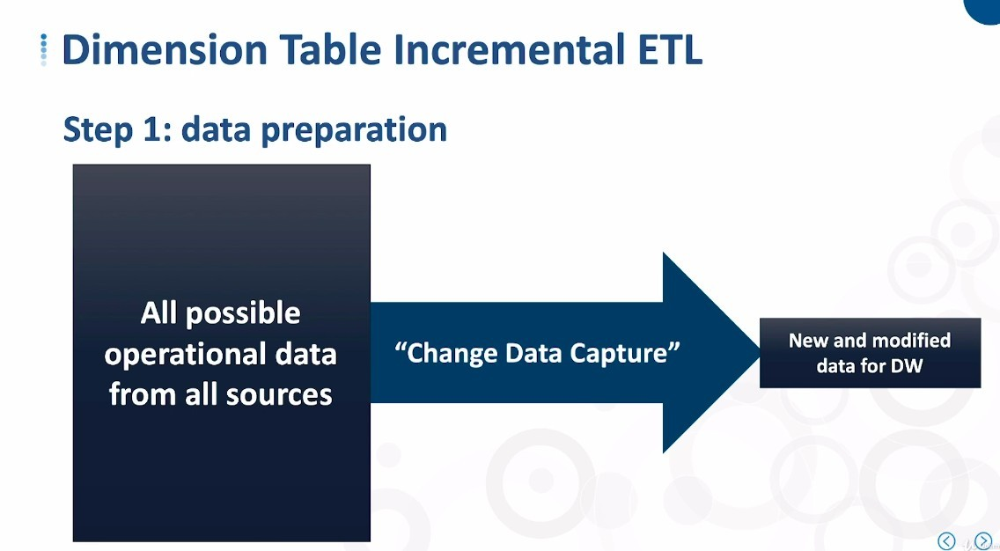
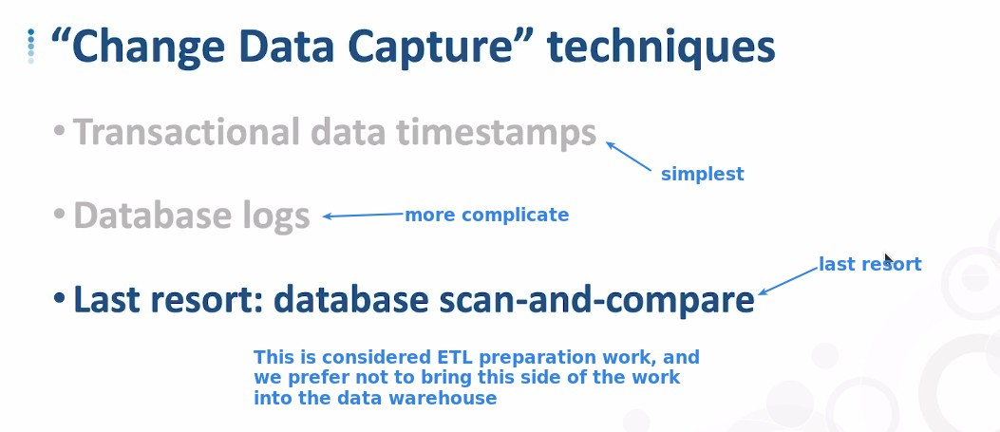
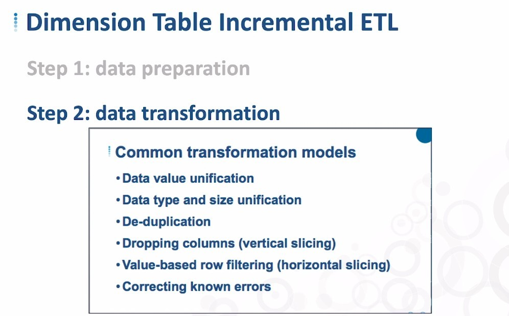
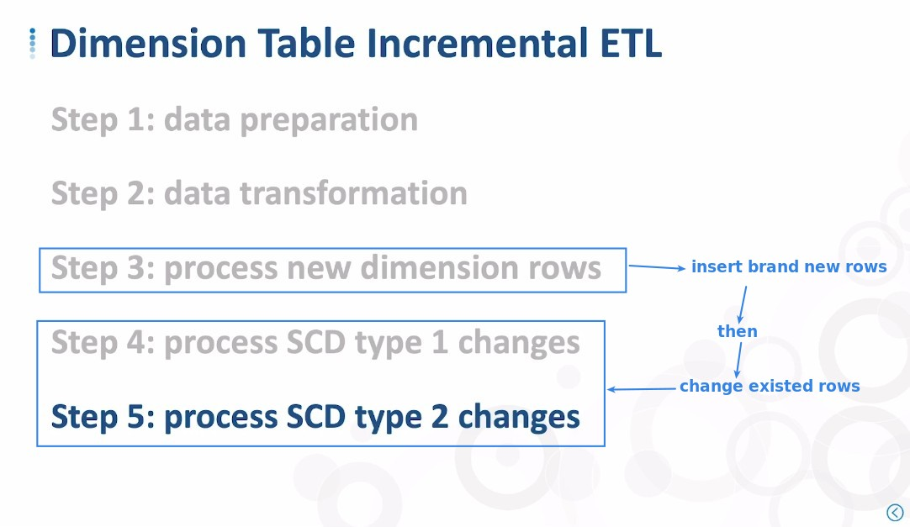
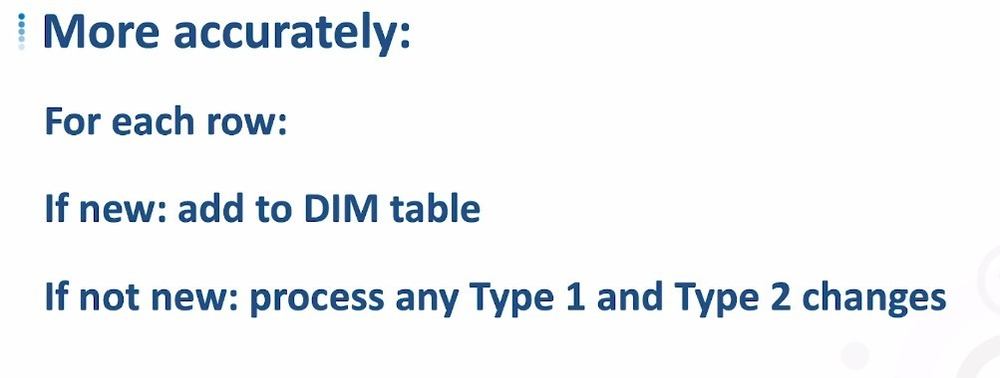
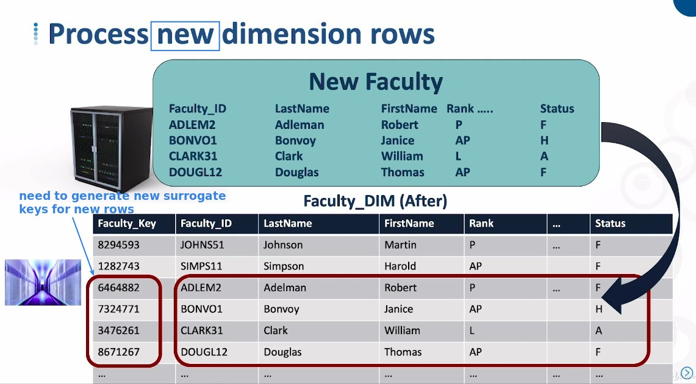

# ***Dimension Table ETL***

> We will use the case of Star Schemas as an illustration, because Snowflake Schemas has to consider the dependency between Dimension tables, which is too complicated for newbies.

## **Step 1: data preparation**

### _Technique: Change Data Capture_

## **Step 2: data transformation**

## **Step 3, 4, 5: insert/update rows**

