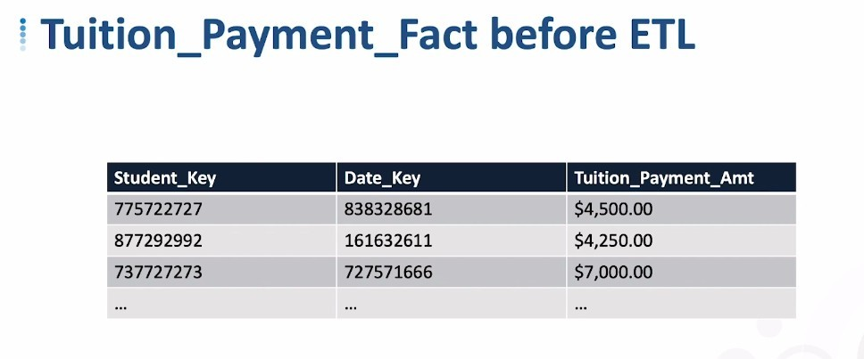

## **Before ETL to Fact table**

## **ETL of Fact table**

### _Multiple records in dimension table_

**pick current_flag = Y**

**use relevant date to filter**

> If you use the relevant date, you can insert historical fact information, which cannot be done by using current_flag alone.

## **Watch for Complications...**

- While inserting or updating a single table may feel simple, but linking different tables together can produce complex results.

  - If you are not prepared for the complexity you will face, the result will be very difficult to manage.
